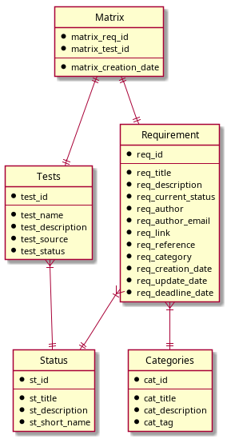

# Requirement Manager (ReqMan)

This software is a basic management for requirements and tests. 

## ToDo List
+ [ ] Hierarchy for
  + [ ] Requirements
  + [ ] Tests  
+ [ ] Operations log
+ [ ] Parsers for requirements
  + [ ] Latex files (Write a command)
  + [ ] Word files (Write a macro)
+ [ ] Parser for tests
  + [ ] Doxygen documentation
+ [ ] Better webpage 
+ [ ] Reports generator
  + [ ] Latex template
  + [X] Excel 
  + [ ] PDF document
+ [ ] Multiples projects
+ [x] REST API (partially)
+ [ ] Optimize DB access
  + [ ] Reduce SQL queries
  + [ ] DB pool
+ [ ] Security
  + [ ] Use https
  + [ ] users/admin
+ ...

## API 

At http://localhost:8080/api there is a REST API with the following endpoints:

+ api/requirements  (GET/POST)
+ api/requirements/\<id\> (GET)
+ api/status        (GET)
+ api/categories    (GET)
+ api/matrixID      (GET)

## JSON format

TBD

# Database

This prototype is based on Postgres. See docker container for set-up the database.

## Schema

See entity diagram


# Running

Terminal 1

```
> docker-compose run
```

Terminal 2

```
> diesel setup
> diesel migration redo
> cargo run
```

It should publish a webpage at http://localhost:8000 

