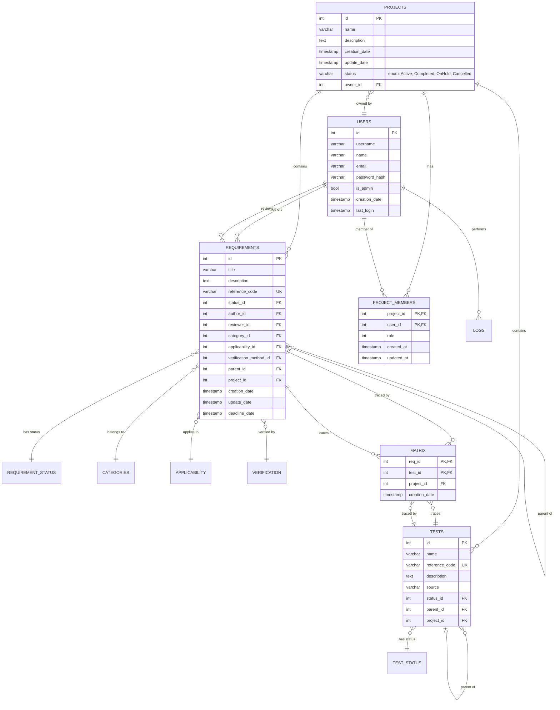
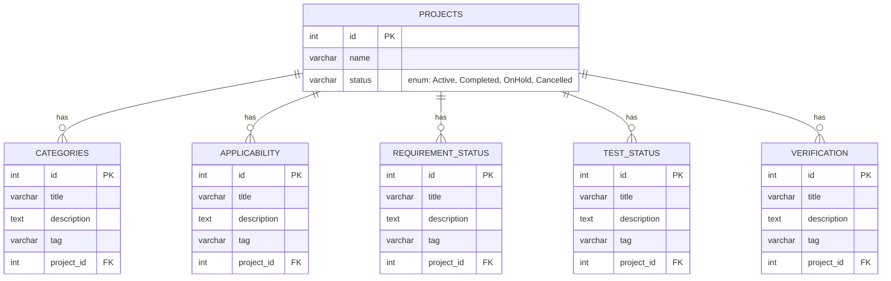
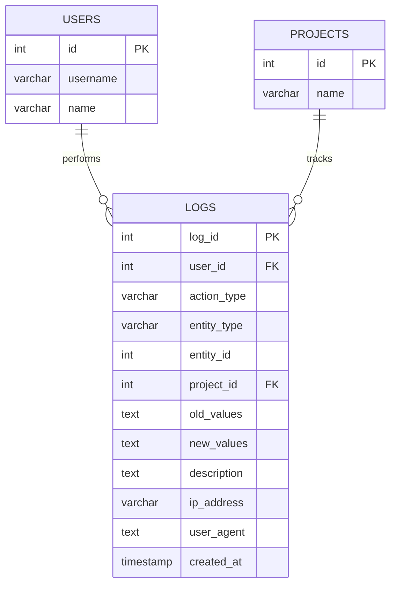

# Database Models and Structure

## Table of Contents
1. [Overview](#overview)
2. [Entity-Relationship Diagrams](#entity-relationship-diagrams)
3. [Data Models](#data-models)
4. [Main Relationships](#main-relationships)
5. [Indexes and Constraints](#indexes-and-constraints)
6. [Migration and Evolution](#migration-and-evolution)

---

## Overview

Marreq uses PostgreSQL as a relational database with Diesel as the ORM. The schema is designed to manage requirements management projects with complete traceability between requirements and tests.

### Technologies
- **Database**: PostgreSQL
- **ORM**: Diesel 2.x
- **Migrations**: Diesel CLI
- **Language**: Rust

---

## Entity-Relationship Diagrams

### 1. Main Diagram: Core Entities



### 2. Configuration Entities (Tagged Entities)

All these entities share the same structure and are customizable per project:



### 3. Audit System



---

## Data Models

For complete details of each table, consult the schema at [`src/schema.rs`](../src/schema.rs).

### Main Entities

#### **Projects**
Groups requirements, tests, and configurations. Has a relationship with `ProjectStatus` for lifecycle management.

**Key fields**: `id`, `name`, `description`, `status_id`, `owner_id`

#### **Requirements**
System requirements with complete traceability, hierarchies (`parent_id` field), and metadata such as status, category, applicability, and verification method.
`status` field that is an enum (Active, Completed, OnHold, Cancelled) for lifecycle management.

**Key fields**: `id`, `name`, `description`, `status` (enum)
#### **Tests**
Test cases linked to requirements via the `Matrix` table. Supports hierarchies.

**Key fields**: `id`, `name`, `reference_code` (UNIQUE), `status_id`, `project_id`, `parent_id`

#### **Users**
System users with authentication. `is_admin` field for global permissions.

**Key fields**: `id`, `username`, `email`, `password_hash`, `is_admin`

⚠️ **Security**: `password_hash` should never be exposed in APIs (protected with `#[serde(skip_serializing)]`)

#### **Matrix (Traceability)**
N:M linking table between requirements and tests. Composite primary key: (`req_id`, `test_id`)

#### **ProjectMembers**
Per-project access management with roles (0=viewer, 1=editor, 2=admin). Primary key: (`project_id`, `user_id`)

### Configuration Entities (Tagged Entities)

The following entities share the same structure and are customizable per project:

- **Categories**: Classification of requirements
- **Applicability**: Application contexts
- **RequirementStatus**: Requirement states
- **TestStatus**: Test states
- **Verification**: Verification methods

**Common structure**: `id`, `title`, `description`, `tag`, `project_id`

### Audit

#### **Logs**
Complete record of all system actions (CREATE, UPDATE, DELETE, LOGIN, etc.) with old/new values in JSON.

**Key fields**: `log_id`, `user_id`, `action_type`, `entity_type`, `entity_id`, `created_at`

---

## Main Relationships

### Project Hierarchies
```
Projects
  ├── Requirements (with internal hierarchies via parent_id)
  ├── Tests (with internal hierarchies via parent_id)
  ├── Categories
  ├── Applicability
  ├── RequirementStatus
  ├── TestStatus
  ├── Verification
  └── Matrix (req-test traceability)
```

### Traceability
- **Requirements ↔ Tests**: N:M relationship via `Matrix` table
- **Projects ↔ Users**: N:M relationship via `ProjectMembers` with roles

### Integrity Constraints
- Foreign keys with `ON DELETE CASCADE` (except `status_id` and `parent_id` which use `SET NULL`)
- Unique `reference_code` in `requirements` and `tests`
- CHECK constraints to prevent self-references and validate roles

---

## Indexes and Constraintsparent_id` which uses `SET NULL`)
- Unique `reference_code` in `requirements` and `tests`
- CHECK constraints to prevent self-references and validate roles
- `ProjectStatus` enum constrains project status to: Active, Completed, OnHold, Cancelled
- **By project**: `requirements`, `tests`, `matrix`, `logs` all indexed by `project_id`
- **By status**: `requirements.status_id`, `tests.status_id`
- **Hierarchies**: `requirements.parent_id`, `tests.parent_id`
- **Audit**: `logs.user_id`, `logs.created_at`, `logs(entity_type, entity_id)`
- **Traceability**: `matrix.req_id`, `matrix.test_id`

See migration `2025-11-23-000006_add_performance_indexes` for details.

### Main Constraints
- **UNIQUE**: `requirements.reference_code`, `tests.reference_code`
- **CHECK**: Role validation (0-2), prevention of self-refereparent_id` which uses `SET NULL`
- **ENUM**: `projects.status` uses `ProjectStatus` enum (Active, Completed, OnHold, Cancelled)
- **FOREIGN KEYS**: Mostly with `ON DELETE CASCADE`, except `status_id` and `parent_id` which use `SET NULL`

See migrations `2025-11-23-000004` (FKs) and `2025-11-23-000005` (CHECKs) for details.

---

## Migration and Evolution

The project uses Diesel CLI to manage migrations.

### Key Change History

| Date | Change |
|------|--------|
| 2022-11-07 | Initial creation (`requirements`, `users`, `tests`, `matrix`) |
| 2025-08-03 | Added `applicability` and `justification` |
| 2025-08-06 | Multi-project system witProjectStatus` enumd `project_members` |
| 2025-09-06 | Split status tables by project |
| 2025-11-23 | Suite of improvements: `project_status`, complete FKs, CHECK constraints, performance indexes |

### Diesel Commands

```bash
diesel migration generate migration_name  # Create
diesel migration run                      # Apply
diesel migration revert                   # Revert
diesel print-schema > src/schema.rs      # Regenerate schema
```

See [`migrations/`](../migrations/) folder for all migrations.

---

## Additional Resources

- **Diesel Schema**: [`src/schema.rs`](../src/schema.rs)
- **Rust Models**: [`src/models/entities.rs`](../src/models/entities.rs)
- **Migrations**: [`migrations/`](../migrations/)
- **DB Setup**: [`DATABASE_SETUP_README.md`](../DATABASE_SETUP_README.md)

---

**Last updated**: December 12, 2025
