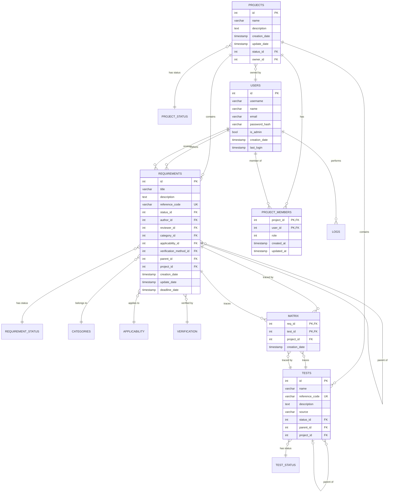
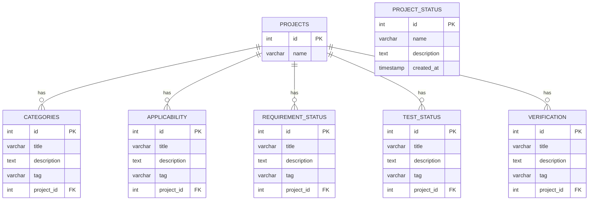
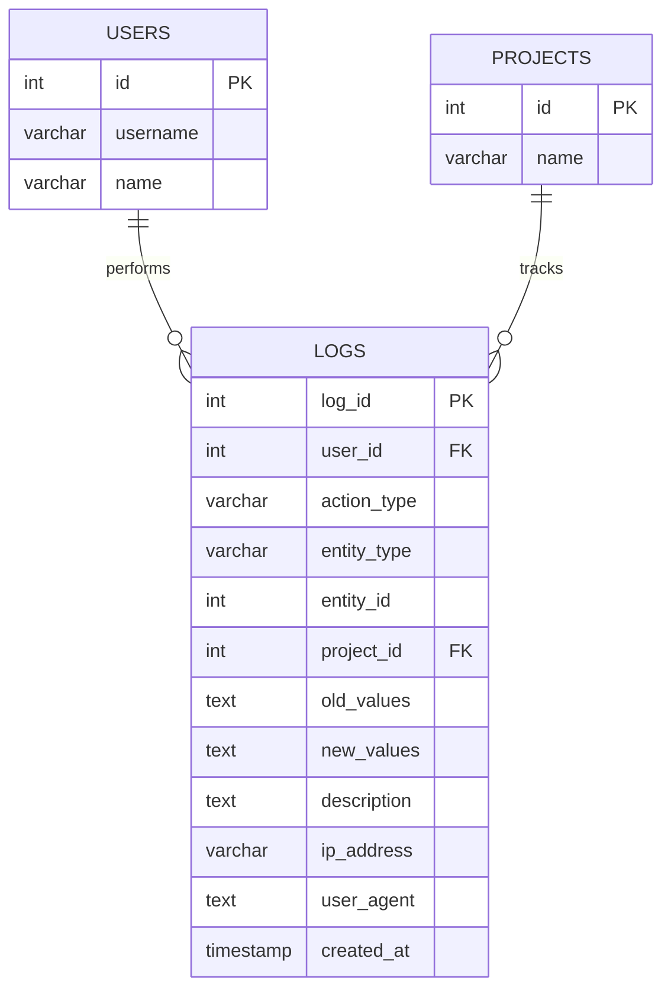

# Modelos y Estructura de la Base de Datos

## Índice
1. [Visión General](#visión-general)
2. [Diagrama Entidad-Relación](#diagrama-entidad-relación)
3. [Modelos de Datos](#modelos-de-datos)
4. [Relaciones Principales](#relaciones-principales)
5. [Índices y Restricciones](#índices-y-restricciones)
6. [Migración y Evolución](#migración-y-evolución)

---

## Visión General

ReqMan utiliza PostgreSQL como base de datos relacional con Diesel como ORM. El esquema está diseñado para gestionar proyectos de gestión de requisitos con trazabilidad completa entre requisitos y pruebas.

### Tecnologías
- **Base de datos**: PostgreSQL
- **ORM**: Diesel 2.x
- **Migraciones**: Diesel CLI
- **Lenguaje**: Rust

---

## Diagramas Entidad-Relación

### 1. Diagrama Principal: Core Entities



### 2. Entidades de Configuración (Tagged Entities)

Todas estas entidades comparten la misma estructura y son personalizables por proyecto:



### 3. Sistema de Auditoría



---

## Modelos de Datos

Para el detalle completo de cada tabla consulta el esquema en [`src/schema.rs`](../src/schema.rs).

### Entidades Principales

#### **Projects**
Agrupa requisitos, tests y configuraciones. Tiene relación con `ProjectStatus` para gestión del ciclo de vida.

**Campos clave**: `id`, `name`, `description`, `status_id`, `owner_id`

#### **Requirements**
Requisitos del sistema con trazabilidad completa, jerarquías (campo `parent_id`), y metadatos como estado, categoría, aplicabilidad y método de verificación.

**Campos clave**: `id`, `title`, `reference_code` (UNIQUE), `status_id`, `author_id`, `reviewer_id`, `project_id`, `parent_id`

#### **Tests**
Casos de prueba vinculados a requisitos mediante la tabla `Matrix`. Soporta jerarquías.

**Campos clave**: `id`, `name`, `reference_code` (UNIQUE), `status_id`, `project_id`, `parent_id`

#### **Users**
Usuarios del sistema con autenticación. Campo `is_admin` para permisos globales.

**Campos clave**: `id`, `username`, `email`, `password_hash`, `is_admin`

⚠️ **Seguridad**: `password_hash` nunca debe exponerse en APIs (protegido con `#[serde(skip_serializing)]`)

#### **Matrix (Trazabilidad)**
Tabla de enlace N:M entre requisitos y tests. Clave primaria compuesta: (`req_id`, `test_id`)

#### **ProjectMembers**
Gestión de acceso por proyecto con roles (0=viewer, 1=editor, 2=admin). Clave primaria: (`project_id`, `user_id`)

### Entidades de Configuración (Tagged Entities)

Las siguientes entidades comparten estructura y son personalizables por proyecto:

- **Categories**: Clasificación de requisitos
- **Applicability**: Contextos de aplicación
- **RequirementStatus**: Estados de requisitos
- **TestStatus**: Estados de tests
- **Verification**: Métodos de verificación

**Estructura común**: `id`, `title`, `description`, `tag`, `project_id`

### Auditoría

#### **Logs**
Registro completo de todas las acciones del sistema (CREATE, UPDATE, DELETE, LOGIN, etc.) con valores antiguos/nuevos en JSON.

**Campos clave**: `log_id`, `user_id`, `action_type`, `entity_type`, `entity_id`, `created_at`

---

## Relaciones Principales

### Jerarquías de Proyectos
```
Projects
  ├── Requirements (con jerarquías internas vía parent_id)
  ├── Tests (con jerarquías internas vía parent_id)
  ├── Categories
  ├── Applicability
  ├── RequirementStatus
  ├── TestStatus
  ├── Verification
  └── Matrix (trazabilidad req-test)
```

### Trazabilidad
- **Requirements ↔ Tests**: Relación N:M mediante tabla `Matrix`
- **Projects ↔ Users**: Relación N:M mediante `ProjectMembers` con roles

### Restricciones de Integridad
- Claves foráneas con `ON DELETE CASCADE` (excepto `status_id` y `parent_id` que usan `SET NULL`)
- `reference_code` único en `requirements` y `tests`
- Restricciones CHECK para prevenir auto-referencias y validar roles

---

## Índices y Restricciones

### Índices de Rendimiento
- **Por proyecto**: `requirements`, `tests`, `matrix`, `logs` todos indexados por `project_id`
- **Por estado**: `requirements.status_id`, `tests.status_id`
- **Jerarquías**: `requirements.parent_id`, `tests.parent_id`
- **Auditoría**: `logs.user_id`, `logs.created_at`, `logs(entity_type, entity_id)`
- **Trazabilidad**: `matrix.req_id`, `matrix.test_id`

Ver migración `2025-11-23-000006_add_performance_indexes` para detalles.

### Restricciones Principales
- **UNIQUE**: `requirements.reference_code`, `tests.reference_code`
- **CHECK**: Validación de roles (0-2), prevención de auto-referencias en jerarquías
- **FOREIGN KEYS**: Mayoritariamente con `ON DELETE CASCADE`, excepto `status_id` y `parent_id` que usan `SET NULL`

Ver migraciones `2025-11-23-000004` (FKs) y `2025-11-23-000005` (CHECKs) para detalles.

---

## Migración y Evolución

El proyecto utiliza Diesel CLI para gestionar migraciones.

### Historial de Cambios Clave

| Fecha | Cambio |
|-------|--------|
| 2022-11-07 | Creación inicial (`requirements`, `users`, `tests`, `matrix`) |
| 2025-08-03 | Añadida `applicability` y `justification` |
| 2025-08-06 | Sistema multi-proyecto con `projects` y `project_members` |
| 2025-09-06 | División de tablas de estado por proyecto |
| 2025-11-23 | Suite de mejoras: `project_status`, FKs completas, restricciones CHECK, índices de rendimiento |

### Comandos Diesel

```bash
diesel migration generate nombre_migracion  # Crear
diesel migration run                         # Aplicar
diesel migration revert                      # Revertir
diesel print-schema > src/schema.rs         # Regenerar schema
```

Ver carpeta [`migrations/`](../migrations/) para todas las migraciones.

---

## Recursos Adicionales

- **Schema Diesel**: [`src/schema.rs`](../src/schema.rs)
- **Modelos Rust**: [`src/models/entities.rs`](../src/models/entities.rs)
- **Migraciones**: [`migrations/`](../migrations/)
- **Setup de BD**: [`DATABASE_SETUP_README.md`](../DATABASE_SETUP_README.md)

---

**Última actualización**: 9 de diciembre de 2025
