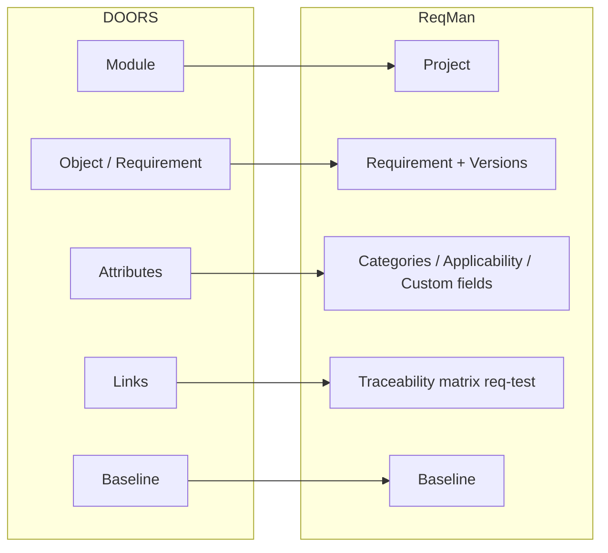

# Migrating from IBM DOORS to ReqMan

This guide is for teams familiar with **IBM DOORS** (DOORS Classic or DOORS Next Generation) who want to move to **ReqMan**. It compares concepts and workflows between the two tools and gives a step-by-step migration path using ReqIF and Excel.

---

## Introduction

**ReqMan** (Requirement Manager) is a web-based requirements and test management system. It provides hierarchical requirements, version history, comments, approval workflow, requirement–test traceability, immutable baselines, and ReqIF 1.2 import/export—all self-hosted, with no per-seat licensing.

If you are moving from DOORS, you can expect:

- **Familiar ideas**: Projects, requirements, attributes, baselines, and ReqIF interchange.
- **Different structure**: ReqMan has no “module” entity; requirements live in projects. Traceability is centered on requirement–test links and parent/child hierarchy.
- **Practical migration**: Export from DOORS as ReqIF 1.2 (or Excel), create a ReqMan project, import, then verify and optionally re-establish traceability and create baselines.

For day-to-day use of ReqMan after migration, see the [User Manual](UserManual.md) and [Typical Workflow](Workflow.md).

---

## Concept mapping: DOORS vs ReqMan

The following diagram and table show how DOORS concepts map to ReqMan.

| DOORS concept | ReqMan equivalent | Notes |
|---------------|--------------------|--------|
| **Project / Folder** | **Project** | ReqMan has a single top-level “project”; there are no nested folders. One DOORS project (or set of formal modules) often maps to one ReqMan project. |
| **Formal module** | **Project** (or one set of requirements in a project) | ReqMan has no separate “module” entity; requirements belong directly to a project. You can map one DOORS module to one ReqMan project, or merge several modules into one project. |
| **Object / requirement** | **Requirement** (with **versions**) | ReqMan stores the current content plus full history as immutable versions; DOORS object history maps to this version history. |
| **Attributes** | **Category**, **Applicability**, **Status**, **Custom fields** | Map DOORS attributes (e.g. Status, Type, Safety) to ReqMan’s category, applicability, requirement status, and project custom fields. Configure these in the project before or after import. |
| **Links (in-module / cross-module)** | **Traceability matrix** (requirement–test) and **parent/child** requirement hierarchy | ReqMan emphasizes requirement–test traceability and parent/child links. DOORS “satisfied by” / “verifies” style links map to the matrix; structural links can map to parent/child. |
| **Module baseline** | **Project baseline** | Both are immutable. A ReqMan baseline is a snapshot of requirement versions and the traceability matrix at a point in time. |
| **ReqIF export** | **ReqIF 1.2 export** (current or from baseline) | ReqIF is the preferred interchange format for migrating from DOORS to ReqMan. |

---

## Workflow comparison

| Workflow | DOORS (typical) | ReqMan (equivalent) |
|----------|------------------|----------------------|
| **Authoring** | Create and edit objects in modules; set attributes. | Create and edit requirements in a project; set category, applicability, status, verification; optionally set parent requirement. See [User Manual §4 Requirements](UserManual.md#4-requirements). |
| **Review / approval** | DOORS: change requests, reviews; DNG: lifecycle states. | ReqMan: Draft → Reviewed → Approved, with “Mark as Reviewed” and “Approve Requirement” (and comments). See [Workflow §4 Review and approve](Workflow.md#4-review-and-approve-requirements). |
| **Linking / traceability** | Create links between objects (or to test artifacts in DNG). | Add links in the **Traceability matrix** (requirement ↔ test); view “Verified by” on the requirement detail page; use Reports for coverage. See [User Manual §5 Test Management](UserManual.md#5-test-management) and [§6 Traceability Matrix](UserManual.md#6-traceability-matrix). |
| **Baselines** | Create module (or stream) baseline; immutable. | Create a **project baseline** (Baselines → New Baseline); immutable; export as ReqIF or use “Diff vs current” on requirements. See [User Manual §7 Baselines](UserManual.md#7-baselines). |
| **Export** | ReqIF, CSV, PDF, etc. | ReqIF 1.2 (current or from baseline), Excel (requirements, matrix, tests), PDF reports. See [User Manual §9 Reports & Export](UserManual.md#9-reports--export). |
| **Import** | ReqIF, CSV into module/project. | **Import ReqIF** or **Import Excel** into a project; for Excel, map columns to ReqMan fields. See [User Manual §10 Import](UserManual.md#10-import). |

**Authoring:** In DOORS you work in modules and set object attributes. In ReqMan you work in a project: each requirement has title, statement, rationale, category, applicability, status, verification methods, and optional parent. Version history is automatic on edit.

**Review and approval:** ReqMan uses an explicit three-state workflow (Draft → Reviewed → Approved) with comments. Project owners/managers perform the transitions; the manual describes the actions and confirmation dialogs.

**Traceability:** ReqMan’s matrix links requirements to tests; the requirement detail page shows “Verified by” and a verification panel (pass/fail/pending). Coverage (requirements without tests, tests without requirements) appears in Reports. This is the main place to re-create traceability after migration if it was not carried over in ReqIF.

**Baselines:** As in DOORS, baselines are immutable. In ReqMan you create a project baseline at a milestone, then can export it as ReqIF or compare individual requirements to the current version via “Diff vs current.”

---

## Migration path

1. **Export from DOORS**
   - Prefer **ReqIF 1.2** if your DOORS version supports it (preserves structure, attributes, and hierarchy where supported).
   - Otherwise export to **Excel or CSV** with columns you can map to ReqMan (e.g. title, description, id, status, parent).

2. **Prepare ReqMan**
   - Create a **project** in ReqMan (Projects → New Project, or see [User Manual §3 Projects](UserManual.md#3-projects)).
   - Optionally configure **categories**, **applicability**, and **requirement statuses** to match your DOORS attributes (see [User Manual §8](UserManual.md#8-categories-applicability--verification)).
   - Decide mapping: one ReqMan project per DOORS module, or one project per DOORS project with multiple modules merged.

3. **Import into ReqMan**
   - **ReqIF**: Open the project, then **Import ReqIF** (Quick Actions or Admin); upload the ReqIF file and complete the import. See [User Manual §10.2 Importing ReqIF](UserManual.md#102-importing-reqif).
   - **Excel**: Use **Import File** for the project; upload the file; map columns to ReqMan fields (title, description, reference, status, category, etc.); run the import. See [User Manual §10.1 Importing from Excel](UserManual.md#101-importing-from-excel).

4. **Verify and refine**
   - Check the **Requirements** list (card/table/tree) and requirement detail pages.
   - Confirm hierarchy (parent/child) and attributes (category, applicability, status). Edit requirements or adjust project configuration as needed.

5. **Re-establish traceability**
   - If requirement–test (or requirement–requirement) traceability was not brought in via ReqIF/Excel, create **tests** in ReqMan and use the **Traceability matrix** to link requirements to tests. See [User Manual §5 Test Management](UserManual.md#5-test-management) and [§6 Traceability Matrix](UserManual.md#6-traceability-matrix).

6. **Baselines and export**
   - Create a **baseline** for the migrated state (Baselines → New Baseline). Use **Export ReqIF** (from baseline) or Excel/PDF for audits. See [User Manual §7 Baselines](UserManual.md#7-baselines) and [§9 Reports & Export](UserManual.md#9-reports--export).

For the full ReqMan workflow (including project setup and configuration), see [Workflow](Workflow.md).

---

## Where ReqMan differs

- **No “module” entity**: Only projects and requirements. Multiple DOORS modules become one or more ReqMan projects (or one project with all requirements).
- **Web-only**: No thick client; use a browser. Optional REST API and MCP for integration.
- **Built-in test management**: Tests and requirement–test traceability are first-class; DOORS often relies on external test tools or DNG test artifacts.
- **Approval workflow**: Explicit Draft / Reviewed / Approved with comments; different from DOORS change requests or DNG lifecycle.
- **ReqIF scope**: ReqMan’s ReqIF 1.2 support focuses on requirements and comments (as Remarks). Traceability in ReqIF may be partial; document what your DOORS export includes and what you may need to re-link in ReqMan.

---

## References

- [User Manual](UserManual.md) — Full ReqMan usage: projects, requirements, test management, matrix, baselines, categories, reports, export/import, profile, administration.
- [Typical Workflow with ReqMan](Workflow.md) — End-to-end workflow from project setup through baselines and export.
- [User Manual §4 Requirements](UserManual.md#4-requirements) — Requirements list, detail, create, edit, versions, comments, approval.
- [User Manual §6 Traceability Matrix](UserManual.md#6-traceability-matrix) — Linking requirements to tests and coverage.
- [User Manual §7 Baselines](UserManual.md#7-baselines) — Creating baselines and exporting as ReqIF.
- [User Manual §9 Reports & Export](UserManual.md#9-reports--export) — Excel and ReqIF export options.
- [User Manual §10 Import](UserManual.md#10-import) — Import ReqIF and Import Excel.
