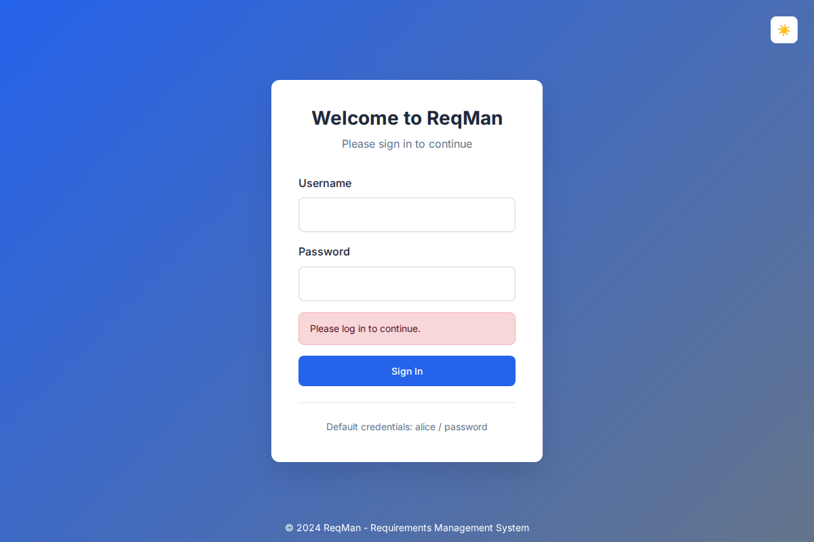
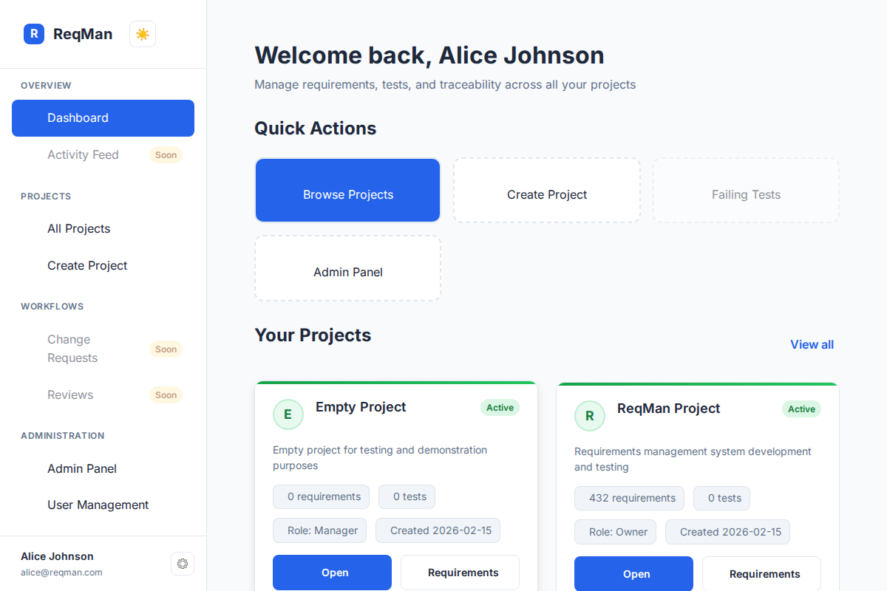
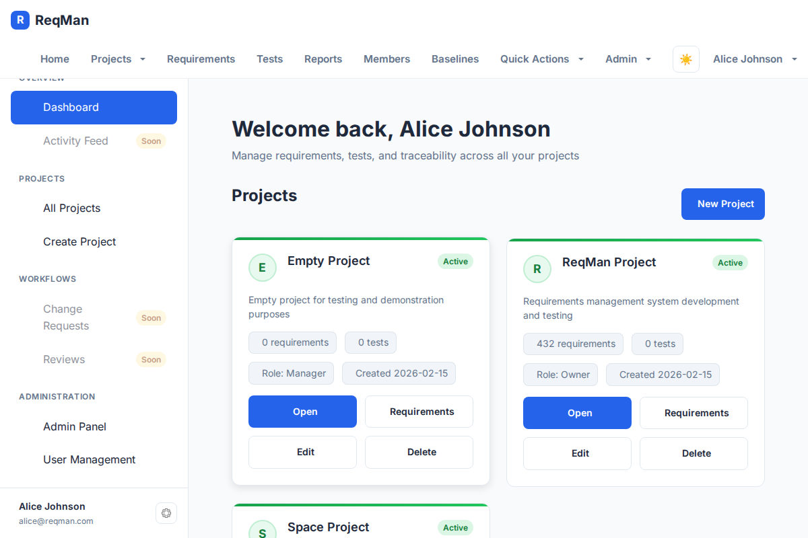
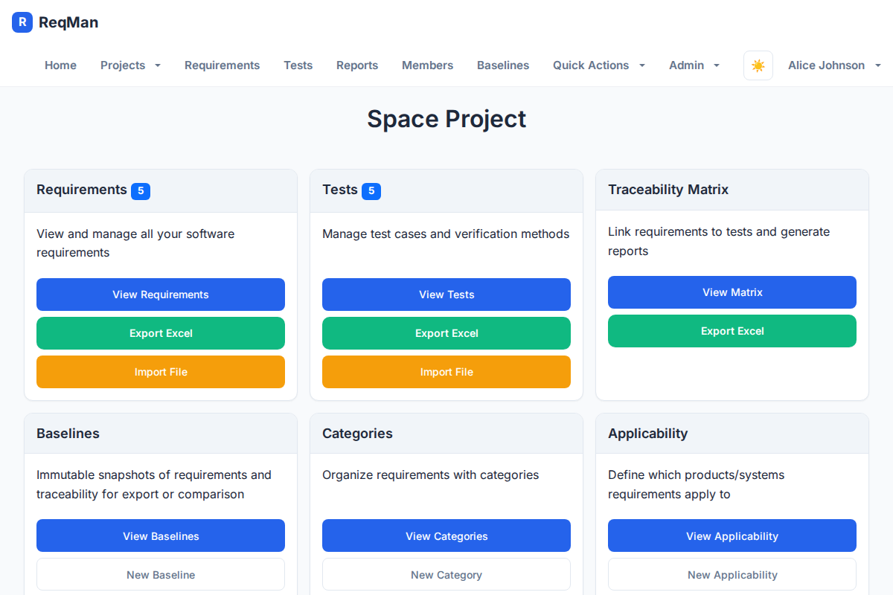
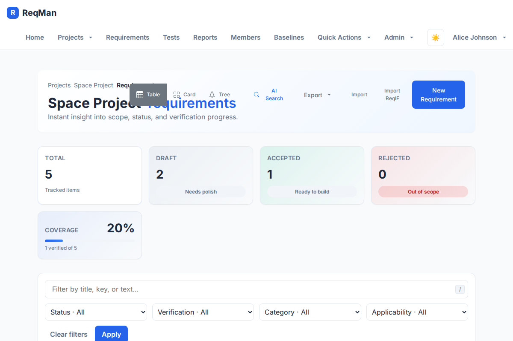
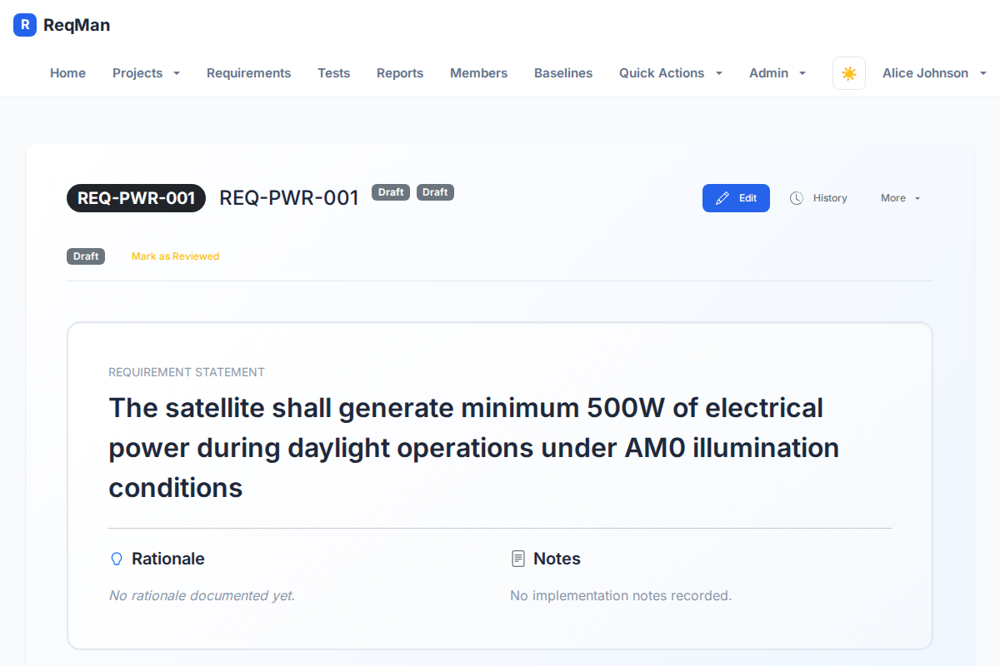
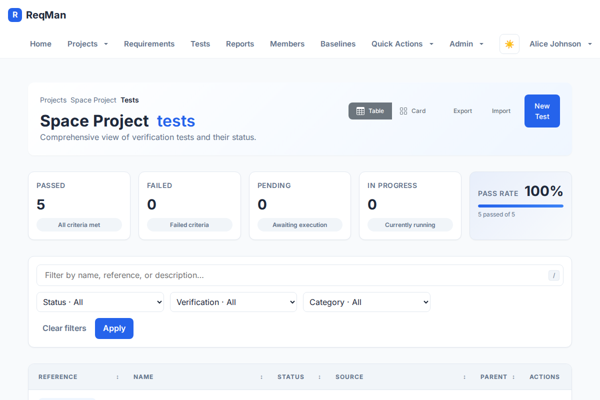
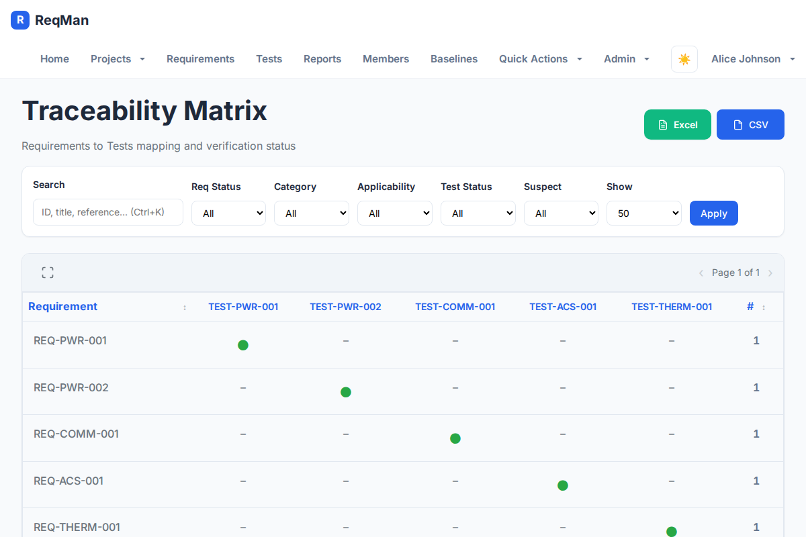
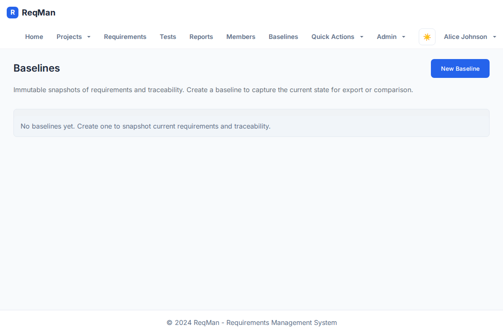
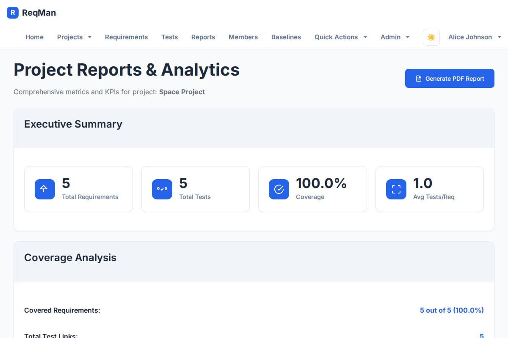

# ReqMan User Manual

**Requirement Manager (ReqMan)** is a web-based requirements and test management system. This manual describes how to use the application from the end-user perspective.

**IBM DOORS users:** See **[Migrating from DOORS to ReqMan](DOORS_to_ReqMan_Migration.md)** for concept mapping, workflow comparison, and migration steps.

For a **typical end-to-end workflow** (project setup → requirements → tests → traceability → approval → baselines → export), see **[Typical Workflow with ReqMan](Workflow.md)**.

---

## Table of Contents

1. [Introduction](#1-introduction)
2. [Getting Started](#2-getting-started)
3. [Projects](#3-projects)
4. [Requirements](#4-requirements)
5. [Test Management](#5-test-management)
6. [Traceability Matrix](#6-traceability-matrix)
7. [Baselines](#7-baselines)
8. [Categories, Applicability & Verification](#8-categories-applicability--verification)
9. [Reports & Export](#9-reports--export)
10. [Import](#10-import)
11. [Project Members](#11-project-members)
12. [Profile & Account](#12-profile--account)
13. [Administration](#13-administration)
14. [Tips & Shortcuts](#14-tips--shortcuts)

---

## 1. Introduction

ReqMan helps you:

- **Manage requirements** in a hierarchy, with version history, comments, and approval workflow
- **Manage tests** — create and organize tests (including hierarchy), track test status (e.g. Pass/Fail/Pending), link tests to requirements, and see coverage in reports and on requirement pages
- **View and export** traceability matrices and reports
- **Create immutable baselines** for audits or releases
- **Import/export** via Excel and ReqIF 1.2

Data is organized by **projects**. Each project has its own requirements, tests, categories, applicability options, and baselines. You must be logged in to use the application.

See **[Typical Workflow with ReqMan](Workflow.md)** for a step-by-step workflow from project setup through baselines and export.

---

## 2. Getting Started

### 2.1 Logging In

1. Open the application in your browser (e.g. **http://localhost:8000**).
2. You will see the **Welcome to ReqMan** login page.
3. Enter your **Username** and **Password**.
4. Click **Sign In**.

If you use a demo setup, typical users include `alice`, `dr_smith`, `eng_jones`, `tech_lee`, `qa_wilson`, and `admin`; the default password is often `password` (check with your administrator).

- **Theme**: Use the sun/moon toggle on the login card to switch between light and dark mode.
- **Logout**: Click your name in the top-right → **Logout**.

### 2.2 Home Page

After login you see the **Home** page:

- **Quick Actions**: Browse Projects, (if admin) Create Project, Admin Panel
- **Your Projects**: Grid of project cards; click a project to open its detail page
- **Recent Activity**: Placeholder for future activity feed

Use **Home** in the navbar to return here anytime.

### 2.3 Navigation

The top navigation bar includes:

| Item                      | Description                                                                                                          |
| ------------------------- | -------------------------------------------------------------------------------------------------------------------- |
| **Home**                  | Dashboard and project list                                                                                           |
| **Projects**              | All Projects / New Project (admin only)                                                                              |
| **Requirements**          | Project requirements (active when a project is selected)                                                             |
| **Tests**                 | Project tests                                                                                                        |
| **Reports**               | Project reports & analytics                                                                                          |
| **Members**               | Project members                                                                                                      |
| **Baselines**             | Project baselines                                                                                                    |
| **Quick Actions** (admin) | Shortcuts: New Project, New Requirement/Test/Category/Applicability/Verification/Status, New User, Import File/ReqIF |
| **Admin** (admin)         | Dashboard, User Management, Database Backup, Import, System Logs, Log Analytics                                      |

In the top-right:

- **Theme toggle** (sun/moon) for light/dark mode
- **User menu**: My Profile, Change Password, Logout

Requirements, Tests, Reports, Members, and Baselines are **project-scoped**: select a project first (e.g. by opening it from Home or Projects) so these links apply to that project.

---

## 3. Projects

### 3.1 Viewing Projects

- **All Projects**: **Projects → All Projects** or open **Home** and use “View all” under Your Projects.
- **Project detail**: Click a project card to open **Project Detail** (`/p/<project_id>`).

On the project detail page you see:

- Project name, status (e.g. active), description
- Created/Updated dates and owner
- **Quick Actions**: View Requirements, View Tests, View Matrix, Baselines, View Reports, View Members
- **Project Members** list with names, usernames, roles, and email

### 3.2 Creating a Project (Admin)

1. **Projects → New Project** or **Quick Actions → New Project**.
2. Enter **Name** (required), optional **Description**.
3. Submit the form.

You are typically taken to the new project or the project list.

### 3.3 Editing a Project

1. Open the project detail page.
2. Click **Edit Project**.
3. Update name/description and save.

---

## 4. Requirements

Requirements are the core artifact. Each requirement can have multiple **versions** (history), **comments**, and an **approval** state (draft → reviewed → approved). Requirements can be hierarchical (parent/child) and are linked to tests via the traceability matrix.

### 4.1 Requirements List

- Open a project, then use **Requirements** in the nav or **View Requirements** on the project detail page.
- URL: `/p/<project_id>/requirements`.

You can:

- **View** requirements in **Card**, **Table**, or **Tree** layout (use the view toggle).
- **Filter** by status, verification, category, applicability, approval (e.g. Approved only / Not approved), and custom filters.
- **Search** (and use **Semantic Search** if enabled).
- **Paginate** through results.
- **Create** a new requirement (button in header; admin/appropriate role).
- **Open** a requirement by clicking its title or reference to see the **Requirement detail** page.

Metrics (e.g. total count, by status) are shown at the top.

### 4.2 Requirement Detail Page

- URL: `/p/<project_id>/requirements/show/<requirement_id>`.
- For a specific version: `/p/<project_id>/requirements/show/<requirement_id>/version/<version_id>`.

On the detail page you see:

- **Approval badge**: Draft / Reviewed / Approved, and who approved and when.
- **Actions** (for project owners/managers): **Mark as Reviewed**, **Approve Requirement** (with confirmation).
- **Content**: Title, reference code, statement, rationale, category, status, applicability, verification methods, author, reviewer, dates.
- **Traceability**: Upstream/downstream requirements and **Verified by** — list of linked tests with links to test pages.
- **Verification** panel: pass/fail/pending counts and overall pass rate; list of linked tests.
- **Version history**: List of versions with approval state; click a version to view that snapshot.
- **Comments**: Chronological list; form to add a comment (optional version reference). On approved versions, comments may be locked by policy (`LOCK_APPROVED_VERSION_COMMENTS`).
- **Custom metadata** (if the project uses custom fields).

**Editing an approved requirement**: Clicking **Edit** on an approved requirement shows a warning that editing will create a new **Draft** version; you can cancel or proceed.

### 4.3 Creating a Requirement

1. From the project’s requirements list, click **New Requirement** (or **Quick Actions → New Requirement** when a project is selected).
2. URL: `/p/<project_id>/requirements/new`.
3. Fill in:
   - **Title** (required)
   - **Reference** (optional; can be auto-generated)
   - **Statement** (required)
   - **Rationale** (optional)
   - **Category**, **Status**, **Verification methods**, **Applicability** (as configured for the project)
   - **Reviewer**, **Parent requirement** (optional)
   - Any **Custom fields** if present
4. Click **Save**.

You can optionally pass a parent or template via query parameters (`parent`, `template`).

### 4.4 Editing a Requirement

1. Open the requirement detail page.
2. Click **Edit**.
3. URL: `/p/<project_id>/requirements/edit/<requirement_id>`.
4. Change title, statement, rationale, category, status, applicability, verification, reviewer, parent, and custom fields as needed.
5. Use **Save** to create a new version. **Cancel** returns to the detail view.

The editor supports rich text (bold, italic, list, code, link) and a preview toggle for the statement. Autosave and “All changes saved” are shown in the header.

### 4.5 Version History & Diff

- On the requirement detail page, the **Version history** section lists all versions (newest first); each shows approval state.
- Click a version to view that snapshot: `/p/<project_id>/requirements/show/<requirement_id>/version/<version_id>`.
- **Compare two versions**: Use the diff action (e.g. “Compare” or “Diff”) to open a **diff modal** that shows added/removed/unchanged text and metadata (with labels for status, category, applicability, verification where available).

### 4.6 Comments

- On the requirement (or version) detail page, use the **Comments** section to read existing comments and add new ones.
- Comments are immutable once created; they can reference an optional requirement version.
- If the current version is approved and the system locks comments on approved versions, the add-comment form is hidden.

### 4.7 Duplicating a Requirement

- From the requirements list or detail, use the **Duplicate** action (if available).
- A modal lets you adjust title, reference, statement, rationale, category, status, verification, applicability, reviewer, and parent before creating the new requirement.

### 4.8 Semantic Search (AI)

If your administrator has enabled semantic search (embeddings/RAG):

- Open the **Semantic Search (AI)** modal from the requirements list (e.g. search icon or **Ctrl+K**).
- Enter a natural-language question or search phrase; you can restrict by status, category, applicability, verification.
- Results show matching requirements; “AI Answer” may appear when using the RAG “ask” feature.
- Shortcuts: **Ctrl+K** open, **Enter** search, **Esc** close.

---

## 5. Test Management

Test management in ReqMan covers creating and organizing tests, tracking execution status (e.g. Pass, Fail, Pending), and linking tests to requirements for traceability and coverage. Tests are project-scoped and can be arranged in a **parent/child hierarchy**. Linking is done in the [Traceability Matrix](#6-traceability-matrix); once linked, requirement detail pages show a **Verified by** section and verification pass/fail summary.

### 5.1 Tests List

- Open a project, then **Tests** in the nav or **View Tests** on the project detail page.
- URL: `/p/<project_id>/tests`.

You can:

- Switch between **Card** and **Table** view.
- **Filter** by test status, verification, category, and **search** (e.g. by name or reference).
- View **metrics** (e.g. total tests, counts by status such as Passed/Failed/Pending).
- Click **New Test** to create a test (admin/appropriate role).
- Click a test to open its **Test detail** page.

- **Update test status** inline in the list (e.g. set Pass/Fail after execution) when the UI offers it.
- **Export tests to Excel** from the tests list or Reports (see [§9.3 Exporting Tests to Excel](#93-exporting-tests-to-excel)).

### 5.2 Test Detail Page

- URL: `/p/<project_id>/tests/show/<test_id>`.

Shows: **Name**, **Description**, **Source** (e.g. test file or document reference), **Status**, **Reference code**, **Parent test** (if part of a hierarchy), and **which requirements this test verifies** (traceability links). From here you can **Edit** the test (name, description, source, status, reference, parent) or **update status** (e.g. after running the test). Status updates feed into the requirement **Verification** panel and into [Reports](#9-reports--export) (coverage, pass rate).

### 5.3 Creating a Test

1. From the project’s tests list, click **New Test** (or **Quick Actions → New Test**).
2. URL: `/p/<project_id>/tests/new`.
3. Enter **Name**, **Description**, **Source** (e.g. path to test script or doc), **Status** (e.g. Pending, Not Run), **Reference code** (optional; e.g. TEST-PWR-001), and **Parent test** (optional, for hierarchy).
4. Save.

After creation, link the test to requirements in the [Traceability Matrix](#6-traceability-matrix).

### 5.4 Editing a Test

1. Open the test detail page.
2. Click **Edit**.
3. URL: `/p/<project_id>/tests/edit/<test_id>`.
4. Update name, description, source, status, reference code, or parent test; save.

Linking or unlinking tests to/from requirements is done in the **Traceability Matrix** (add/remove links there).

### 5.5 Updating Test Status

As tests are executed, update their status (e.g. Pass, Fail, Pending, In Progress) so that:

- Requirement detail pages show correct **Verification** counts (passed/failed/pending) and overall pass rate.
- **Reports** and **Matrix** reflect current coverage and test results.
- **Matrix** and **Reports** can be filtered by test status (e.g. show only Failed tests).

Update status from the **Test detail** page (Edit or dedicated status control) or, when available, **inline from the tests list** or from the matrix. Test statuses are configured per project under [Test statuses](#85-test-statuses).

### 5.6 Test Hierarchy

Tests can have a **parent test** (e.g. a test suite or feature area). Set the parent when creating or editing a test. The tests list and tree views (if available) reflect this hierarchy; reporting and traceability still work at the level of individual tests linked to requirements.

---

## 6. Traceability Matrix

The traceability matrix is central to **test management** and coverage: it shows which requirements are linked to which tests. You add or remove links here; requirement detail pages and reports then show verification status and coverage. The matrix can display test status, requirement status, category, applicability, and suspect links.

### 6.1 Opening the Matrix

- From the project: **Matrix** in the nav or **View Matrix** on the project detail page.
- URL: `/p/<project_id>/matrix`.

### 6.2 Using the Matrix

- **Table**: Rows and columns represent requirements and tests (or the configured layout); cells indicate links.
- **Filters**: Restrict by test status, requirement status, category, applicability, search, suspect links.
- **Sort** and **paginate** as available.
- **Sticky headers** and **virtual scrolling** may be used for large matrices.
- **Clear suspect**: For links marked “suspect” (e.g. after a requirement or test change), you can clear the suspect flag from the matrix (action/button or **Clear suspect** form); the system records user and timestamp.

### 6.3 Exporting the Matrix

- **Export Excel**: Use **Export Excel** on the matrix page to download the matrix as `.xls`.
- **Export CSV**: Use the CSV export link/button when offered (e.g. `/p/<project_id>/matrix.csv`).

---

## 7. Baselines

Baselines are **immutable** point-in-time snapshots of requirement versions and traceability for a project. Use them for audits, releases, or comparison.

### 7.1 Baselines List

- From the project: **Baselines** in the nav or **View Baselines** on the project detail page.
- URL: `/p/<project_id>/baselines`.

You see all baselines for the project and can click **New Baseline** to create one.

### 7.2 Creating a Baseline

1. Click **New Baseline**.
2. URL: `/p/<project_id>/baselines/new`.
3. Enter **Name** and optional **Description**.
4. Submit.

The system captures the **current** requirement version for each requirement and the **current** traceability matrix. The baseline cannot be edited or deleted.

### 7.3 Viewing a Baseline

- Click a baseline in the list.
- URL: `/p/<project_id>/baselines/<baseline_id>`.

You see:

- **Metadata**: Name, description, created date, created by.
- **Requirements in this baseline**: Table with requirement ID, reference, title; links to requirement (and version) pages.
- **Traceability**: List of requirement–test pairs (with references like REQ-PWR-001, TEST-PWR-001).
- **Diff vs current**: For each requirement that has changed since the baseline, a **Diff vs current** action opens a **diff modal** comparing the baseline snapshot to the current version. If the requirement is unchanged, this action is hidden.
- **Export ReqIF**: Button to export **this baseline** as ReqIF 1.2 XML.

### 7.4 Exporting a Baseline as ReqIF

- On the baseline detail page: **Export ReqIF**.
- Or from the project’s export menu: **Export → ReqIF (from baseline…)** and choose the baseline. The downloaded file is the ReqIF snapshot of that baseline.

---

## 8. Categories, Applicability & Verification

These are **project-level** configuration entities used to classify and manage requirements (and sometimes tests).

### 8.1 Categories

Categories organize requirements (e.g. “Safety”, “Performance”).

- **List**: `/p/<project_id>/categories`.
- **New**: **Quick Actions → New Category** or `/p/<project_id>/categories/new` — enter title, description, tag.
- **Edit**: Open a category → Edit; URL `/p/<project_id>/categories/edit/<category_id>`.

### 8.2 Applicability

Applicability represents product lines, system types, or scope (e.g. “Product A”, “All”).

- **List**: `/p/<project_id>/applicability`.
- **New**: **Quick Actions → New Applicability** or `/p/<project_id>/applicability/new`.
- **Edit**: `/p/<project_id>/applicability/edit/<applicability_id>`.

### 8.3 Verification Methods

Verification methods define how requirements are verified (e.g. Test, Analysis, Review).

- **List**: `/p/<project_id>/verification`.
- **New**: **Quick Actions → New Verification** or `/p/<project_id>/verification/new`.
- **Edit**: `/p/<project_id>/verification/edit/<verification_id>`.

### 8.4 Requirement Statuses

Requirement statuses (e.g. Draft, Accepted, Rejected) are configured per project.

- **List**: `/p/<project_id>/requirement_statuses`.
- **New**: `/p/<project_id>/requirement_statuses/new`.
- **Edit**: `/p/<project_id>/requirement_statuses/edit/<status_id>`.

### 8.5 Test Statuses

Test statuses (e.g. Pass, Fail, Not Run) are configured per project.

- **List**: `/p/<project_id>/test_statuses`.
- **New**: `/p/<project_id>/test_statuses/new`.
- **Edit**: `/p/<project_id>/test_statuses/edit/<status_id>`.

---

## 9. Reports & Export

### 9.1 Reports Page

- From the project: **Reports** in the nav or **View Reports** on the project detail page.
- URL: `/p/<project_id>/reports`.

You see:

- **Executive summary**: Total requirements, total tests, coverage %, average tests per requirement.
- **Coverage analysis** (test management): Covered vs uncovered requirements, requirements without tests, tests without requirements, suspect links. Test status distribution (e.g. Passed/Failed/Pending) may be shown for test management overview.
- **Generate PDF Report**: Button to open/download a full project report PDF.
- **Download requirements (PDF)**: Link to requirements-only PDF.

### 9.2 Exporting Requirements to Excel

- From the **Requirements** list: **Export Excel** (or use the project-level export link).
- URL: `/p/<project_id>/requirements.xls`.
- Downloads an `.xls` file with requirements and all configured fields (including a **Comments** sheet when applicable).

### 9.3 Exporting Tests to Excel

- From the **Tests** list or reports: use **Export Excel** (tests) when available to download all project tests for test management or external reporting.
- URL: `/p/<project_id>/tests.xls`.
- The export includes test fields (name, description, source, status, reference code, etc.) so you can share or analyze test data outside ReqMan.

### 9.4 Exporting ReqIF

- **Current project**: **Export → ReqIF (current)** (or equivalent) to download ReqIF 1.2 XML for the current requirement set (and comments as Remarks when present).
- **From a baseline**: **Export → ReqIF (from baseline…)** or open the baseline and use **Export ReqIF** to get an immutable ReqIF snapshot.

---

## 10. Import

### 10.1 Importing from Excel

1. Open **Import File** for the project: **Quick Actions → Import File** or **Admin → Import File**, or go to `/p/<project_id>/import_excel`.
2. Upload a file (**.xlsx**, **.xls**, or **.csv**).
3. Click **Upload and Map Columns**.
4. On the mapping page, map your columns to ReqMan fields (requirements, tests, traceability).
5. Complete the import; data is created/updated via the API.

### 10.2 Importing ReqIF

1. Open **Import ReqIF**: **Quick Actions → Import ReqIF** or **Admin → Import ReqIF**, or `/p/<project_id>/import_reqif`.
2. Upload a **ReqIF 1.2** XML file.
3. Follow the process flow; requirements (and optionally comments) are imported into the project.

---

## 11. Project Members

- **View members**: Project detail page → **View Members**, or **Members** in the nav for the selected project.
- URL: `/p/<project_id>/members`.

You see the list of members with names, usernames, roles (e.g. owner, manager), and email. **Admins** can add/remove members and change roles via **Add member** and member actions (e.g. remove).

- **Add member**: Submit the form with user and role.
- **Remove member**: Use the remove action for a member (e.g. **Remove** button); confirm if prompted.

---

## 12. Profile & Account

### 12.1 My Profile

- **User menu (top-right) → My Profile**.
- URL: `/user/profile`.

You see: full name, username, email, member since, last login. Click **Edit Profile** to change name and email (and any other editable profile fields). Success message is shown after update.

### 12.2 Edit Profile

- URL: `/user/profile/edit`.
- Update **Full name**, **Email** (and any other fields offered). Save.

### 12.3 Change Password

- **User menu → Change Password**.
- URL: `/change_password`.

Enter **Current password**, **New password**, and **Confirm new password**. Passwords must meet the minimum length (e.g. 8 characters). Submit; success or error message is shown.

---

## 13. Administration

Available only to **administrators** (`is_admin`).

### 13.1 Admin Dashboard

- **Admin → Dashboard**.
- URL: `/admin`.

Overview of system status and links to user management, backup, cache, logs.

### 13.2 User Management

- **Admin → User Management**.
- URL: `/admin/users`.

List all users. Create **New User** (`/user/new`), or open a user to view/edit (`/user/<user_id>/show`, `/user/<user_id>/edit`). You can set username, name, email, password, and admin flag.

### 13.3 Database Backup

- **Admin → Database Backup**.
- URL: `/admin/backup`.

Generate a backup file; download or save as configured.

### 13.4 Cache (if exposed)

- **Admin → Cache** (or `/admin/cache` when available).
- Options may include: view cache stats, **Clear cache**, **Cleanup** expired entries, health check, warm cache. Use for tuning or troubleshooting.

### 13.5 System Logs

- **Admin → System Logs**.
- URL: `/logs`.

Browse audit logs (entity type, entity ID, user, action, timestamp). You can filter by entity and export logs (e.g. **Export logs** with optional filename). **Cleanup logs** (if available) removes old entries.

### 13.6 Log Analytics

- **Admin → Log Analytics**.
- URL: `/log_analytics`.

Analytics views over log data (if implemented).

---

## 14. Tips & Shortcuts

- **Theme**: Use the sun/moon icon in the navbar or on the login page for light/dark mode; preference is often stored in the browser.
- **Semantic search**: **Ctrl+K** on the requirements page (when semantic search is enabled) opens the AI search modal; **Enter** runs the search, **Esc** closes.
- **Requirement diff**: From requirement version history or baseline “Diff vs current”, the diff modal uses **red** for removed, **green** for added, **gray** for unchanged.
- **Breadcrumbs**: Requirement and test edit/create pages show breadcrumbs (Project → Requirements → …); use them to navigate back.
- **Project context**: Many links (Requirements, Tests, Matrix, Reports, Members, Baselines) depend on having a project selected; open a project from Home or Projects first.
- **Export formats**: Requirements and matrix export as **Excel** (`.xls`); ReqIF export is **XML**. PDF reports are available from the Reports page.

---

## Support

For installation, database setup, API reference, and MCP (Model Context Protocol) integration, see the main project **README** and **doc/** (e.g. `DATABASE_SETUP_README.md`, `doc/MCP_SETUP.md`). For bugs or feature requests, use the project’s issue tracker.
