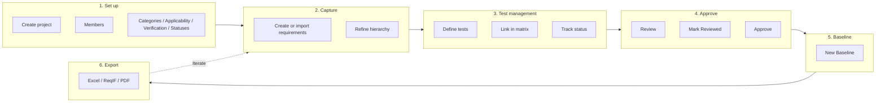

# Typical Workflow with ReqMan

This document describes a **typical end-to-end workflow** for using ReqMan: from project setup through requirements, **test management**, traceability, approval, baselines, and export. For detailed steps on each screen, see the [User Manual](UserManual.md), in particular [Test Management](UserManual.md#5-test-management) and [Traceability Matrix](UserManual.md#6-traceability-matrix).

---

## Overview

A common ReqMan workflow follows this sequence:

1. **Set up the project** and configuration (categories, applicability, verification, requirement and **test statuses**).
2. **Capture requirements** (create, optionally import, organize in hierarchy).
3. **Test management**: define tests, organize (e.g. hierarchy), link to requirements in the traceability matrix, and track test status (Pass/Fail/Pending) as tests are run.
4. **Review and approve** requirements (draft → reviewed → approved).
5. **Create baselines** for milestones or releases.
6. **Export** for audits, documentation, or tooling (requirements Excel, **tests Excel**, matrix Excel/CSV, ReqIF, PDF).

You can adapt the order (e.g. import requirements first, then configure categories) or iterate (add requirements and tests over time, update test status as you execute tests).

### Workflow diagram

---

## 1. Set Up the Project

- **Create the project** (Admin: **Projects → New Project**). Enter name and description.
- **Add project members** (**Members**): assign users and roles (e.g. owner, manager) so the right people can approve requirements and manage the project.
- **Configure project-level data** (Admin or project **Quick Actions**):
  - **Categories** (e.g. Safety, Performance, Usability) — used to tag requirements.
  - **Applicability** (e.g. Product A, Product B, All) — used for product line or scope.
  - **Verification methods** (e.g. Test, Analysis, Review, Inspection) — used to state how each requirement will be verified.
  - **Requirement statuses** (e.g. Draft, Accepted, Rejected) — lifecycle of requirements.
  - **Test statuses** (e.g. Pass, Fail, Not Run, Blocked) — for test execution.

Having these in place before bulk-adding requirements keeps data consistent and makes filtering and reporting more useful.

---

## 2. Capture Requirements

- **Create requirements** one by one: **Requirements → New Requirement**. Fill in title, statement, rationale, category, status, applicability, verification method(s), and optionally parent requirement (for hierarchy) and reviewer.
- **Or import** existing data:
  - **Import File**: upload Excel/CSV, map columns to ReqMan fields, then run the import (see [User Manual – Import](UserManual.md#10-import)).
  - **Import ReqIF**: upload ReqIF 1.2 XML to bring in requirements (and optionally comments) from another tool.
- **Refine**: use the **Requirements** list in card/table/tree view, filter by status/category/applicability, and **Edit** requirements to adjust content or set parent/child relationships.
- **Optional**: use **Semantic Search (AI)** (if enabled) to find related requirements or answer questions over the requirement set.

---

## 3. Test Management and Traceability

### 3.1 Define and Organize Tests

- **Create tests**: **Tests → New Test**. Enter name, description, **Source** (e.g. test file or document), **Status** (e.g. Pending, Not Run), and **Reference code** (e.g. TEST-PWR-001). Use **Parent test** to build a test hierarchy (suites, feature areas) if needed.
- **Manage tests** from the **Tests** list: filter by status, verification, category, search; switch between card and table view; view metrics (total tests, by status). Edit tests to change name, description, source, or parent.
- **Export tests**: From the Tests list or Reports, **Export Excel** (tests) to get all tests in `.xls` for external reporting or test management.

### 3.2 Link Tests to Requirements (Traceability)

- Open the **Traceability Matrix** for the project.
- **Add links** between requirements and tests (via the matrix UI: e.g. select requirement and test, then add link).
- The matrix shows **coverage**; requirements without tests and tests without requirements are visible in **Reports** (Coverage analysis) and on requirement detail pages (**Verified by** section, **Verification** panel).

### 3.3 Track Test Execution (Test Status)

- **Update test status** as tests are run (e.g. Pass, Fail, Pending, In Progress) from the **Test detail** page or, when available, inline from the tests list or matrix.
- Requirement detail pages then show the **Verification** panel: passed/failed/pending counts and overall pass rate for linked tests.
- **Reports** and the **Matrix** reflect current coverage and test results; filter the matrix by test status (e.g. show only Failed tests) for test management and defect follow-up.

---

## 4. Review and Approve Requirements

- **Review**: Authors and reviewers use the **Requirement detail** page to read the requirement, check linked tests and verification status, and use the **Comments** section to discuss.
- **Mark as Reviewed**: A project owner/manager uses **Mark as Reviewed** on the requirement (with confirmation). This moves the requirement along the approval workflow.
- **Approve**: When the requirement is ready for release or baseline, a project owner/manager uses **Approve Requirement** (with confirmation). The requirement then shows as **Approved** with approver and date; editing it later creates a new **Draft** version.
- **Filter by approval**: On the Requirements list, use filters such as **Approved only** or **Not approved** to focus on what still needs review.

---

## 5. Create Baselines

- When the requirement set (and optionally approvals) are at a **milestone** (e.g. release or audit point), create a **baseline**:
  - **Baselines → New Baseline**. Enter name and optional description, then submit.
- The baseline is **immutable**: it stores the current requirement version for each requirement and the traceability matrix at that moment. You cannot edit or delete a baseline.
- Use baselines to:
  - **Export ReqIF** for that exact snapshot (e.g. for auditors or downstream tools).
  - **Compare** later: open the baseline and use **Diff vs current** on individual requirements to see what changed since that snapshot.

---

## 6. Export for Audits and Documentation

- **Requirements**: From **Requirements** or **Reports**, **Export Excel** to get all requirements (and a Comments sheet) in `.xls`.
- **Tests** (test management): From **Tests** list or **Reports**, **Export Excel** (tests) to get all tests in `.xls` (name, description, source, status, reference code, etc.).
- **Traceability matrix**: From **Matrix**, **Export Excel** (or CSV) for the requirement–test mapping; optionally filter by test status before export.
- **ReqIF**:
  - **Current project**: **Export → ReqIF (current)** for the latest state.
  - **From a baseline**: Open the baseline and use **Export ReqIF**, or **Export → ReqIF (from baseline…)** and select the baseline — use this for audits or release packages.
- **Reports**: From **Reports**, use **Generate PDF Report** or **Download requirements (PDF)** for human-readable summaries, coverage, and test-related metrics.

---

## Iteration and Maintenance

- **Ongoing**: Add or edit requirements and tests, update traceability, **run tests and update test status** (Pass/Fail/Pending), and add comments. Create new baselines at each major milestone.
- **Test management**: Use the Tests list and Matrix to track which tests are passing or failing; use Reports for coverage and test status distribution. Export tests to Excel when you need to share test data or integrate with other test tools.
- **After changes**: Traceability links may be marked **suspect** when a requirement or test changes; review and **Clear suspect** from the matrix when the link is still valid (user and timestamp are recorded).
- **History**: Use **Version history** on requirements and **Diff** (between versions or baseline vs current) to see what changed and when.

For detailed instructions on each action, see the [User Manual](UserManual.md), including [Test Management](UserManual.md#5-test-management).
