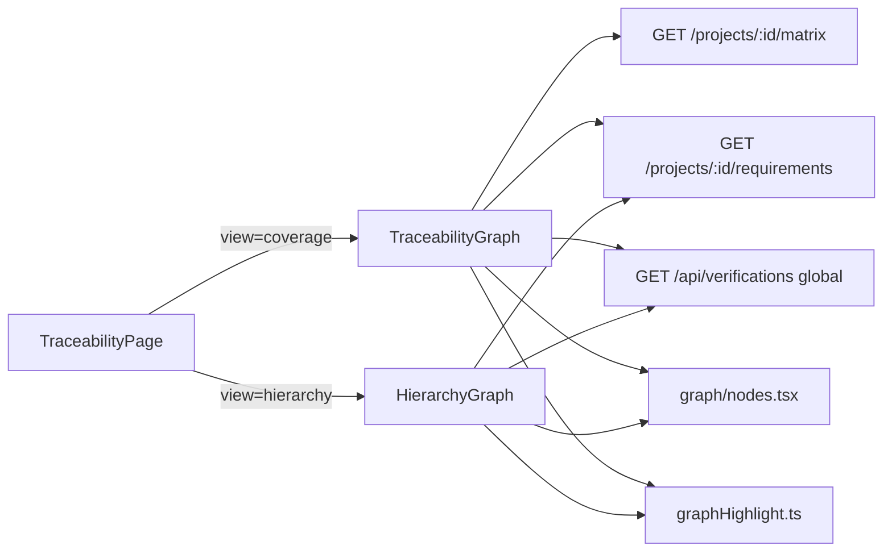

# Spec Compliance Audit — Traceability Hierarchy Graph

**Branch:** `feat/traceability-hierarchy-graph`  
**Auditor:** Warden (Spec Compliance Auditor, `.cursor/agents/auditor.md`)  
**Date:** 2026-05-26  
**Method:** Cross-reference of implementation against `docs/`, `README.md`, `INSTALL.md`, `frontend/README.md`, `docs/architecture/ui/requirements-dag-view.md`, user manual, HTTP API surface, and existing tests.

---

## Executive verdict: **PASS WITH DEVIATIONS**

The traceability **Hierarchy** graph, **Coverage** graph enhancements, cache freshness fix, and Docker nginx template hardening are substantively aligned with in-app Help (`HelpPage.tsx`) and README’s general matrix/graph claims. **No hard spec violations** were found for this feature scope.

Documentation gaps, UX/performance deviations, and test holes remain. The separate **Requirements DAG view** spec (`docs/architecture/ui/requirements-dag-view.md`) is **not implemented** on this branch; treat as a different deliverable unless explicitly in scope.

---

## Inspection scope

| Area | Files / artifacts reviewed |
|------|---------------------------|
| Hierarchy graph | `frontend/src/components/HierarchyGraph.tsx`, `HierarchyGraph.test.tsx` |
| Coverage graph | `frontend/src/components/TraceabilityGraph.tsx` |
| Shared graph UI | `frontend/src/components/graph/nodes.tsx`, `frontend/src/utils/graphHighlight.ts`, `graphHighlight.test.ts`, `frontend/src/index.css` |
| Page integration | `frontend/src/pages/TraceabilityPage.tsx`, `frontend/src/pages/HelpPage.tsx` |
| API integration | `frontend/src/api/requirements.ts`, `verifications.ts`, `marreq-core/src/api/requirements.rs`, `verifications.rs` |
| Cache | `marreq-core/src/repository/cache_middleware.rs` (+ unit test `test_requirements_repository_flows`) |
| Docker / docs | `docker/frontend/Dockerfile`, `nginx.conf.template`, deleted `nginx.conf`, `README.md`, `INSTALL.md`, `frontend/README.md` |
| Spec corpus | `docs/architecture/ui/requirements-dag-view.md`, `docs/user-manual/user-manual.md`, `docs/developer/openapi.yaml` (partial), `docs/developer/http-api-contract.md` |

**Tests executed during audit:**

- `vitest` — 17/17 passed (`graphHighlight.test.ts`, `HierarchyGraph.test.tsx`)
- `cargo test -p marreq-core --lib test_requirements_repository_flows` — passed

---

## Summary counts

| Category | Count |
|----------|------:|
| **VIOLATION** | 0 |
| **DEVIATION** | 8 |
| **AMBIGUITY** | 3 |
| **SUGGESTION** | 5 |
| **COMPLIANT** (notable) | 12 |

---

## Findings

| ID | Severity | Location | Spec reference | Evidence | Remediation |
|----|----------|----------|----------------|----------|-------------|
| **F-001** | DEVIATION | `frontend/README.md:21` | `frontend/README.md` routes table | Documents only “matrix graph”; no Coverage/Hierarchy subtabs, `?view=hierarchy`, or `?kind=` | Update `frontend/README.md` to match `TraceabilityPage.tsx` and `HelpPage.tsx` |
| **F-002** | DEVIATION | `docs/user-manual/user-manual.md` §6 | User manual traceability section | Manual describes matrix/table workflow; no SPA graph Coverage/Hierarchy subtabs (unlike `HelpPage.tsx`) | Add §6 subsection or link to Help for graph views |
| **F-003** | DEVIATION | `HierarchyGraph.tsx:50-57`, `119-127` | User manual §5.6 “tree views (if available)” | Graph includes only entities in **parent edges**. Root requirements/verifications with no children never appear; project with only roots shows empty state | Document as “linked hierarchy only” or include orphan roots as nodes |
| **F-004** | DEVIATION | `HierarchyGraph.tsx:212-214`, `TraceabilityGraph.tsx:142-144`, `nodes.tsx:21-78` | `requirements-dag-view.md` UX; SPA table pattern | Node click only sets `selectedNodeId` for highlight; no navigation to requirement/verification detail | Add link/`useNavigate` on reference code or double-click; document behavior |
| **F-005** | DEVIATION | `HierarchyGraph.tsx:158-163`, `TraceabilityGraph.tsx:102-107` | `README.md:206` — `GET /projects/{id}/verifications` | Both graphs call `listVerifications()` → `GET /api/verifications` (all projects), then filter client-side | Add `listVerificationsByProject(projectId)` using project-scoped endpoint |
| **F-006** | DEVIATION | `HierarchyGraph.tsx:71-72`, `88-89` | UX: stable graph layout | Node Y positions from `Set` iteration order — **non-deterministic** across reloads | Sort ids before layout (e.g. `Array.from(reqIds).sort((a,b)=>a-b)`) |
| **F-007** | DEVIATION | `nodes.tsx:22-23` | `requirements-dag-view.md` — status `tag_color` | Status bar uses `approval_state` regex, not requirement **status** `tag_color` from project config | Pass `status_id`/label/color from catalog API if status coloring is desired |
| **F-008** | DEVIATION | `TraceabilityGraph.tsx` | Branch quality / test recommendations | `buildGraph` has **no** unit tests; only hierarchy builder is tested | Export `buildGraph` or add `TraceabilityGraph.test.tsx` |
| **A-001** | AMBIGUITY | Branch vs `docs/architecture/ui/requirements-dag-view.md` | DAG spec acceptance criteria | Branch delivers React Flow hierarchy on **`/traceability`**, not requirements DAG on requirements page | Confirm DAG spec is **out of scope** for this branch |
| **A-002** | AMBIGUITY | `TraceabilityPage.tsx` vs `HierarchyGraph.tsx` | URL param naming | `?view=hierarchy` and `?kind=reqs\|vers` can coexist but undocumented in README | Document combined query params in Help + README |
| **A-003** | AMBIGUITY | `cache_middleware.rs:139-142` | README caching strategy | `get_requirements_by_project` bypasses cache; `get_requirements_all` still cached 300s | Document: bulk imports may stale **global** requirement list until TTL |
| **S-001** | SUGGESTION | `HierarchyGraph.tsx` + `TraceabilityGraph.tsx` | DRY | ~40 lines duplicate node construction in `buildGraph` vs `buildHierarchyGraph` | Extract `buildRequirementNode` / `buildVerificationNode` in `graph/nodes.tsx` |
| **S-002** | SUGGESTION | `HierarchyGraph.tsx:104-130` | DAG integrity | No cycle detection; cyclic parent links render as cycles | Optional backend validation or frontend cycle warning |
| **S-003** | SUGGESTION | `TraceabilityPage.tsx:31-38` | URL hygiene | Switching to Coverage leaves `?kind=` in URL | Clear `kind` when `view !== 'hierarchy'` |
| **S-004** | SUGGESTION | Large projects | Performance | Full lists + full graph in memory; no pagination/virtualization | Monitor with seed scripts; consider lazy expand later |
| **S-005** | SUGGESTION | `graphHighlight.ts` | Test gap | No test for `connectedComponentNodeIds` when start id missing from edges | Add edge-case test if isolated nodes are shown (F-003) |

### Compliant items (selected)

| ID | Location | Notes |
|----|----------|-------|
| **C-001** | `TraceabilityPage.tsx:63-78` | Coverage / Hierarchy subtabs; `?view=hierarchy` persistence |
| **C-002** | `HierarchyGraph.tsx:265-309` | Requirements / Verifications / Both filter; `?kind=` URL sync |
| **C-003** | `HierarchyGraph.tsx:106-128` | Multi-parent edges from `parent_requirement_ids`; legacy `parent_id` fallback |
| **C-004** | `HierarchyGraph.test.tsx` | 10 tests: multi-parent, kind filter, edge styles, orphan parent placeholder |
| **C-005** | `TraceabilityGraph.tsx:76-85` | Suspect matrix links: animated, coral stroke `#f28b82` |
| **C-006** | `graphHighlight.ts` + both graphs | Shared connected-component dimming; `index.css` selected node |
| **C-007** | `cache_middleware.rs:139-142` | Project requirement list always hits DB after bulk SQL seed |
| **C-008** | `docker/frontend/` | `NGINX_ENVSUBST_FILTER=^MARREQ_`; `$api_upstream` avoids envsubst mangling |
| **C-009–C-012** | `README.md`, `INSTALL.md`, `HelpPage.tsx`, `nodes.tsx` | Install pointer, devops matrix, in-app help accuracy, shared layout constants |

---

## Architecture assessment

### Integration pattern

**Strengths**

- Clear separation: **Coverage** = matrix bipartite graph; **Hierarchy** = parent forests (req + ver).
- Shared node types and highlight utilities reduce duplication.
- URL-driven state (`view`, `kind`) matches existing SPA patterns.
- Backend exposes `parent_requirement_ids` on project requirements — hierarchy graph uses the correct contract.

**Weaknesses**

- Data loading uses global verifications API despite documented project-scoped endpoint (F-005).
- Simple two-column stack layout, not hierarchical layout (acceptable for MVP; differs from DAG spec).
- No shared graph shell — loading/error/empty/ReactFlow props duplicated between graph components (~60 lines).
- Cache bypass for project lists is correct; global list staleness after bulk SQL unchanged (A-003).

**Coupling:** Low between `TraceabilityGraph` and `HierarchyGraph`; weak link from graph nodes to entity detail routes (F-004).

---

## Test coverage assessment

| Component | Unit tests | Gap |
|-----------|------------|-----|
| `buildHierarchyGraph` | **10 tests** — strong | — |
| `graphHighlight` | **7 tests** — adequate | Isolated-node edge case (S-005) |
| `buildGraph` / `TraceabilityGraph` | **None** | Suspect edges, empty matrix, highlight wiring (F-008) |
| `TraceabilityPage` tabs | None | URL `view`/`kind` behavior |
| `cache_middleware` `get_requirements_by_project` | Updated in `test_requirements_repository_flows` | Adequate for this change |
| Docker nginx template | None | Config-only; manual/compose acceptable |

---

## Acceptance criteria (binary)

Derived from `HelpPage.tsx` and README graph claims:

| # | Criterion | Met? |
|---|-----------|------|
| AC-1 | Traceability page offers **Coverage** and **Hierarchy** subtabs | **YES** |
| AC-2 | Coverage graph shows requirement ↔ verification links | **YES** |
| AC-3 | Suspect links visually distinct (coral / animated) | **YES** |
| AC-4 | Hierarchy shows req parent links (solid blue) and ver parent links (dashed green) | **YES** |
| AC-5 | Hierarchy filter Requirements / Verifications / Both | **YES** |
| AC-6 | Filter persisted in URL (`?kind=`) | **YES** |
| AC-7 | Hierarchy view persisted in URL (`?view=hierarchy`) | **YES** |
| AC-8 | Multi-parent requirements via `parent_requirement_ids` | **YES** |
| AC-9 | Click node highlights connected component | **YES** |
| AC-10 | User manual / frontend README document graph hierarchy | **NO** (F-001, F-002) |
| AC-11 | Graph navigates to entity detail | **NO** (F-004) |
| AC-12 | Requirements DAG view spec (`requirements-dag-view.md`) | **NO** — out of scope unless ruled in (A-001) |
| AC-13 | Project requirement list fresh after bulk SQL seed | **YES** |
| AC-14 | Docker frontend proxies `/api/` with correct upstream env substitution | **YES** |

**Score:** 10/14 met for this branch’s implied scope; 2 out-of-scope (DAG); 2 documentation/UX gaps.

---

## Security and performance — cache middleware

**Change:** `get_requirements_by_project` no longer uses read-through cache (`cache_middleware.rs`).

| Dimension | Finding |
|-----------|---------|
| **Security** | No regression. Bypass does not skip auth. |
| **Correctness** | Improvement for bulk SQL / admin imports bypassing invalidation. |
| **Performance** | Trade-off: extra DB read per project requirements list (dashboard, tables, both graphs). |

**Verdict:** Compliant with operational intent.

---

## Prioritized action list

### P0 — before merge (documentation / user-visible correctness)

1. **F-001 / F-002:** Update `frontend/README.md` and user manual (or cross-link Help) for Coverage/Hierarchy graph and URL params.
2. **F-003:** Decide product behavior for root-only hierarchies; show roots or document empty-state semantics in Help.

### P1 — quality / performance

3. **F-005:** Use `GET /api/projects/{project_id}/verifications` from both graphs.
4. **F-006:** Stabilize node ordering (sort ids before layout).
5. **F-008:** Add `TraceabilityGraph` / `buildGraph` unit tests.

### P2 — UX polish

6. **F-004:** Node click → navigate to requirement/verification detail (match list behavior).
7. **S-003:** Strip `kind` from URL when leaving Hierarchy subtab.
8. **S-001:** Extract shared node builder.

### P3 — clarify with product owner

9. **A-001:** Confirm `requirements-dag-view.md` is not expected on this branch (separate ticket).

---

## Closing

Implementation on `feat/traceability-hierarchy-graph` delivers the **Traceability → Hierarchy** feature described in in-app Help, with sound API alignment for multi-parent requirements, a justified cache freshness fix, and defensible Docker nginx changes. Documentation outside Help lags the product; global verification fetching and missing detail navigation are the principal engineering deviations.

**Merge recommendation:** Acceptable once P0 documentation items are addressed or explicitly waived.

**Stale after:** 2026-06-02
