# Marreq User Manual

**Requirement Manager (Marreq)** is a web-based requirements and test management system. This manual describes how to use the application from the end-user perspective.

**IBM DOORS users:** See **[Migrating from DOORS to Marreq](doors-to-marreq-migration.md)** for concept mapping, workflow comparison, and migration steps.

For a **typical end-to-end workflow** (project setup → requirements → tests → traceability → approval → baselines → export), see **[Typical Workflow with Marreq](workflow.md)**.

---

## Table of Contents

1. [Introduction](#1-introduction)
2. [Getting Started](#2-getting-started)
3. [Projects](#3-projects)
4. [Requirements](#4-requirements)
5. [Test Management (Verifications)](#5-test-management-verifications)
6. [Traceability Matrix](#6-traceability-matrix)
7. [Baselines](#7-baselines)
8. [Categories, Applicability & Verification](#8-categories-applicability--verification)
9. [Reports & Export](#9-reports--export)
10. [Import](#10-import)
11. [Project Members](#11-project-members)
12. [Profile & Account](#12-profile--account)
13. [Administration](#13-administration)
14. [Tips & Shortcuts](#14-tips--shortcuts)

---

## 1. Introduction

Marreq helps you:

- **Manage requirements** in a hierarchy, with version history, comments, and approval workflow
- **Manage tests** — create and organize tests (including hierarchy), track test status (e.g. Pass/Fail/Pending), link tests to requirements, and see coverage in reports and on requirement pages
- **View and export** traceability matrices and reports
- **Create immutable baselines** for audits or releases
- **Import/export** via Excel, ReqIF 1.2, and JSON project bundles

Data is organized by **projects**. Each project has its own requirements, tests, categories, applicability options, and baselines. You must be logged in to use the application.

See **[Typical Workflow with Marreq](workflow.md)** for a step-by-step workflow from project setup through baselines and export.

---

## 2. Getting Started

### 2.1 Logging In

1. Open the application in your browser (e.g. **http://localhost:8000**).
2. You will see the **Welcome to Marreq** login page.
3. Enter your **Username** and **Password**.
4. Click **Sign In**.

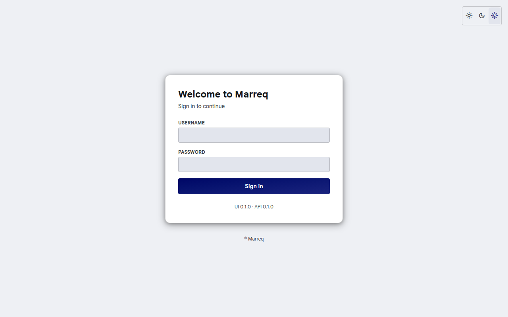

If you use a demo setup, typical users include `alice`, `dr_smith`, `eng_jones`, `tech_lee`, `qa_wilson`, and `admin`; the default password is `ChangeMe123!` unless your administrator changed it.

- **Theme**: Use the sun/moon toggle on the login card to switch between light and dark mode.
- **Logout**: Click your name in the top-right → **Logout**.

### 2.2 Home Page

After login you see the **Home** page:

- **Quick Actions**: Browse Projects, (if admin) Create Project, Admin Panel
- **Your Projects**: Grid of project cards; click a project to open its detail page
- **Recent Activity**: Placeholder for future activity feed

Use **Home** in the navbar to return here anytime.

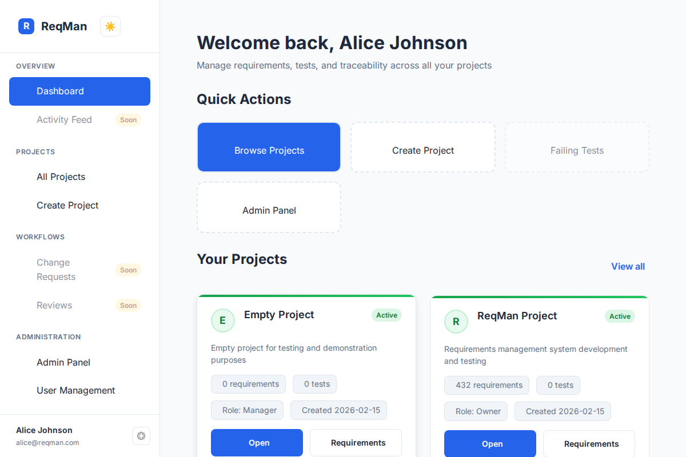

### 2.3 Navigation

Inside a project, the **sidebar** on the left holds the pages you work in every day:

| Item | Description |
| --- | --- |
| **Dashboard** | Counts and traceability health of the project |
| **Requirements** | The requirement list (table, list or graph view) |
| **Verifications** | Verifications (test cases, analyses, reviews) and their status |
| **Traceability** | Coverage graph, hierarchy, dependency structure matrix (DSM) and the requirement × verification **Matrix**, as tabs |
| **Baselines** | Immutable snapshots of the project |
| **Reports & exports** | Coverage reports and Excel, PDF, ReqIF/ReqIFZ and JSON downloads |

At the bottom of the sidebar:

- **Project settings**: one page with tabs for **General** (name, status, owner, group), **Members & reviewers**, **Catalog** (categories, applicability, statuses, custom fields, verification methods), **Storage**, **Notifications** and **Import**.
- **Help**, the **Collapse** button (the sidebar remembers whether it is collapsed) and the UI and API versions.

The top bar holds:

- the project name and the **Projects** menu: switch to another project (you stay on the same page), or open **Groups**, **New project** or **Import project bundle**;
- **Global search**, the theme switch (light, dark, match system) and notifications;
- the **Create** button: create a requirement or verification, or **Import**;
- the **user menu** (avatar): Account settings, **Administration** (instance administrators only, see [§13](#13-administration)), Change password and Sign out.

On a narrow screen the sidebar is hidden; open it with the **☰** button in the top bar.

Older links keep working: `/<project>/matrix` opens the Matrix tab, `/<project>/import`, `/<project>/members` and `/<project>/catalog/…` open the matching Project settings tab, and `/<project>/admin/…` opens the Administration area.

---

## 3. Projects

### 3.1 Viewing Projects

- **All Projects**: **Projects → All Projects** or open **Home** and use “View all” under Your Projects.
- **Project detail**: Click a project card to open **Project Detail** (`/<project-slug>`).

Project URLs use the project slug only (`/<project-slug>/dashboard`). Owner usernames and group names are not part of the path.

On the project detail page you see:

- Project name, status (e.g. active), description
- Created/Updated dates and owner
- **Quick Actions**: View Requirements, View Verifications, View Matrix, Baselines, View Reports, View Members
- **Project Members** list with names, usernames, roles, and email

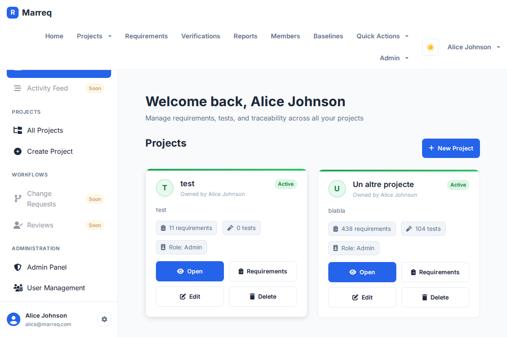

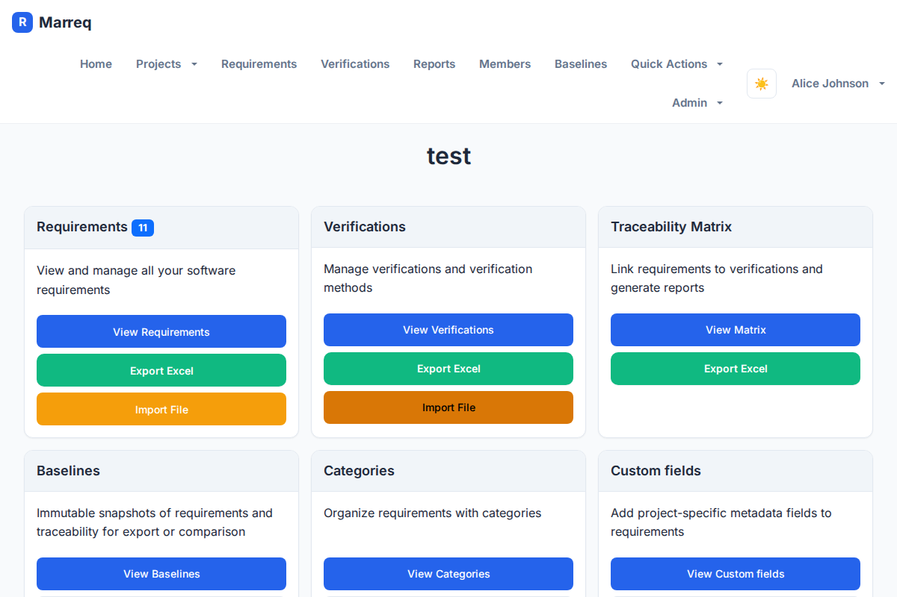

### 3.2 Creating a Project (Admin)

1. **Projects → New Project** or **Quick Actions → New Project**.
2. Enter **Name** (required), optional **Description**.
3. Submit the form.

You are typically taken to the new project or the project list.

### 3.3 Editing a Project

Open **Project settings** at the bottom of the sidebar. The **General** tab (`/<project-slug>/settings/general`) shows the project's properties:

- **Name** (2–100 characters) and **Description** (up to 1000 characters; leave empty to remove it).
- **Status**: Active, On hold, Completed or Cancelled.
- **Owner**: any member of the project.
- **Group**: the group the project belongs to, or *Personal (no group)*. The list shows the groups where you may manage projects. Moving a project needs that right in both the current and the new group.
- **URL**: the project's address (`/<project-slug>`). It stays the same when you rename the project, so existing links and bookmarks keep working.

Change the fields and select **Save changes**. The new name appears in the header, the sidebar and the project list right away, and the change is recorded in **System logs** with the old and new values. **Discard** resets the form.

Only project **Admins** and instance administrators can change these properties. Other members see them read-only.

### 3.4 Project Storage

Files attached to requirements and verifications ([§4.9](#49-attachments)) count toward the project's storage limit. **Project settings › Storage** shows:

- How much of the limit is used. Each file counts once, even when the same file is attached in several places.
- How much of that is taken by deleted files that baselines still keep ([§7.3](#73-viewing-a-baseline)).
- The largest file allowed and the file types that can be uploaded.

The defaults are **10 MB per file** and **500 MB per project**. The server administrator sets them with `MARREQ_ATTACHMENT_MAX_MB` and `MARREQ_PROJECT_STORAGE_QUOTA_MB`. Instance administrators can give a project its own limit in **Project settings › Storage**, or use **Reset to default** to go back to the server-wide value. The change is recorded in **System logs**. A limit below the current usage is allowed: it only blocks new uploads.

### 3.5 Deleting a Project

The **project owner** and instance administrators can delete a project. Open **Project settings › General** and select **Delete project…** in the **Danger zone** at the bottom of the page. Other members see who can delete the project instead.

Deleting a project **cannot be undone**. It removes everything in the project:

- requirements, with their versions, links and comments;
- verifications and the traceability matrix;
- baselines (including frozen ones) and saved views;
- attachments and their files (a file that another project also uses is kept);
- the catalog, custom fields, members, reviewers and storage settings.

To keep a copy, export a project bundle or a ReqIFZ archive from **Reports & exports** first ([§9](#9-reports--export)). To confirm, type the project's URL name (its slug, e.g. `satellite-demo`) and select **Delete project**. You are then taken to another project, or to the home page if you have none left.

Users are not deleted. The project's entries in **System logs** are kept, and a new entry records who deleted the project, its name and how many requirements, verifications, baselines and attachments it had.

---

## 4. Requirements

Requirements are the core artifact. Each requirement can have multiple **versions** (history), **comments**, and an **approval** state (draft → reviewed → approved). Requirements can be hierarchical (parent/child) and are linked to tests via the traceability matrix.

### 4.1 Requirements Views

- Open a project, then use **Requirements** in the nav or **View Requirements** on the project detail page.
- URL: `/<project-slug>/requirements`.

You can:

- Switch between three purpose-built views:
  - **Table** for dense scanning, comparison, column configuration, and inline editing.
  - **List** for reading and reviewing requirement statements with status, approval, category, hierarchy, verification method, author, and modification context.
  - **Graph** for exploring requirement hierarchy and traceability relationships.
- The List view is responsive for narrow screens. Its review cards use a fixed contextual layout, while the **Columns** control remains specific to Table.
- **Filter** by status, verification, category, applicability, approval (e.g. Approved only / Not approved), and custom filters.
- **Search** (and use **Semantic Search** if enabled).
- **Paginate** through results.
- **Create** a new requirement (button in header; admin/appropriate role).
- **Open** a requirement by clicking its title or reference to see the **Requirement detail** page.

Metrics (e.g. total count, by status) are shown at the top.

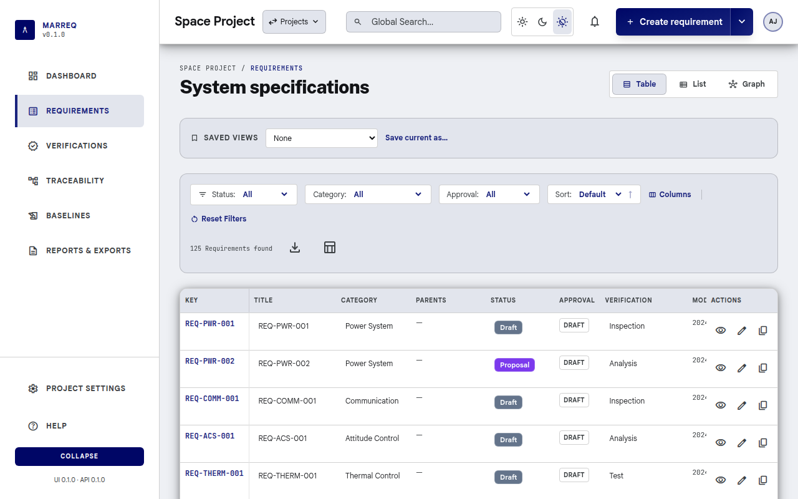

### 4.2 Requirement Detail Page

- URL: `/<project-slug>/requirements/<requirement_id>`.
- For a specific version: `/<project-slug>/requirements/<requirement_id>/versions/<version_id>`.
- Classic bookmarks `/<project-slug>/requirements/show/<requirement_id>` and `/<project-slug>/requirements/show/<requirement_id>/version/<version_id>` redirect to those SPA URLs.

On the detail page you see:

- **Approval badge**: Draft / Reviewed / Approved, and who approved and when.
- **Actions** (for **project reviewers**, or an administrator when no reviewers are configured): **Mark as Reviewed**, **Approve Requirement** (with confirmation).
- **Content**: Title, reference code, statement, rationale, category, status, applicability, verification methods, author, reviewer, dates.
- **Traceability**: Upstream/downstream requirements and **Verified by** — list of linked verifications with links to verification detail pages.
- **Verification** panel: pass/fail/pending counts and overall pass rate; list of linked verifications.
- **Version history**: List of versions with approval state; click a version to view that snapshot.
- **Comments**: Chronological list; form to add a comment (optional version reference). On approved versions, comments may be locked by policy (`LOCK_APPROVED_VERSION_COMMENTS`).
- **Custom metadata** (if the project uses custom fields).

**Editing an approved requirement**: Clicking **Edit** on an approved requirement shows a warning that editing will create a new **Draft** version; you can cancel or proceed.

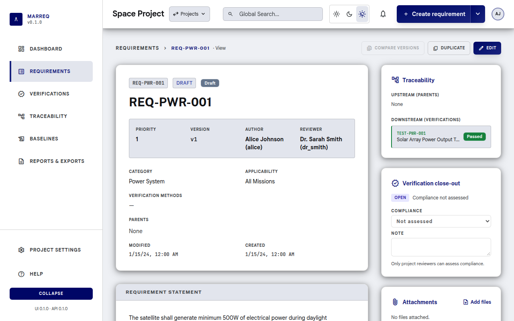

### 4.3 Creating a Requirement

1. From the project’s requirements list, click **New Requirement** (or **Quick Actions → New Requirement** when a project is selected).
2. URL: `/<project-slug>/requirements/new`.
3. Fill in:
   - **Title** (required)
   - **Reference** (optional; can be auto-generated)
   - **Statement** (required; shown as **Description** on the form, with the same formatting toolbar and preview as in [§4.4](#44-editing-a-requirement))
   - **Rationale** (optional)
   - **Category**, **Status**, **Verification methods**, **Applicability** (as configured for the project)
   - **Reviewer**, **Parent requirement** (optional)
   - Any **Custom fields** if present
4. Click **Save**.

You can optionally pass a parent or template via query parameters (`parent`, `template`).

### 4.4 Editing a Requirement

1. Open the requirement detail page.
2. Click **Edit**.
3. URL: `/<project-slug>/requirements/<requirement_id>/edit`.
4. Change title, statement, rationale, category, status, applicability, verification, reviewer, parent, and custom fields as needed.
5. Use **Save** to create a new version. **Cancel** returns to the detail view.

#### Formatting the statement

The statement editor has a formatting toolbar and a **Write / Preview** toggle. Statements are stored as a small, documented Markdown subset, so they stay readable as plain text in exports:

| You want | Type (or use the toolbar) | Shortcut |
| --- | --- | --- |
| **Bold** | `**text**` | Ctrl/Cmd+B |
| *Italic* | `*text*` or `_text_` | Ctrl/Cmd+I |
| `Code` | `` `text` `` | |
| Link | `[label](https://example.com)` (only `http`, `https`, and `mailto` links) | Ctrl/Cmd+K |
| Bulleted list | a line starting with `- ` (or `* `) | |
| Numbered list | lines starting with `1. `, `2. `, … (the first number sets the start) | |
| New paragraph | a blank line (a single line break stays a line break) | |

Anything else, such as headings, tables, or HTML, is shown literally. Put `\` before `*`, `_`, `` ` ``, `[` or `]` to show the character itself. **Preview** shows the statement exactly as it appears on the requirement page. The statement is limited to 2000 bytes including the formatting characters; the counter under the editor shows how much is used.

Formatting is shown on the requirement page, and version snapshots and review cards show the text without markers. ReqIF export writes the statement as XHTML so other tools keep the formatting, and ReqIF import turns XHTML lists, emphasis, and links back into this format (see [§9.4](#94-exporting-reqif) and [§10.2](#102-importing-reqif)). Excel and JSON exports contain the Markdown source.

### 4.5 Version History & Diff

- On the requirement detail page, the **Changelog** section lists all versions (newest first); each shows approval state. Click a version label (`v1`, `v2`, …) to open that version as a **read-only snapshot** (`/<project-slug>/requirements/<id>/versions/<version_id>`).
- A historical snapshot shows title, statement, rationale, metadata, custom fields, and approval as stored on that version. Edit, duplicate, and adding comments are hidden. Use **View current** to return to the latest version.
- Select **Compare versions** to compare any two saved versions. The latest version and its predecessor are selected by default.
- Use **Compare with previous** on a version-history row to open that adjacent pair directly.
- When an older approved snapshot exists, use **Compare with last approved** beside the approval state before reviewing the current draft.
- The comparison dialog shows removed, added, and unchanged title, statement, and justification text (line by line; statements are compared as their Markdown source, so each list item is its own line). It also compares status, category, applicability, verification methods, and custom fields.
- At least two saved versions are required. Version comparison is read-only and is available to anyone who can view the project requirements.

### 4.6 Comments

- On the requirement (or version) detail page, use the **Comments** section to read existing comments and add new ones.
- Comments are immutable once created; they can reference an optional requirement version.
- If the current version is approved and the system locks comments on approved versions, the add-comment form is hidden.

### 4.7 Duplicating a Requirement

- From the requirements list, detail, or edit page, select **Duplicate**.
- The create page opens with a new reference code and copied title, statement, rationale, catalog values, verification methods, custom fields, reviewer, and parent links.
- Review or change those values before selecting **Create duplicate**. The new requirement is independent: approval state, version history, comments, and traceability-matrix links are not copied.

### 4.8 Semantic Search (AI)

If your administrator has enabled semantic search (embeddings/RAG):

- Open the **Semantic Search (AI)** modal from the requirements list (e.g. search icon or **Ctrl+K**).
- Enter a natural-language question or search phrase; you can restrict by status, category, applicability, verification.
- Results show matching requirements; “AI Answer” may appear when using the RAG “ask” feature.
- Shortcuts: **Ctrl+K** open, **Enter** search, **Esc** close.

### 4.9 Attachments

Requirements and verifications can carry files, such as test reports, drawings, analysis spreadsheets or photos. The **Attachments** card is on the requirement view and edit pages (right column) and on the verification view and edit pages.

- **Download**: select a file name. Files are always downloaded; the browser never opens them inline.
- **Upload** (needs **Edit requirements** permission): use **Add files**, or drag files onto the drop area. You can pick several files at once.
- **Delete**: use the bin icon next to a file and confirm.

Allowed types are PDF, PNG, JPEG, GIF, WebP, Word, Excel and PowerPoint (`.docx`, `.xlsx`, `.pptx`), OpenDocument (`.odt`, `.ods`, `.odp`), ZIP, plain text (`.txt`, `.log`, `.md`), CSV, JSON and XML. The server checks the file's contents, not just its name: a file renamed to `.pdf` that is not a PDF is refused. Other types, including HTML, SVG and programs, are not accepted.

An upload is refused when the file is larger than the per-file limit, or when it would take the project over its storage limit ([§3.4](#34-project-storage)). The message says how much space is used. Uploads and deletions are recorded in **System logs**.

Attachments belong to the requirement, not to one version, so historical version snapshots do not show them. Baselines keep their own list ([§7.3](#73-viewing-a-baseline)). Deleting a requirement or verification also deletes its attachments.

---

## 5. Test Management (Verifications)

Test management in Marreq covers creating and organizing verifications (test cases), tracking execution status (e.g. Pass, Fail, Pending), and linking them to requirements for traceability and coverage. In the UI, the nav item and pages are named **Verifications**. Verifications are project-scoped and can be arranged in a **parent/child hierarchy**. Linking is done in the [Traceability Matrix](#6-traceability-matrix); once linked, requirement detail pages show a **Verified by** section and verification pass/fail summary.

### 5.1 Verifications List

- Open a project, then **Verifications** in the nav or **View Verifications** on the project detail page.
- URL: `/<project-slug>/verifications`.

You can:

- Switch between **Table** and **List** (card) view. The view and the filters are kept in the URL, so switching views, reloading, or sharing the link keeps them.
- See **status metrics** for the whole project above the list: the **Total**, one chip per verification status with its count (statuses with no verifications are dimmed; **Other** counts verifications whose status is not in the project's list), and a **Pass rate** ("X of Y passed") when the project has a status named *Passed*. Click a status chip to show only that status; click it again to clear the filter. The metrics always cover the whole project, not just the filtered rows.
- **Filter** by **Status** and **Method** (including *No method*), and **search** with the header search box (reference, title, description, source, or parent). **Reset Filters** clears status and method.
- **Paginate** through results (25, 50, or 100 rows per page; controls appear above and below the list when there is more than one page).
- Click **New Verification** to create a verification (admin/appropriate role).
- Click a verification to open its **Verification detail** page.

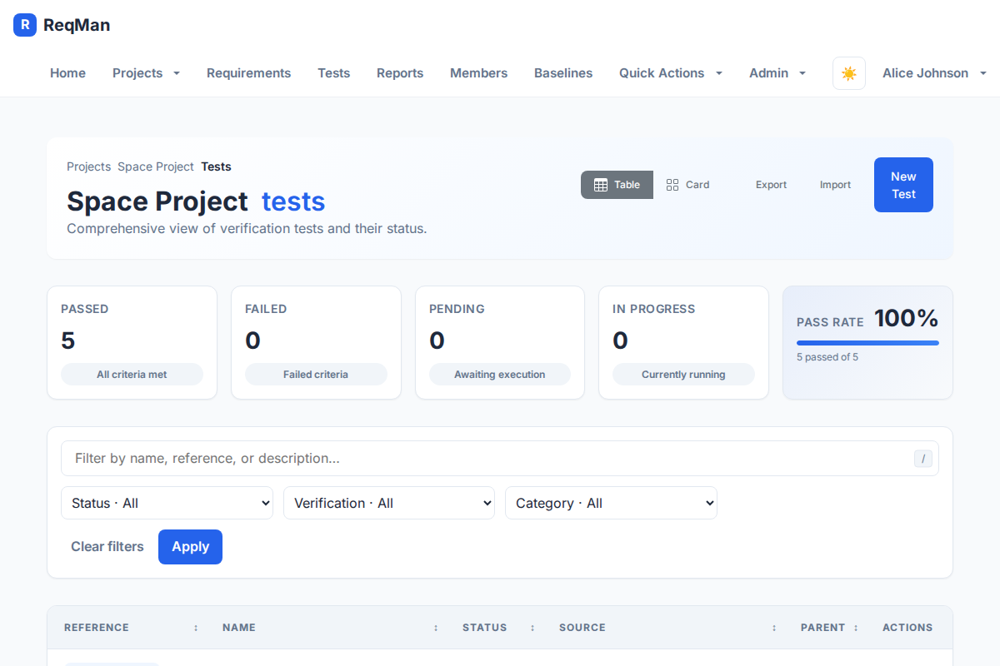

- **Update verification status** inline (e.g. set Passed after a lab run): click the status in the table or list. Only **project reviewers** with edit rights can change the status; other editors can still edit the title, method, and source inline.
- **Export** from the filter bar: **CSV** contains the rows currently shown (after filters and search); **Excel** contains every verification in the project (the same workbook as [§9.3 Exporting Verifications to Excel](#93-exporting-verifications-to-excel)).

### 5.2 Verification Detail Page

- URL: `/<project-slug>/verifications/<verification_id>`.

Shows: **Name**, **Description** (with its formatting), **Source** (e.g. test file or document reference), **Status**, **Reference code**, **Verification type**, **Parent verification** (if part of a hierarchy), and **which requirements this verification covers** (traceability links). From here you can **Edit** the verification (name, description, source, status, reference, method, parent) or **update status** (e.g. after running the test). Status updates feed into the requirement **Verification** panel and into [Reports](#9-reports--export) (coverage, pass rate).

### 5.2.1 Version history and diff

- The verification detail **Changelog** lists audit-log activity (creates and field updates).
- Select **Compare versions** to compare any two saved snapshots. The latest snapshot and its predecessor are selected by default.
- Snapshots are reconstructed from the audit log: each create or update becomes a version. If the first recorded change is an update, a “before recorded history” snapshot is included.
- The comparison dialog shows removed, added, and unchanged name, description, source, and reference text. It also compares status, verification type, and parent.
- At least two snapshots are required (create the verification, then edit and save). Comparison is read-only and is available to anyone who can view the project.

### 5.3 Creating a Verification

1. From the project’s verifications list, click **New Verification** (or **Quick Actions → New Verification**).
2. URL: `/<project-slug>/verifications/new`.
3. Enter **Name**, **Description**, **Source** (e.g. path to test script or doc), **Status** (e.g. Pending, Not Run), **Reference code** (optional; e.g. TEST-PWR-001), and **Parent verification** (optional, for hierarchy). The description has the same formatting toolbar, **Write / Preview** toggle, and syntax as requirement statements (see [Formatting the statement](#formatting-the-statement)), for example a numbered list of test steps.
4. Save.

After creation, link the verification to requirements in the [Traceability Matrix](#6-traceability-matrix).

### 5.4 Editing a Verification

1. Open the verification detail page.
2. Click **Edit**.
3. URL: `/<project-slug>/verifications/<verification_id>/edit`.
4. Update name, description, source, status, reference code, parent verification, or **verification method**; save. Changing the method keeps the same verification identity and matrix links.

Linking or unlinking verifications to/from requirements is done in the **Traceability Matrix** (add/remove links there).

### 5.5 Updating Verification Status

As tests are executed, update their status (e.g. Pass, Fail, Pending, In Progress) so that:

- Requirement detail pages show correct **Verification** counts (passed/failed/pending) and overall pass rate.
- **Reports** and **Matrix** reflect current coverage and test results.
- **Matrix** and **Reports** can be filtered by verification status (e.g. show only Failed).

Update status from the **Verification detail** page (Edit), **inline from the verifications list** (click the status; project reviewers only, see [§5.1](#51-verifications-list)), or from the matrix. Verification statuses are configured per project under [Verification statuses](#85-verification-statuses).

### 5.6 Verification Hierarchy

Verifications can have a **parent verification** (e.g. a test suite or feature area). Set the parent when creating or editing a verification. The verifications list and tree views (if available) reflect this hierarchy; reporting and traceability still work at the level of individual verifications linked to requirements.

### 5.7 Verification Control and Close-out

Marreq tracks how far each requirement's verification has gone, for the Verification Control Document (VCD).

**On a verification** (its detail page, **Verification control** card), anyone who can edit requirements records:

- **Level**: where it is verified, e.g. *Equipment*, *Subsystem* or *System*.
- **Stage**: when it is verified, e.g. *QUAL* (qualification) or *ACC* (acceptance).
- **Evidence**: the document that proves the result, e.g. a test report number.

Level and stage are free text. The fields suggest the values already used in the project, so the same terms are reused.

**On a requirement** (its detail page, **Verification close-out** card), a **project reviewer** records the **compliance** assessment: **C** (compliant), **PC** (partially compliant, e.g. accepted with a waiver) or **NC** (non-compliant), with an optional note such as the waiver or nonconformance number. Choosing **Not assessed** removes it. Each change is recorded in **System logs**.

The card shows whether the requirement is **Closed** or **Open**, and why:

| Situation | Close-out |
| --- | --- |
| No verification linked | Open: *No verification linked* |
| A linked verification failed | Open: *VER-x failed* |
| A linked verification has not passed yet | Open: *VER-x not run* or *in progress* |
| All linked verifications passed, no assessment | Open: *Compliance not assessed* |
| All passed, assessed NC | Open: *Non-compliant* (and the note) |
| All passed, assessed C or PC | **Closed** |

Whether a verification "passed" comes from the **outcome** of its status, set in **Project settings › Catalog › Verification statuses** ([§8](#8-categories-applicability--verification)).

---

## 6. Traceability Matrix

The traceability matrix is central to **test management** and coverage: it shows which requirements are linked to which tests. You add or remove links here; requirement detail pages and reports then show verification status and coverage. The matrix can display test status, requirement status, category, applicability, and suspect links.

### 6.1 Opening the Matrix

- From the project: **Traceability** in the sidebar, then the **Matrix** tab (next to Coverage, Hierarchy and DSM).
- URL: `/<project-slug>/traceability?view=matrix` (the old `/<project-slug>/matrix` still works). Filters and sorting are kept in the URL, so they survive switching tabs.

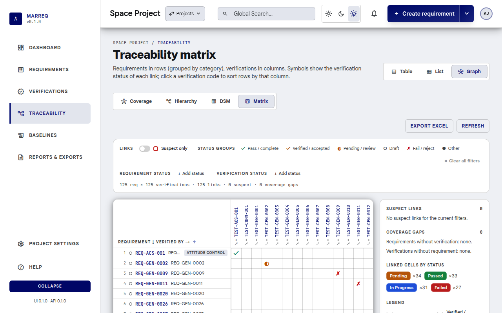

### 6.2 Using the Matrix

The matrix uses the same layout as the dependency structure matrix (§6.4).

- **Grid:** requirements are rows and verifications are columns. The header rows stay visible while you scroll in either direction. A symbol in a cell means the requirement is verified by that verification, and shows the verification's status: **✓** pass/complete, **✓** verified/accepted, **◐** pending/review, **○** draft, **✗** fail/reject, **●** other (in the status colour). Empty cells are not linked.
- **Rows:** grouped by **category** (separated by a line, with the category name on the first row), in reference-code order. Click the corner header to reverse the order, and drag its right edge to resize the requirement column.
- **Sort by a verification:** click a verification's code in the column header to list the requirements it verifies first (suspect links first among them). Click again to reverse. The **↗** below the code opens the verification.
- **Hover** a requirement, a verification or a cell to see its details: title, category, status, approval state, link counts and, for suspect links, the reason and date.
- **Filters** (above the matrix, together with the global search):
  - **Suspect only:** a switch that keeps only suspect links.
  - **Status groups:** buttons for the high-level groups (pass, verified, pending, draft, fail, other). Select one or more to show only verifications in those groups.
  - **Requirement status** and **Verification status:** each selected status appears as a chip in its own colour. Select **×** on a chip to remove it. **Add status** opens a list of the project's statuses; tick one or several, then press Escape or click outside the list to close it. With the keyboard, use the arrow keys, Home and End to move, and Space or Enter to tick.
  - **Clear all filters** removes every filter at once and keeps the sort.
  - Filters and sort are kept in the page URL, so a filtered view can be bookmarked or shared.
- **Suspect links:** shown with a red frame. The side panel lists them.
  - Click a suspect link in the panel to scroll the matrix to its cell.
  - **Review** compares the requirement version that triggered the flag with its preceding version.
  - **Clear** removes the flag; the system records the user and timestamp.
- **Coverage gaps:** the side panel lists requirements without any verification and verifications without any requirement. Click one to scroll to its row or column.
- **Linked cells by status** in the side panel counts the visible links per verification status.

### 6.3 Exporting the Matrix

From **Reports**, download:

- **Matrix (.xlsx)**: coverage grid (requirements as rows, verifications as columns, `Yes` where linked). For review, not for re-import.
- **Matrix links (.xlsx)**: two columns (`requirement_code`, `verification_code`), one row per link. Upload this file on **Import** as **Matrix links** (same project is a no-op for existing pairs; use it to copy links into another project that already has those codes).

### 6.4 Dependency Structure Matrix (DSM)

The DSM shows how **requirements depend on each other**, for a whole project on one screen. It complements the requirement × verification matrix above.

- **Open it:** **Traceability** → **DSM** tab (URL `/<project-slug>/traceability?view=dsm`).
- **How to read it:** rows and columns are the same requirements in the same order, and the dark diagonal is the requirement itself. A mark in row *i*, column *j* means requirement *i*'s current version links to requirement *j*. The letter shows the link type: **D** derives from, **R** refines, **P** depends on, **S** satisfies, **~** relates to. Several letters mean several links between the same pair.
- **Link types:** toggle the chips to choose which relations are drawn. *Relates to* is off by default.
- **Order:**
  - **Hierarchy** (default) groups requirements by category, drawn as framed blocks along the diagonal, and nests children under their parent.
  - **Partition** puts dependencies before the requirements that depend on them. Ordinary dependencies then fall below the diagonal, and marks above it point to feedback worth reviewing.
- **Scope:** limit the matrix to one **category** or to the **subtree** of one requirement. Links to requirements outside the scope are counted in the summary line but not drawn.
- **Loops:** requirements that depend on each other in a circle (across any link types) are tinted amber and listed in the side panel with the loop path. Hover a loop in the panel to highlight its cells. Loops are rare, because Marreq already rejects circular links between versions, but they can appear when a link points to an older version of a requirement.
- **Upstream changed:** a red frame marks an approved requirement whose target was edited *after* that approval. Review whether the approved requirement still holds. The side panel lists all of them.
- **Details:** hover a cell to see the link types, the target title, loop membership and any upstream change. Click a mark, or a code in the row header, to open the requirement.
- **Export Excel:** downloads the matrix with the current filters (sheets *DSM*, *Loops* and *Legend*), for offline design reviews.

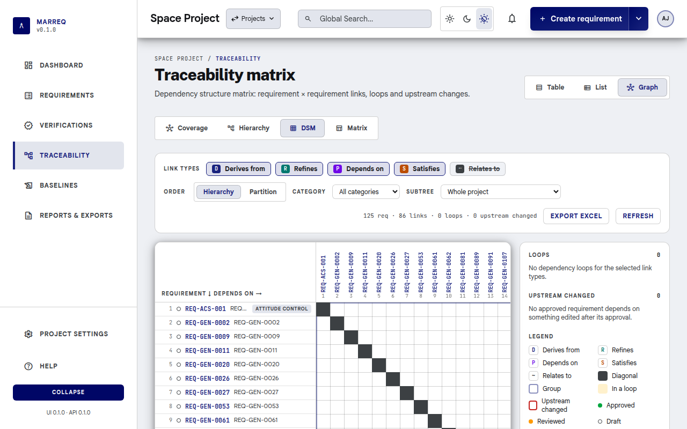

---

## 7. Baselines

Baselines are **immutable** point-in-time snapshots of requirement versions and traceability for a project. Use them for audits, releases, or comparison.

### 7.1 Baselines List

- From the project: **Baselines** in the nav or **View Baselines** on the project detail page.
- URL: `/<project-slug>/baselines`.

You see all baselines for the project and can click **New Baseline** to create one.

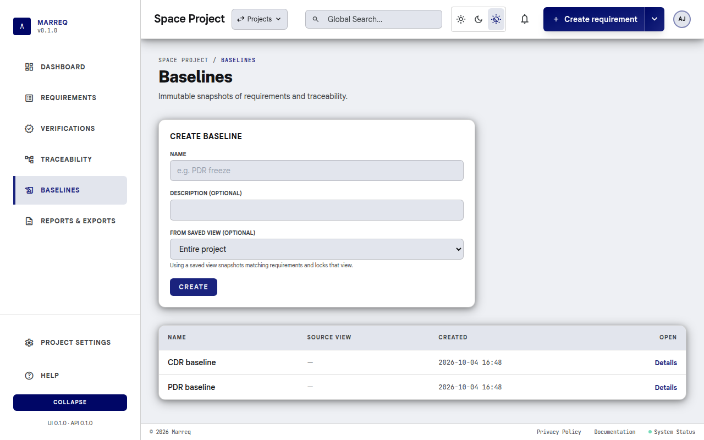

### 7.2 Creating a Baseline

1. Click **New Baseline**.
2. URL: `/<project-slug>/baselines/new`.
3. Enter **Name** and optional **Description**.
4. Submit.

The system captures the **current** requirement version for each requirement, the **current** traceability matrix (requirement–verification links), and a **snapshot of verification statuses** at that moment. The baseline cannot be edited or deleted.

### 7.3 Viewing a Baseline

- Click a baseline in the list.
- URL: `/<project-slug>/baselines/<baseline_id>`.

You see:

- **Metadata**: Name, description, created date, created by.
- **Requirements in this baseline**: Table with requirement ID, reference, title; links to requirement (and version) pages.
- **Traceability**: List of requirement–verification pairs (with references like REQ-PWR-001, TEST-PWR-001). A **Verifications** snapshot is also stored so you can see which verification status (e.g. Pass/Fail) each linked verification had at baseline time.
- **Diff vs current**: For each requirement that has changed since the baseline, a **Diff vs current** action opens a **diff modal** comparing the baseline snapshot to the current version. If the requirement is unchanged, this action is hidden.
- **Diff between baselines**: Select another baseline and use **Diff baselines** on requirements whose frozen versions differ.
- **Verification diff vs current**: Verification rows compare the frozen name, description, source, reference, status, type, and parent with the current verification.
- **Attachments**: The files attached to the included requirements and to the verifications when the baseline was taken. Files deleted since stay downloadable here and are marked *deleted since*; they keep counting toward the project's storage until the baseline no longer needs them.
- **Export ReqIF**: Button to export **this baseline** as ReqIF 1.2 XML.

### 7.4 Exporting a Baseline as ReqIF

- On the baseline detail page: **Export ReqIF**.
- The downloaded file is the ReqIF 1.2 snapshot of that baseline. Project-wide current-state ReqIF is available from **Reports → Requirements (.reqif)**.

---

## 8. Categories, Applicability & Verification

These are **project-level** configuration entities used to classify and manage requirements and verifications. They are edited under **Project settings › Catalog** (`/<project-slug>/settings/catalog`), one tab each; you need **Edit requirements** permission to change them.

| Tab | What it holds | URL |
| --- | --- | --- |
| **Categories** | Groups of requirements (e.g. “Safety”, “Performance”) | `…/settings/catalog/categories` |
| **Applicability** | Product lines, system types or scope (e.g. “Product A”, “All”) | `…/settings/catalog/applicability` |
| **Requirement statuses** | e.g. Draft, Accepted, Rejected | `…/settings/catalog/requirement-statuses` |
| **Verification statuses** | e.g. Pass, Fail, Not run | `…/settings/catalog/verification-statuses` |
| **Custom fields** | Extra requirement fields and their types | `…/settings/catalog/custom-fields` |
| **Verification methods** | How requirements are verified (e.g. Test, Analysis, Review) | `…/settings/catalog/verification-methods` |

Each tab lists the entries with their title, description and tag, and lets you add, edit and delete them. The old `/<project-slug>/catalog/…` URLs redirect here.

Each verification status also has an **outcome**: *Passed*, *Failed*, *In progress* or *Not run*. The outcome tells Marreq what the status means for requirement close-out ([§5.7](#57-verification-control-and-close-out)). New statuses get it from their title (a status called "Passed" is *Passed*; an unknown title is *Not run*), and you can change it for your own statuses.

---

## 9. Reports & Export

### 9.1 Reports Page

- From the project: **Reports** in the nav or **View Reports** on the project detail page.
- URL: `/<project-slug>/reports`.

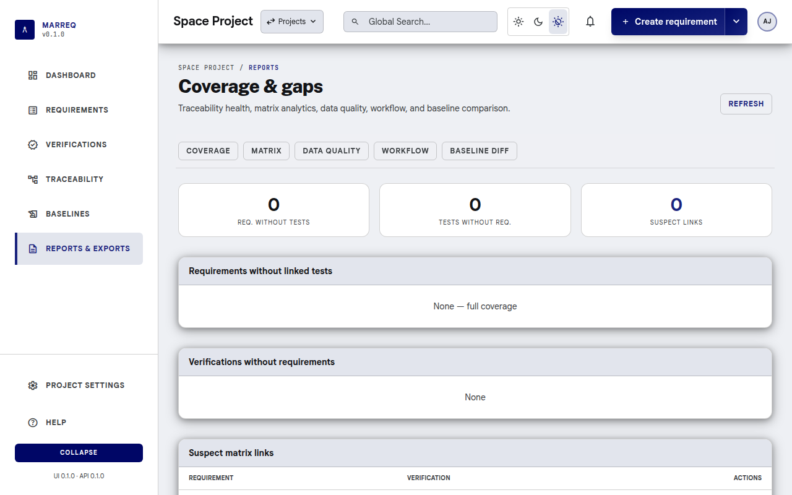

You see:

- **Executive summary**: Total requirements, total verifications, coverage %, average verifications per requirement.
- **Coverage analysis**: Covered vs uncovered requirements, requirements without verifications, verifications without requirements, suspect links. Verification status distribution (e.g. Passed/Failed/Pending) may be shown.
- **Generate PDF Report** (*Report PDF*): the **Traceability & coverage report**: cover page, contents, coverage figures, coverage by reference-code prefix, requirements without verification, verifications without requirements, suspect links and data quality.
- **Download requirements (PDF)**: Link to requirements-only PDF.
- **Excel downloads**: Requirements, Verifications, **Matrix** (coverage grid), and **Matrix links** (two code columns for import).

### 9.2 Exporting Requirements to Excel

- From the **Requirements** list: **Export Excel** (or use the project-level export link).
- URL: `/<project-slug>/requirements.xls`.
- Downloads an `.xls` file with requirements and all configured fields (including a **Comments** sheet when applicable).

### 9.3 Exporting Verifications to Excel

- From the **Verifications** list or reports: use **Export Excel** (verifications) when available to download all project verifications for test management or external reporting.
- URL: `/<project-slug>/verifications.xls`.
- The export includes verification fields (name, description, source, status, reference code, etc.) so you can share or analyze test data outside Marreq.

### 9.4 Exporting ReqIF

- **Current project**: open **Reports** and download **Requirements (.reqif)** for the live requirement set (comments are included as Remarks when present).
- Attachment file names are listed in an **Attachments** attribute; the files themselves are not included in a `.reqif` file.
- **With the files**: download **Requirements with files (.reqifz)** instead. A ReqIFZ archive is a ZIP file holding the `.reqif` document and each requirement's attachments under `files/<attachment id>/<file name>`. The statements link to the files the standard ReqIF way (XHTML objects), so DOORS, Polarion, Codebeamer and Marreq itself can pick them up.
- **From a baseline**: open the baseline and use **Export ReqIF** for an immutable ReqIF 1.2 snapshot, or **Export ReqIFZ (with files)** to include the files the baseline recorded, including ones deleted since.

### 9.5 Exporting a project bundle (JSON)

- Open **Reports** and download **Project bundle (.json)**.
- The file is a portable snapshot of the project catalog, current requirements, verifications, matrix links, comments, and members (by username). It does not include version history, baselines, attachments, or passwords.
- Anyone who can view the project can export the bundle.

### 9.6 Report documents (VCD and coverage report)

The **Report documents** card on the Reports page produces formatted documents:

- **Verification Control Document (VCD)**: for every requirement, its verification method, the level and stage and evidence recorded on its verifications, the compliance assessment and whether it is closed ([§5.7](#57-verification-control-and-close-out)). It follows ECSS-E-ST-10-02C Annex B.
- **Traceability & coverage report**: coverage figures, coverage by group, requirements without verification, verifications without requirements, suspect links and data quality. *Report PDF* in the exports list is this report with its default settings.

Choose the **report**, a **template** (*Default* or a saved one) and the **format**, then select **Generate**.

- **PDF**: page numbers, a table of contents with page numbers, the matrix on landscape pages, and optionally an archival PDF/A file.
- **ODT** (OpenDocument, for LibreOffice or Word): the same content, ready to edit. To fill in page numbers in its table of contents, right-click the contents in LibreOffice and choose **Update Index**.

**Customize…** opens the report builder (`/<project-slug>/reports/builder`):

- **Sections**: tick a section to include it. Reorder with the arrow buttons or by dragging. Some sections have options (the tune icon), for example how the matrix is grouped and which columns it shows, or your own introduction text.
- **Document**: document ID, title, issue and revision, classification, a watermark such as *DRAFT* (PDF only), page size, PDF/A, and the signatories, change record and reference documents printed in the front matter.
- **Preview PDF** opens the result in a new tab. **Download PDF** and **Download ODT** save it.
- **Save as…** stores the settings as a named template, private or shared with all project members. **Save** updates the selected template and **Delete** removes it. Only the template's owner, a project Admin or an instance administrator can change or delete it; anyone can still use it, or save their own copy. **Reset to default** returns to the built-in settings.

When a later version of Marreq adds a section, your saved templates show it switched off, so they keep producing the same document.

---

## 10. Import

### 10.1 Importing from Excel or CSV

1. Open a project and go to **Project settings › Import**, **Create → Import**, or `/{project-slug}/settings/import`.
2. You need **Edit requirements** permission.
3. Upload a **`.xlsx`** or **`.csv`** file (first sheet only).
4. Click **Upload and map columns**.
5. Choose **Requirements**, **Verifications**, or **Matrix links**, map each column to a Marreq field (or skip it), then **Import**.
6. Review the count and any per-row errors, then open the requirements or verifications list. After a matrix import, open **Traceability** (Matrix tab) to see coverage.

Unmapped catalog fields (status, category, applicability, verification method) use project defaults. When a mapped file value does not exist in the project (for example, a category from another instance), the mapping page preselects a safe project default and asks you to confirm or change it. Parent references remain strict and must identify an existing requirement or an earlier successfully imported row. Import creates new records; it does not update existing ones.

Excel/CSV requirement and verification import does not create matrix links. After both sides exist, upload a second spreadsheet with requirement and verification **reference codes** (Import as **Matrix links**), or download **Matrix links (.xlsx)** from Reports. Missing codes are reported; Marreq does not invent records. Extra columns are ignored. Re-importing a file exported from the same project skips pairs that already exist.

### 10.2 Importing ReqIF

1. Open a project and go to **Project settings › Import** (`/{project-slug}/settings/import`). You need **Edit requirements** permission.
2. In the **ReqIF 1.2** section, choose a **`.reqif`** or **`.xml`** file, or a **`.reqifz`** archive.
3. Click **Import ReqIF**. Marreq uses the first project status, category, applicability, and verification method, and the current user as author and reviewer.
4. Review the imported count, created links, and any warnings or errors, then open the requirements list.

Import creates new requirements; it does not update existing ones. Custom attributes and original ReqIF identifiers are not persisted. Empty catalogs (especially verification methods) cause the import to fail until they exist.

**ReqIFZ archives.** Every `.reqif` document in the archive is imported into the project. Each file a requirement's text references (an XHTML object) becomes an attachment of that requirement, with the same checks as a manual upload ([§4.9](#49-attachments)): allowed types, the per-file limit and the project's storage limit ([§3.4](#34-project-storage)). A file that fails a check, or that is missing from the archive, is skipped and listed as a warning; its requirement is still imported. Archives can be up to 100 MB (`MARREQ_REQIFZ_MAX_MB`). Archives with unsafe content (paths leading outside the archive, links, extreme compression) are refused as a whole. Files attached in other, tool-specific ways are not imported and are reported as a warning.

### 10.3 Importing a project bundle (JSON)

1. Go to **New project** (`/projects/new`) and open **Import from JSON bundle**, or visit `/projects/import-bundle`.
2. Upload a `marreq.project-bundle.v1` file exported from Reports. Optionally choose a group namespace you manage.
3. Marreq **creates a new project** (it does not merge into an existing one). Catalog tags, requirement and verification reference codes, matrix links, and comments are restored. Authors and members are matched by username or email on this instance; missing users are skipped or mapped to you.
4. After import, you land on the new project's dashboard.

This is separate from in-project Excel/CSV and ReqIF import, which add records to the project you already have open.

---

## 11. Project Members

- **View members**: **Project settings › Members & reviewers**.
- URL: `/<project-slug>/settings/members` (the old `/<project-slug>/members` redirects here).

You see each member and their role (Admin, Reviewer, Author, Viewer). Users with **Manage members** can change roles and remove members.

- **Add member**: pick an account and a role, then **Add**. Picking from all accounts needs the user directory, which only instance administrators can see; other managers are asked to have an administrator add people.
- **Remove member**: **Remove** next to the member, then confirm.

### 11.1 Project reviewers (workflow gates)

Some actions are limited to a **designated reviewer list** for the project (not the same as the “Reviewer” role alone):

- **Who**: open **Project settings › Members & reviewers**. Users with **Manage members** can check which **project members** act as **project reviewers**. Only members of the project can be reviewers.
- **What they control**: **Requirement status** (from the requirements table or requirement editor), **verification (test) status**, and **version approval** transitions (**draft → reviewed → approved**). Other editors can still change most requirement or verification fields if they have **Edit requirements**, but not those gates unless they are in the reviewer list.
- **Verifications**: Each verification has an assigned **author** and **reviewer** (users). The **status** of the verification is still changed only by **project reviewers** (or an administrator).
- **Audit**: Version **reviewed** / **approved** and verification status changes record **who** performed the action where the product exposes it (and in server logs).

If **no project reviewers** are configured, only **administrators** can change those statuses and approvals until at least one reviewer is added.

---

## 12. Profile & Account

### 12.1 Account Settings

- **User menu (avatar, top-right) → Account settings**.
- URL: `/account`.

The page has three sections: **Profile** (below), **Connected accounts** (sign-in with external providers such as company SSO; connect or disconnect, plus a **Change password** link when your account has a password), and **Connected applications** (apps you authorized through OAuth, with **Revoke**).

### 12.2 Edit Profile

In **Account settings → Profile**:

- **Username** is shown read-only. It is also your workspace path, so it cannot be changed here.
- **Full name**: your display name (2–100 characters), shown in the header, as author/reviewer, and in logs.
- **Email**: must be a valid address not used by another account. When you change it, enter your **Current password** to confirm. Accounts that only sign in with an external provider (no password) don't need one.
- Click **Save profile**. "Profile updated." confirms the change, and the header shows the new name right away.

On the hosted cloud service, where email addresses must be verified, the email field is read-only; contact your administrator to change it. Administrators can also edit any user from **Administration › Users** (see [§13.1](#131-user-management)).

### 12.3 Change Password

- **User menu (avatar, top-right) → Change password**. Users with no projects can use **Change password** on the empty home screen.
- URL: `/change-password`.

Enter **Current password**, **New password**, and **Confirm new password**. Passwords must be at least 8 characters and must not be common, breached, or based on your name or username. Submit; on success you are signed out and redirected to sign in.

---

## 13. Administration

Available only to **instance administrators** (`is_admin`). Open **Administration** from the user menu (avatar, top right); other users don't see the entry. The area lives outside any project at `/admin`, with tabs for **Users**, **System logs**, **Log analytics** and **Backup**, and a **Back to project** link. Old `/<project-slug>/admin/…` links redirect here.

### 13.1 User Management

- **Administration › Users**.
- URL: `/admin`.

The **User directory** lists every account (username, name, email, admin flag). Row actions:

- **New user** (header): username, full name, email, password (entered twice), and optionally **Site administrator**. Password-policy problems (too short, too common, contains your username or email, …) are shown in the form.
- **Edit**: change username, name, email, and the **Site administrator** flag. You cannot remove your own administrator rights, and at least one administrator must remain.
- **Set password**: choose a new password for the user without knowing the old one. The user is signed out of their other sessions.
- **Delete**: asks for confirmation. You cannot delete your own account. A user who still owns or authored records (groups, baselines, saved views, requirements, …) cannot be deleted until those are reassigned.

In deployments where users **self-register** (hosted cloud mode), **New user** is hidden and the **Site administrator** flag cannot be changed; the remaining actions work the same way. All changes are recorded in **System logs**.

### 13.2 Database Backup

- **Administration › Backup** (not shown in the hosted cloud mode).
- URL: `/admin/backup`.

**Download backup** runs `pg_dump` on the server and downloads the whole database (all projects, users, and audit logs) as gzipped SQL named `marreq-backup_<YYYYMMDD>_<HHMMSS>.sql.gz`. Nothing is stored on the server. Large databases can take a few minutes; keep the page open. The file contains password hashes and all project data, so store it securely. Each download (or failure) is recorded in **System logs** as an `EXPORT` entry.

To restore, load the file into an **empty** database with `psql` from PostgreSQL 17 or newer:

```bash
gunzip -c marreq-backup_YYYYMMDD_HHMMSS.sql.gz | psql "$DATABASE_URL"
```

The download contains the database only. Attachment files live in the `marreq_attachments` Docker volume (the directory set by `MARREQ_ATTACHMENTS_DIR`). Back that up at the same time; see *Backup and Restore* in the database setup guide.

Available on self-hosted (`marreq-server`) installations only. In the hosted cloud mode the page explains that backups are managed by the hosting operator.

### 13.3 System Logs

- **Administration › System logs**.
- URL: `/admin/logs`.

Browse audit logs (entity type, entity ID, user, action, timestamp). You can filter by entity and export logs (e.g. **Export logs** with optional filename). **Cleanup logs** (if available) removes old entries.

### 13.4 Log Analytics

- **Administration › Log analytics**.
- URL: `/admin/logs/analytics`.

A summary of instance-wide activity from the audit log, for the last **7**, **30** (default), or **90** days:

- **Events**, **Average per day**, **Active users** (distinct users with at least one event), and **Busiest day**.
- **Events per day**: one bar per day; hover or focus a bar for the exact count, or use **Show as table**.
- **Top actions** and **Top users** (ten each): click an entry to open **System logs** filtered to that action or user for the same period.

Days are calendar days in **UTC**. Available to administrators only.

---

## 14. Tips & Shortcuts

- **Theme**: use the light / dark / match-system switch in the top bar (on wider screens) or on the login page; the choice is stored in the browser.
- **Semantic search**: **Ctrl+K** on the requirements page (when semantic search is enabled) opens the AI search modal; **Enter** runs the search, **Esc** closes.
- **Requirement diff**: From requirement version history or baseline “Diff vs current”, the diff modal uses **red** for removed, **green** for added, **gray** for unchanged.
- **Breadcrumbs**: Requirement and test edit/create pages show breadcrumbs (Project → Requirements → …); use them to navigate back.
- **Project context**: the sidebar pages and Project settings belong to the current project; switch projects with the **Projects** menu in the top bar (you stay on the same page).
- **Export formats**: Requirements, verifications, matrix grid, and matrix links export as **Excel** (`.xlsx`) from Reports; ReqIF export is **XML**. PDF reports are available from the Reports page.

---

## Support

For installation, database setup, API reference, and MCP (Model Context Protocol) integration, see the main project **README** and the [docs index](../README.md) plus the developer docs (e.g. [database setup](../developer/database-setup.md), [MCP setup](../developer/mcp-setup.md)). For bugs or feature requests, use the project’s issue tracker.
