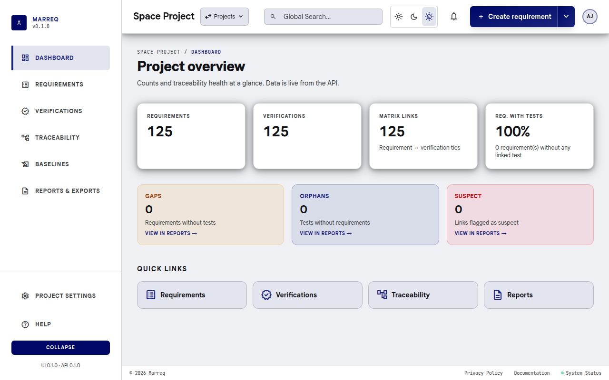
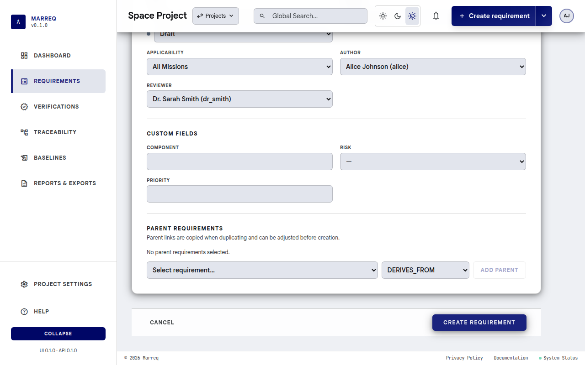
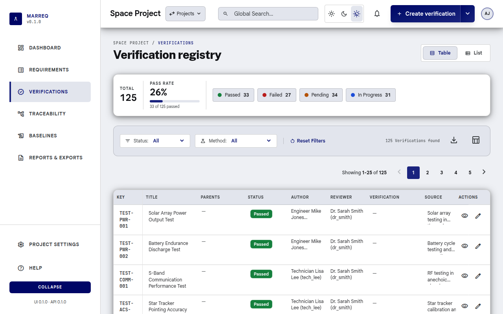
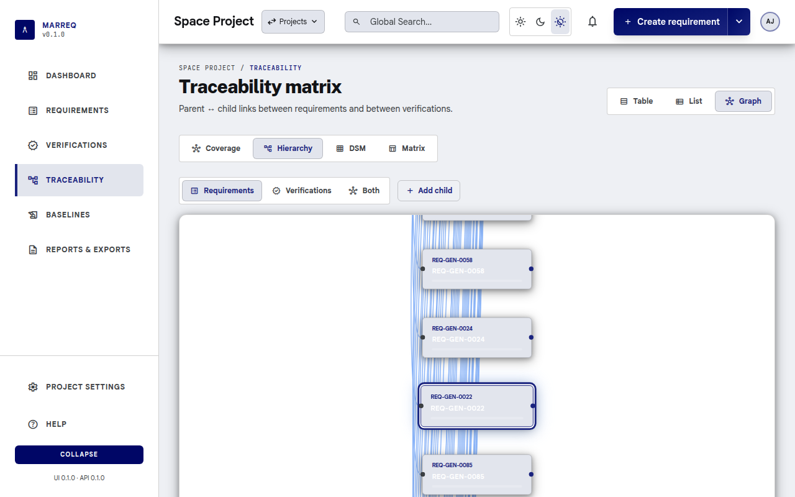
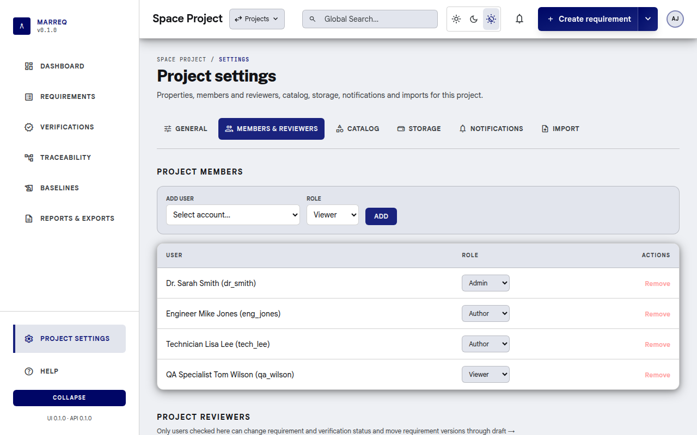

# Marreq User Manual

**Requirement Manager (Marreq)** is a web-based requirements and test management system. This manual describes how to use the application from the end-user perspective.

**IBM DOORS users:** See **[Migrating from DOORS to Marreq](doors-to-marreq-migration.md)** for concept mapping, workflow comparison, and migration steps.

For a **typical end-to-end workflow** (project setup → requirements → tests → traceability → approval → baselines → export), see **[Typical Workflow with Marreq](workflow.md)**.

---

## Table of Contents

1. [Introduction](#1-introduction)
2. [Getting Started](#2-getting-started)
3. [Projects](#3-projects)
4. [Requirements](#4-requirements)
5. [Test Management (Verifications)](#5-test-management-verifications)
6. [Traceability](#6-traceability)
7. [Baselines](#7-baselines)
8. [Categories, Applicability & Verification](#8-categories-applicability--verification)
9. [Reports & Export](#9-reports--export)
10. [Import](#10-import)
11. [Project Members](#11-project-members)
12. [Profile & Account](#12-profile--account)
13. [Administration](#13-administration)
14. [Tips & Shortcuts](#14-tips--shortcuts)

---

## 1. Introduction

Marreq helps you:

- **Manage requirements** in a hierarchy, with version history, comments, and approval workflow
- **Manage verifications** (tests, analyses, inspections, reviews): organise them in a hierarchy, track their status (e.g. Passed/Failed/Pending), link them to requirements, and see coverage on the dashboard, requirement pages and reports
- **Explore traceability** in a coverage graph, a hierarchy graph, a dependency structure matrix and the requirement × verification matrix
- **Produce documents** such as the Verification Control Document (VCD) and a traceability & coverage report, as PDF or ODT
- **Create immutable baselines** for audits or releases
- **Import/export** via Excel/CSV, ReqIF 1.2 / ReqIFZ (with attached files), and project bundles

Data is organized by **projects**, which can belong to **groups**. Each project has its own requirements, verifications, catalog (categories, applicability, statuses, verification methods, custom fields), members and baselines. You must be signed in to use the application.

See **[Typical Workflow with Marreq](workflow.md)** for a step-by-step workflow from project setup through baselines and export.

---

## 2. Getting Started

### 2.1 Signing In

1. Open the application in your browser (the address your administrator gives you).
2. Enter your **Username** and **Password** and select **Sign in**.


Depending on how Marreq is set up, the login page also offers:

- **Continue with …** buttons to sign in with your organisation's single sign-on.
- **Forgot your password?** and **Create an account** (on installations that allow self-registration, such as the hosted cloud service). A new account must confirm its email address before it can sign in.

The UI and API versions are shown under the login card. If they do not belong together, a banner at the top of the application says so; ask your administrator to update.

If you use a demo setup, typical users include `alice`, `dr_smith`, `eng_jones`, `tech_lee` and `qa_wilson`; the default password is `ChangeMe123!` unless your administrator changed it.

- **Theme**: the **Light / Dark / Auto** buttons at the top right of the login page (and in the top bar inside the application) switch the colour theme; *Auto* follows your system. The choice is stored in the browser.
- **Sign out**: open the user menu (the circle with your initials, top right) and select **Sign out**.

### 2.2 Start Screen

After signing in you land on the **start screen** (`/`). It asks **Where to?** and gathers what you need to pick up your work across all your projects:

- **Search** (focused straight away; **Ctrl K** or **⌘ K** from anywhere on the page): type part of a project name, a requirement's reference code or title (e.g. `REQ-PWR-012` or `battery`), or an action such as *new project* or *groups*. Requirements are searched in every project you can see, from two characters on. Use the arrow keys and **Enter** to open a result, **Esc** to clear.
- **Needs your attention**: what is waiting for you, newest first, with a one-line summary above the search box:
  - requirements **waiting for your approval** (marked *Reviewed*) and the number of **drafts to review**, in projects where you are a project reviewer ([§11.1](#111-project-reviewers-workflow-gates));
  - **suspect links** to review, in projects where you can edit;
  - unread notifications that ask something of you: you were made a requirement's reviewer, someone commented on your requirement, or someone **mentioned** you in a comment ([§4.6](#46-comments)).

  Select a row to open the requirement, the draft list, or the Matrix filtered to suspect links. Opening a notification marks it read. The first four rows are shown; **Show all** lists the rest. Archived projects ([§3.5](#35-archiving-a-project)) never appear here.
- **Recent**: the last page you opened in each of your three most recent projects (for example *Requirements › REQ-PWR-012*). It is kept in your browser, so it starts empty on a new browser; until then the list shows your projects instead.
- **New project**, **Import** and **Groups**, and **All projects (n)** and **Archived (n)** to list your projects.

The **Marreq** logo at the top of the project sidebar brings you back here. Links to a specific page (for example from a notification email) still open that page directly.

If you are not a member of any project yet, you see **You don't have any projects yet** with **New project**, **New group**, **Change password** and **Sign out**.

### 2.3 Dashboard

Each project opens on its **Dashboard**, `/<project-slug>/dashboard`, titled **Project overview**.

- **Counts**: Requirements, Verifications, Matrix links, and **Req. with tests** (the share of requirements linked to at least one verification).
- **Traceability health**: **Gaps** (requirements without tests), **Orphans** (tests without requirements) and **Suspect** (links flagged as suspect). Each card opens the matching list on the Reports page.
- **Quick links** to Requirements, Verifications, Traceability and Reports.



### 2.4 Navigation

Inside a project, the **sidebar** on the left holds the pages you work in every day:

| Item | Description |
| --- | --- |
| **Dashboard** | Counts and traceability health of the project |
| **Requirements** | The requirement list (table, list or graph view) |
| **Verifications** | Verifications (test cases, analyses, reviews) and their status |
| **Traceability** | Coverage graph, hierarchy, dependency structure matrix (DSM) and the requirement × verification **Matrix**, as tabs |
| **Baselines** | Immutable snapshots of the project |
| **Reports & exports** | Coverage reports and Excel, PDF, ReqIF/ReqIFZ and JSON downloads |

At the top of the sidebar, the **Marreq** logo opens the start screen ([§2.2](#22-start-screen)). At the bottom:

- **Project settings**: one page with tabs for **General** (name, status, owner, group), **Members & reviewers**, **Catalog** (categories, applicability, statuses, custom fields, verification methods), **Storage**, **Notifications** and **Import**.
- **Help**, the **Collapse** button (the sidebar remembers whether it is collapsed) and the UI and API versions.

The top bar holds:

- the project name and the **Projects** menu: switch to another project (you stay on the same page), or open **Groups**, **New project** or **Import project bundle**;
- **Global Search**, the theme switch (light, dark, match system) and the **notifications** bell ([§2.5](#25-notifications));
- the **Create** button: its main part creates a requirement (a verification when you are on the Verifications pages); the arrow next to it offers **Create requirement**, **Create verification** and **Import**;
- the **user menu** (avatar): Account settings, **Administration** (instance administrators only, see [§13](#13-administration)), Change password and Sign out.

On a narrow screen the sidebar is hidden; open it with the **☰** button in the top bar.

**Global Search** filters what is on screen as you type: the Requirements table, the Verifications list and the Matrix. It is not a full-text search of the whole project.

Older links keep working: `/<project>/matrix` opens the Matrix tab, `/<project>/import`, `/<project>/members` and `/<project>/catalog/…` open the matching Project settings tab, `/<project>/admin/…` opens the Administration area, and links that still contain an owner or group name before the project are redirected.

### 2.5 Notifications

The bell in the top bar shows how many notifications you have not read (up to *99+*). Open it to see the list; select a notification to go to the requirement it is about, or **Mark all as read**. The list refreshes on its own.

You are notified when you are made the **reviewer** of a requirement, when someone **comments** on a requirement you wrote or review, when someone **mentions** you in a comment ([§4.6](#46-comments)), and, in projects where you turned them on, when requirements are created, updated or deleted. Choose per project in **Project settings › Notifications**: **In-app notifications for this project** and **Email notifications for this project**.

### 2.6 Help

**Help** at the bottom of the sidebar (`/<project-slug>/help`) summarises the main pages and shows the versions of the UI and the API with links to the most used pages.

---

## 3. Projects

### 3.1 Switching Projects

Open the **Projects** menu (the project name in the top bar). It lists your projects: select one to switch to it, staying on the same kind of page. Archived projects ([§3.5](#35-archiving-a-project)) are grouped under **Archived (n)** at the end of the list; select it to show them. The menu also has **Groups** ([§3.7](#37-groups)), **New project** and **Import project bundle** ([§10.3](#103-importing-a-project-bundle)).

Project URLs use the project slug only (`/<project-slug>/dashboard`). Owner usernames and group names are not part of the path. Opening `/<project-slug>` shows the project's [Dashboard](#23-dashboard).

### 3.2 Creating a Project

1. **Projects → New project** (`/projects/new`).
2. Choose the **Namespace**: *Personal* or a group in which you may manage projects.
3. Enter the **Project name** and an optional **Description**.
4. Select **Create project**. You become the project's Admin and land on its dashboard.

Every new project starts with default statuses, verification methods (Inspection, Test, Analysis, Review), one category and one applicability value. Before anyone can create requirements, add at least one **project reviewer** ([§11.1](#111-project-reviewers-workflow-gates)). To start from an existing project instead, use **Import from JSON bundle** on the same page ([§10.3](#103-importing-a-project-bundle)).

### 3.3 Editing a Project

Open **Project settings** at the bottom of the sidebar. The **General** tab (`/<project-slug>/settings/general`) shows the project's properties:

- **Name** (2–100 characters) and **Description** (up to 1000 characters; leave empty to remove it).
- **Status**: Active, On hold, Completed or Cancelled.
- **Owner**: any member of the project.
- **Group**: the group the project belongs to, or *Personal (no group)*. The list shows the groups where you may manage projects. Moving a project needs that right in both the current and the new group.
- **URL**: the project's address (`/<project-slug>`). It stays the same when you rename the project, so existing links and bookmarks keep working.

Change the fields and select **Save changes**. The new name appears in the header, the sidebar and the project list right away, and the change is recorded in **System logs** with the old and new values. **Discard** resets the form.

Only project **Admins** and instance administrators can change these properties. Other members see them read-only.

### 3.4 Project Storage

Files attached to requirements and verifications ([§4.9](#49-attachments)) count toward the project's storage limit. **Project settings › Storage** shows:

- How much of the limit is used. Each file counts once, even when the same file is attached in several places.
- How much of that is taken by deleted files that baselines still keep ([§7.3](#73-viewing-a-baseline)).
- The largest file allowed and the file types that can be uploaded.

The defaults are **10 MB per file** and **500 MB per project**. The server administrator sets them with `MARREQ_ATTACHMENT_MAX_MB` and `MARREQ_PROJECT_STORAGE_QUOTA_MB`. Instance administrators can give a project its own limit in **Project settings › Storage**, or use **Reset to default** to go back to the server-wide value. The change is recorded in **System logs**. A limit below the current usage is allowed: it only blocks new uploads.

### 3.5 Archiving a Project

Archive a project that is finished but must be kept, for example for audits. An archived project is **read-only for everyone**, instance administrators included: nobody can edit requirements or verifications, links, comments, approvals, baselines, saved views, report templates, members, reviewers, the catalog or the project's settings. Members can still open it, search it and export anything from **Reports & exports** ([§9](#9-reports--export)). Nothing is deleted.

The **project owner** and instance administrators can archive a project. Open **Project settings › General** and select **Archive project…** in the **Danger zone**, then confirm with **Archive project**. The change is recorded in **System logs**.

While a project is archived:

- a banner at the top of each page says so, and the **Create** button is hidden;
- the project moves to the **Archived** section of the **Projects** menu ([§3.1](#31-switching-projects)) and is marked **Archived** on its group's page;
- any attempt to change it is refused with *This project is archived; unarchive it to make changes.*

To make changes again, the owner or an instance administrator selects **Unarchive** in the banner, or **Unarchive project** in **Project settings › General**. The project returns exactly as it was.

### 3.6 Deleting a Project

The **project owner** and instance administrators can delete a project. Open **Project settings › General** and select **Delete project…** in the **Danger zone** at the bottom of the page. Other members see who can delete the project instead.

Deleting a project **cannot be undone**. It removes everything in the project:

- requirements, with their versions, links and comments;
- verifications and the traceability matrix;
- baselines (including frozen ones) and saved views;
- attachments and their files (a file that another project also uses is kept);
- the catalog, custom fields, members, reviewers and storage settings.

To keep the project but stop changes to it, archive it instead ([§3.5](#35-archiving-a-project)). To keep a copy, export a project bundle or a ReqIFZ archive from **Reports & exports** first ([§9](#9-reports--export)). To confirm, type the project's URL name (its slug, e.g. `satellite-demo`) and select **Delete project**. You are then taken to another project, or to the home page if you have none left.

Users are not deleted. The project's entries in **System logs** are kept, and a new entry records who deleted the project, its name and how many requirements, verifications, baselines and attachments it had.

### 3.7 Groups

Groups collect projects, for example per team or product line. Open **Projects → Groups** (`/groups`) to see your groups; **New group** creates one (name and description), and you become its Owner.

A group page lists its projects and members. Group roles:

| Role | Can |
| --- | --- |
| **Owner** | Manage the group's members, and create or move projects into the group |
| **Maintainer** | Create or move projects into the group |
| **Contributor**, **Viewer** | See the group |

Owners manage members on the group's **Members** page (add a user with a role, change a role, remove). **Delete group** asks for confirmation; projects in the group then need another group or none. A project's own members and roles ([§11](#11-project-members)) are managed in the project, separately from the group.

---

## 4. Requirements

Requirements are the core artifact. Each requirement can have multiple **versions** (history), **comments**, attachments and an **approval** state (draft → reviewed → approved). Requirements are linked to parent requirements (with a link type such as *derives from*) and to the verifications that verify them.

### 4.1 Requirements Views

- **Requirements** in the sidebar, or `/<project-slug>/requirements`.

Switch between the views with the tabs above the list:

- **Table** for dense scanning, comparison, column configuration and inline editing.
- **List** for reading and reviewing: one card per requirement with its statement, status, approval, parent, verification method, author and last change. It also works on narrow screens.
- **Graph** opens **Traceability** ([§6](#6-traceability)), where the coverage graph, the hierarchy graph and the matrices live.

Above the list:

- **Filters**: **Status**, **Category** and **Approval** (All, Draft, Reviewed, Approved), plus a **Sort** field with a ↑/↓ direction toggle. **Reset Filters** clears them. To search by text, use **Global Search** in the top bar.
- **Saved views**: save the current filters and sort as a named view with **Save current as…**, either **Private** or **Shared** with the project. Pick a saved view to apply it, **Update** it with the current settings, or **Delete** it. A view used by a baseline is marked *locked* and cannot be changed. A saved view has its own link (`?saved_view=<id>`).
- **Columns** (Table only): show or hide Key, Title, Category, Parents, Status, Approval, Verification, Modified, Author and Actions.
- **Downloads**: **CSV** with the rows shown (after filters and search) and **Excel** with the whole project ([§9.2](#92-exporting-requirements-to-excel)).
- The number of requirements found, and **Show rows** (25, 50 or 100 per page).

In the **Table** view:

- Open a requirement with the **View** (eye) icon in the Actions column; **Edit** and **Duplicate** are next to it. Editing an approved requirement first asks for confirmation, because it creates a new Draft version.
- **Inline editing**: click a Title, Category, Status, Verification or Author cell to change it in place. The change is saved straight away as a new version. Only project reviewers can change the status ([§11.1](#111-project-reviewers-workflow-gates)). Esc or a click outside closes the editor.

In the **List** view, select a card's title to open the requirement; its menu has **Duplicate**.


### 4.2 Requirement Detail Page

- URL: `/<project-slug>/requirements/<requirement_id>`.
- For a specific version: `/<project-slug>/requirements/<requirement_id>/versions/<version_id>`.
- Classic bookmarks `/<project-slug>/requirements/show/<requirement_id>` and `/<project-slug>/requirements/show/<requirement_id>/version/<version_id>` redirect to those URLs.

On the detail page you see:

- **Header**: reference code, title, approval badge (Draft / Reviewed / Approved, with who approved and when) and the buttons **Compare versions**, **Duplicate** and **Edit**.
- **Summary**: priority (when the project has a *Priority* custom field), version, author and reviewer.
- **Approval actions** (for **project reviewers**, or an administrator when no reviewers are configured): **Mark as Reviewed** and **Approve Requirement**, each with a confirmation.
- **Requirement statement** and **Rationale**, then category, applicability, verification methods, parents with their link type, and the modified and created dates. **Custom metadata** lists the project's custom fields.
- **Traceability**: **Upstream (parents)**, **Child requirements** and **Downstream (verifications)**, each verification with its status badge.
- **Verification close-out**: the compliance assessment and whether the requirement is closed ([§5.7](#57-verification-control-and-close-out)).
- **Attachments** ([§4.9](#49-attachments)).
- **Changelog**: the version snapshots and the historic activity from the audit log ([§4.5](#45-version-history--diff)).
- **Discussion**: the comments ([§4.6](#46-comments)).

**Editing an approved requirement**: **Edit** on an approved requirement first warns that editing creates a new **Draft** version; you can cancel or continue.


### 4.3 Creating a Requirement

1. Use **Create requirement** in the top bar, **Duplicate** on an existing requirement ([§4.7](#47-duplicating-a-requirement)), or **Add child** in the hierarchy graph ([§6.5](#65-hierarchy-graph)).
2. URL: `/<project-slug>/requirements/new`.
3. Fill in:
   - **Reference code** (required, e.g. `REQ-0001`) and **Title** (required)
   - **Statement** (required; labelled **Description** on the form, with the formatting toolbar and preview described in [§4.4](#44-editing-a-requirement))
   - **Rationale** (optional)
   - **Status**: project reviewers choose any status; other users create in the project's default initial status
   - **Category** and **Applicability**
   - **Verification methods** (at least one)
   - **Author** and **Reviewer** (the reviewer list offers the project reviewers)
   - **Parent requirements**: pick a requirement and a link type, then **Add parent**
   - **Custom fields**, if the project has any
4. Select **Create requirement** (**Create duplicate** when duplicating). The new requirement opens in the editor.



**When creating is blocked.** The button stays disabled, with a link next to it, until the project has:

- at least one **verification method** (**Add a verification method** opens Project settings › Catalog › Verification methods), and
- at least one **project reviewer** (**Add a reviewer in Project settings** opens Members & reviewers, [§11.1](#111-project-reviewers-workflow-gates)).

**Links that fill in the form.** The page accepts these URL parameters:

| Parameter | Effect |
| --- | --- |
| `?parent=<id>` | Adds requirement `<id>` as a parent (with the first link type). The hierarchy graph's **Add child** uses it. |
| `?from=<id>` | Duplicates requirement `<id>` ([§4.7](#47-duplicating-a-requirement)). |
| `?template=<id>` | Same as `from`; when both are given, `from` wins. |

Combine them, e.g. `?from=12&parent=3`. An id that is not a requirement of this project (or a parent with no current version) does not stop the page: a warning names it, for example *Parent requirement 99 is not in this project*, and that part is left out.

### 4.4 Editing a Requirement

1. Open the requirement detail page.
2. Click **Edit**.
3. URL: `/<project-slug>/requirements/<requirement_id>/edit`.
4. Change title, statement, rationale, category, status (project reviewers only), applicability, author and reviewer as needed. Parent links are added and removed at once, without Save. Verification methods and custom fields are not edited on this page.
5. Select **Save requirement** to create a new version; it is enabled once something changed. **Revert changes** puts back the saved values. **Cancel** returns to the requirements list; if you have unsaved changes it asks first and then discards them.

Only project reviewers can change the **Status** ([§11.1](#111-project-reviewers-workflow-gates)). **Delete requirement** at the bottom left deletes the requirement permanently, with its versions, links, comments and attachments, after a confirmation.

#### Unsaved changes and drafts

While you type, the editor keeps a **draft in this browser**, so a reload, a closed tab, a laptop that went to sleep or an expired session does not lose your text. The footer shows the state: **Unsaved changes**, then **Draft kept on this device** with the time.

- A draft is **not** a version: nothing is sent to the server, and only **Save requirement** creates a new version.
- When you open the requirement again, the draft is put back and a banner says so; **Discard draft** returns to the saved text. If the requirement has been saved again since your draft (for example by someone else), the draft is only offered: choose **Restore draft** if it still applies.
- The **New requirement** page keeps a draft in the same way and offers **Restore draft** the next time you open it.
- If your session expires, Save tells you so; sign in again and reopen the requirement: the draft is still there.
- Drafts belong to your user in this browser only (they do not follow you to another computer), are removed when you save, discard or sign out, and expire after 30 days.

#### Formatting the statement

The statement editor has a formatting toolbar and a **Write / Preview** toggle. Statements are stored as a small, documented Markdown subset, so they stay readable as plain text in exports:

| You want | Type (or use the toolbar) | Shortcut |
| --- | --- | --- |
| **Bold** | `**text**` | Ctrl/Cmd+B |
| *Italic* | `*text*` or `_text_` | Ctrl/Cmd+I |
| `Code` | `` `text` `` | |
| Link | `[label](https://example.com)` (only `http`, `https`, and `mailto` links) | Ctrl/Cmd+K |
| Bulleted list | a line starting with `- ` (or `* `) | |
| Numbered list | lines starting with `1. `, `2. `, … (the first number sets the start) | |
| New paragraph | a blank line (a single line break stays a line break) | |

Anything else, such as headings, tables, or HTML, is shown literally. Put `\` before `*`, `_`, `` ` ``, `[` or `]` to show the character itself. **Preview** shows the statement exactly as it appears on the requirement page. The statement is limited to 2000 bytes including the formatting characters; the counter under the editor shows how much is used.

Formatting is shown on the requirement page, and version snapshots and review cards show the text without markers. ReqIF export writes the statement as XHTML so other tools keep the formatting, and ReqIF import turns XHTML lists, emphasis, and links back into this format (see [§9.4](#94-exporting-reqif) and [§10.2](#102-importing-reqif)). Excel and JSON exports contain the Markdown source.

### 4.5 Version History & Diff

- On the requirement detail page, the **Changelog** section lists all versions (newest first); each shows approval state. Click a version label (`v1`, `v2`, …) to open that version as a **read-only snapshot** (`/<project-slug>/requirements/<id>/versions/<version_id>`).
- A historical snapshot shows title, statement, rationale, metadata, custom fields, and approval as stored on that version. Edit, duplicate, and adding comments are hidden. Use **View current** to return to the latest version.
- Select **Compare versions** to compare any two saved versions. The latest version and its predecessor are selected by default.
- Use **Compare with previous** on a version-history row to open that adjacent pair directly.
- When an older approved snapshot exists, use **Compare with last approved** beside the approval state before reviewing the current draft.
- The **Compare requirement versions** dialog shows removed, added, and unchanged **Title**, **Statement** and **Rationale** text (line by line; statements are compared as their Markdown source, so each list item is its own line). Under **Metadata** it also compares status, category, applicability, verification methods, and custom fields.
- At least two saved versions are required. Version comparison is read-only and is available to anyone who can view the project requirements.

### 4.6 Comments

- The **Discussion** section of the requirement page lists the comments and has the form to add one. Each comment is attached to the version that was current when it was written.
- To **mention** a project member, type `@` and choose them from the list (arrow keys and **Enter** or **Tab**, or click; **Esc** closes it), or type their username, for example `@alice`. Mentions of project members are highlighted. Each member you mention is notified (*… mentioned you on REQ-…*) and sees it under **Needs your attention** on the start screen ([§2.2](#22-start-screen)). Mentioning someone who is not a member of the project does nothing.
- A new comment also notifies the requirement's author and reviewer, unless the comment mentions them (then they get only the mention). You are never notified of your own comments.
- Comments cannot be edited or deleted.
- When the current version is **Approved**, the form is replaced by *Comments are locked on this approved version.* Editing the requirement creates a new draft version, which can be discussed again.

### 4.7 Duplicating a Requirement

- From the requirements list, detail, or edit page, select **Duplicate**.
- The create page opens with a new reference code and copied title, statement, rationale, catalog values, verification methods, custom fields, reviewer, and parent links.
- Review or change those values before selecting **Create duplicate**. The new requirement is independent: approval state, version history, comments, and traceability-matrix links are not copied.

### 4.8 Semantic Search (AI)

The web pages have no AI search. When your administrator has turned on embeddings, AI assistants connected through Marreq's MCP server can search requirements by meaning (the `semantic_search_requirements` tool); see the MCP setup guide linked under [Support](#support).

### 4.9 Attachments

Requirements and verifications can carry files, such as test reports, drawings, analysis spreadsheets or photos. The **Attachments** card is on the requirement view and edit pages (right column) and on the verification view and edit pages.

- **Download**: select a file name. Files are always downloaded; the browser never opens them inline.
- **Upload** (needs **Edit requirements** permission): use **Add files**, or drag files onto the drop area. You can pick several files at once.
- **Delete**: use the bin icon next to a file and confirm.

Allowed types are PDF, PNG, JPEG, GIF, WebP, Word, Excel and PowerPoint (`.docx`, `.xlsx`, `.pptx`), OpenDocument (`.odt`, `.ods`, `.odp`), ZIP, plain text (`.txt`, `.log`, `.md`), CSV, JSON and XML. The server checks the file's contents, not just its name: a file renamed to `.pdf` that is not a PDF is refused. Other types, including HTML, SVG and programs, are not accepted.

An upload is refused when the file is larger than the per-file limit, or when it would take the project over its storage limit ([§3.4](#34-project-storage)). The message says how much space is used. Uploads and deletions are recorded in **System logs**.

Attachments belong to the requirement, not to one version, so historical version snapshots do not show them. Baselines keep their own list ([§7.3](#73-viewing-a-baseline)). Deleting a requirement or verification also deletes its attachments.

---

## 5. Test Management (Verifications)

Test management in Marreq covers creating and organizing verifications (tests, analyses, inspections, reviews), tracking their status (e.g. Passed, Failed, Pending), and linking them to the requirements they verify. In the UI, the sidebar item and pages are named **Verifications**. Verifications are project-scoped and can be arranged in a **parent/child hierarchy**.

The links between verifications and requirements are set on the verification's **create** and **edit** pages (**Traceability (requirements)**). Once linked, a requirement's page lists the verification under **Downstream (verifications)** with its status, and the [Traceability](#6-traceability) views and Reports show the coverage.

### 5.1 Verifications List

- **Verifications** in the sidebar, or `/<project-slug>/verifications`.

You can:

- Switch between **Table** and **List** (card) view. The view and the filters are kept in the URL, so switching views, reloading, or sharing the link keeps them.
- See **status metrics** for the whole project above the list: the **Total**, one chip per verification status with its count (statuses with no verifications are dimmed; **Other** counts verifications whose status is not in the project's list), and a **Pass rate** ("X of Y passed") when the project has a status named *Passed*. Click a status chip to show only that status; click it again to clear the filter. The metrics always cover the whole project, not just the filtered rows.
- **Filter** by **Status** and **Method** (including *No method*), and search with **Global Search** in the top bar (reference, title, description, source, or parent). **Reset Filters** clears status and method.
- **Paginate** through results (25, 50, or 100 rows per page; controls appear above and below the list when there is more than one page).
- Create a verification with **Create verification** in the top bar ([§5.3](#53-creating-a-verification)).
- Click a verification to open its **Verification detail** page.



- **Update verification status** inline (e.g. set Passed after a lab run): click the status in the table or list. Only **project reviewers** with edit rights can change the status; other editors can still edit the title, method, and source inline.
- **Export** from the filter bar: **CSV** contains the rows currently shown (after filters and search); **Excel** contains every verification in the project (the same workbook as [§9.3 Exporting Verifications to Excel](#93-exporting-verifications-to-excel)).

### 5.2 Verification Detail Page

- URL: `/<project-slug>/verifications/<verification_id>`.

The page shows the **Reference**, name, **Status**, **Verification type** (method), **Source** (e.g. a test procedure or document reference), **Parent** verification, **Author**, **Reviewer**, the last status change, and the **Description** with its formatting. Further sections:

- **Linked requirements**: the requirements this verification verifies; **Edit links** opens the editor at its traceability section.
- **Verification control**: level, stage and evidence for the VCD ([§5.7](#57-verification-control-and-close-out)).
- **Attachments** ([§4.9](#49-attachments)) and **Changelog** ([§5.2.1](#521-version-history-and-diff)).

**Edit** (with edit permission) and **Compare versions** are in the header. The status is changed in the editor or inline in the list ([§5.5](#55-updating-verification-status)).

### 5.2.1 Version history and diff

- The verification detail **Changelog** lists audit-log activity (creates and field updates).
- Select **Compare versions** to compare any two saved snapshots. The latest snapshot and its predecessor are selected by default.
- Snapshots are reconstructed from the audit log: each create or update becomes a version. If the first recorded change is an update, a “before recorded history” snapshot is included.
- The comparison dialog shows removed, added, and unchanged name, description, source, and reference text. It also compares status, verification type, and parent.
- At least two snapshots are required (create the verification, then edit and save). Comparison is read-only and is available to anyone who can view the project.

### 5.3 Creating a Verification

1. Use **Create verification** in the top bar (on the Verifications pages it is the main part of the **Create** button), or **Add child** in the hierarchy graph ([§6.5](#65-hierarchy-graph)).
2. URL: `/<project-slug>/verifications/new`.
3. Fill in:
   - **Reference code** (required, e.g. `VER-0001`) and **Name** (required)
   - **Description** (required). It has the same formatting toolbar, **Write / Preview** toggle and syntax as requirement statements ([Formatting the statement](#formatting-the-statement)), for example a numbered list of test steps.
   - **Source** (e.g. `manual` or a test rig; `manual` by default)
   - **Status**: project reviewers choose any status; other users create in the project's initial status
   - **Parent verification (optional)** and **Verification method (optional)**
   - **Author** and **Reviewer** (the reviewer list offers the project reviewers)
   - **Traceability (requirements)**: tick the requirements this verification verifies (filter by reference, title or id)
4. Select **Create verification**.

**When creating is blocked.** Until the project has at least one **project reviewer**, the button is disabled with **Add a reviewer in Project settings** next to it ([§11.1](#111-project-reviewers-workflow-gates)).

**Links that fill in the form.** As for requirements ([§4.3](#43-creating-a-requirement)):

| Parameter | Effect |
| --- | --- |
| `?parent=<id>` | Sets verification `<id>` as the parent. The hierarchy graph's **Add child** uses it. |
| `?from=<id>` | Duplicates verification `<id>`: name (with a copy suffix), description, source, status, method, reviewer and parent are copied, and the next free reference code is suggested. The author and the requirement links are not copied. |
| `?template=<id>` | Same as `from`; when both are given, `from` wins. A valid `parent` replaces the copied parent. |

There is no Duplicate button for verifications yet; use the link, e.g. `/<project-slug>/verifications/new?from=7`. An id that is not a verification of this project gives a warning, for example *Template verification 7 is not in this project*, and is ignored.

### 5.4 Editing a Verification

1. Open the verification detail page and select **Edit** (or **Edit links**).
2. URL: `/<project-slug>/verifications/<verification_id>/edit`.
3. Change the name, description, source, status (project reviewers only), reference code, parent verification, verification method, author or reviewer. Changing the method keeps the same verification identity and its links.
4. **Traceability (requirements)**: tick or untick the requirements this verification verifies. Saving replaces all of its links with the ticked ones.
5. Select **Save changes**; it is enabled once something changed. **Back** leaves without saving.

**Delete verification** deletes it permanently, with its links and attachments, after a confirmation.

### 5.5 Updating Verification Status

As verifications are run, update their status (e.g. Passed, Failed, Pending, In progress) so that:

- Requirement pages show each linked verification's status under **Downstream (verifications)**, and the close-out reflects it ([§5.7](#57-verification-control-and-close-out)).
- The **Matrix** shows the status symbol in each cell and can be filtered by status ([§6.2](#62-using-the-matrix)).
- **Reports** and the **Dashboard** reflect current coverage.

Change the status in the **verification editor** or **inline from the verifications list** (click the status). Only **project reviewers** can change it ([§11.1](#111-project-reviewers-workflow-gates)). The statuses are configured per project in **Project settings › Catalog › Verification statuses** ([§8](#8-categories-applicability--verification)).

### 5.6 Verification Hierarchy

Verifications can have a **parent verification** (e.g. a test campaign or feature area). Set the parent when creating or editing a verification. The list shows each verification's parent; the tree itself is drawn in **Traceability › Hierarchy** ([§6.5](#65-hierarchy-graph)), where **Add child** creates a verification under the selected one. Coverage and traceability still work at the level of individual verifications linked to requirements.

### 5.7 Verification Control and Close-out

Marreq tracks how far each requirement's verification has gone, for the Verification Control Document (VCD).

**On a verification** (its detail page, **Verification control** card), anyone who can edit requirements records:

- **Level**: where it is verified, e.g. *Equipment*, *Subsystem* or *System*.
- **Stage**: when it is verified, e.g. *QUAL* (qualification) or *ACC* (acceptance).
- **Evidence**: the document that proves the result, e.g. a test report number.

Level and stage are free text. The fields suggest the values already used in the project, so the same terms are reused.

**On a requirement** (its detail page, **Verification close-out** card), a **project reviewer** records the **compliance** assessment: **C** (compliant), **PC** (partially compliant, e.g. accepted with a waiver) or **NC** (non-compliant), with an optional note such as the waiver or nonconformance number. Choosing **Not assessed** removes it. Each change is recorded in **System logs**.

The card shows whether the requirement is **Closed** or **Open**, and why:

| Situation | Close-out |
| --- | --- |
| No verification linked | Open: *No verification linked* |
| A linked verification failed | Open: *VER-x failed* |
| A linked verification has not passed yet | Open: *VER-x not run* or *in progress* |
| All linked verifications passed, no assessment | Open: *Compliance not assessed* |
| All passed, assessed NC | Open: *Non-compliant* (and the note) |
| All passed, assessed C or PC | **Closed** |

Whether a verification "passed" comes from the **outcome** of its status, set in **Project settings › Catalog › Verification statuses** ([§8](#8-categories-applicability--verification)).

---

## 6. Traceability

**Traceability** in the sidebar (`/<project-slug>/traceability`) has four tabs:

| Tab | Shows |
| --- | --- |
| **Coverage** | A graph of requirements and the verifications linked to them; suspect links are drawn in coral |
| **Hierarchy** | Parent ↔ child links between requirements and between verifications, with **Add child** ([§6.5](#65-hierarchy-graph)) |
| **DSM** | How requirements depend on each other ([§6.4](#64-dependency-structure-matrix-dsm)) |
| **Matrix** | Requirements × verifications with status, suspect links and coverage gaps ([§6.2](#62-using-the-matrix)) |

The **Graph** tab of the Requirements page opens this page as well. The matrix only **shows** links: links between requirements and verifications are set on the verification's create and edit pages ([§5.4](#54-editing-a-verification)), and parent links on the requirement and verification pages.

### 6.1 Opening the Matrix

- **Traceability** in the sidebar, then the **Matrix** tab.
- URL: `/<project-slug>/traceability?view=matrix` (the old `/<project-slug>/matrix` still works, including its filters). Filters and sorting are kept in the URL, so they survive switching tabs and can be shared as a link.


### 6.2 Using the Matrix

The matrix uses the same layout as the dependency structure matrix (§6.4).

- **Grid:** requirements are rows and verifications are columns. The header rows stay visible while you scroll in either direction. A symbol in a cell means the requirement is verified by that verification, and shows the verification's status: **✓** pass/complete, **✓** verified/accepted, **◐** pending/review, **○** draft, **✗** fail/reject, **●** other (in the status colour). Empty cells are not linked.
- **Rows:** grouped by **category** (categories in alphabetical order, *Uncategorised* last; a line and the category name separate them), requirements in reference-code order. Click the corner header to reverse the order, and drag its right edge to resize the requirement column; the width is remembered per project. A dot before each requirement shows its approval (Reviewed or Approved).
- **Sort by a verification:** click a verification's code in the column header to list the requirements it verifies first (suspect links first among them); the category grouping is dropped while sorting this way. Click again to reverse. The **↗** below the code opens the verification.
- **Open:** click a linked cell or a requirement's code to open the requirement.
- **Hover** a requirement, a verification or a cell to see its details: title, category, status, approval state, link counts and, for suspect links, the reason and date.
- **Filters** (above the matrix, together with the global search):
  - **Links › Suspect only:** a switch that keeps only suspect links.
  - **Status groups:** **Pass / complete**, **Verified / accepted**, **Pending / review**, **Draft**, **Fail / reject** and **Other**. Select one or more to show only verifications in those groups. The group (and the cell symbol) comes from words in the status *title*, such as "pass", "accepted" or "fail", not from the status outcome used for close-out.
  - **Requirement status** and **Verification status:** each selected status appears as a chip in its own colour. Select **×** on a chip to remove it. **Add status** opens a list of the project's statuses; tick one or several, then press Escape or Tab, or click outside the list, to close it. With the keyboard, use the arrow keys, Home and End to move, and Space or Enter to tick.
  - **Clear all filters** removes every filter at once and keeps the sort (it is disabled when no filter is set).
  - Filters and sort are kept in the page URL (parameters starting with `mx_`), so a filtered view can be bookmarked or shared.
- **Summary line:** the number of requirements and verifications shown, links, suspect links and coverage gaps.
- **Suspect links:** shown with a red frame. The side panel lists them.
  - Click a suspect link in the panel to scroll the matrix to its cell.
  - **Review** compares the requirement version that triggered the flag with its preceding version.
  - **Clear** removes the flag at once (no confirmation); the system records the user and timestamp.
- **Coverage gaps:** the side panel lists requirements without any verification and verifications without any requirement (the first eight, then *+N more*). Click one to scroll to its row or column; click it again to deselect it.
- **Linked cells by status** in the side panel counts the visible links per verification status.

### 6.3 Exporting the Matrix

- **Export Excel** above the matrix downloads the coverage grid. **Refresh** reloads the data.
- From **Reports & exports**, download:
  - **Matrix (.xlsx)**: coverage grid (requirements as rows, verifications as columns, `Yes` where linked). For review, not for re-import.
  - **Matrix links (.xlsx)**: two columns (`requirement_code`, `verification_code`), one row per link. Upload this file on **Import** as **Matrix links** (same project is a no-op for existing pairs; use it to copy links into another project that already has those codes).

### 6.4 Dependency Structure Matrix (DSM)

The DSM shows how **requirements depend on each other**, for a whole project on one screen. It complements the requirement × verification matrix above.

- **Open it:** **Traceability** → **DSM** tab (URL `/<project-slug>/traceability?view=dsm`).
- **How to read it:** rows and columns are the same requirements in the same order, and the dark diagonal is the requirement itself. A mark in row *i*, column *j* means requirement *i*'s current version links to requirement *j*. The letter shows the link type: **D** derives from, **R** refines, **P** depends on, **S** satisfies, **~** relates to. Several letters mean several links between the same pair.
- **Link types:** toggle the chips to choose which relations are drawn. *Relates to* is off by default.
- **Order:**
  - **Hierarchy** (default) groups requirements by category, drawn as framed blocks along the diagonal, and nests children under their parent.
  - **Partition** puts dependencies before the requirements that depend on them. Ordinary dependencies then fall below the diagonal, and marks above it point to feedback worth reviewing.
- **Scope:** limit the matrix to one **Category** (*All categories* by default) or to the **Subtree** of one requirement (*Whole project* by default). Links to requirements outside the scope are counted in the summary line but not drawn.
- **Loops:** requirements that depend on each other in a circle (across any link types) are tinted amber and listed in the side panel with the loop path. Hover a loop in the panel to highlight its cells; click it to scroll to it. In Hierarchy order, selecting a loop may switch to **Partition** so its requirements sit next to each other; a notice says so. Loops are rare, because Marreq already rejects circular links between versions, but they can appear when a link points to an older version of a requirement.
- **Upstream changed:** a red frame marks an approved requirement whose target was edited *after* that approval. Review whether the approved requirement still holds. The side panel lists all of them.
- **Details:** hover a cell to see the link types, the target title, loop membership and any upstream change. Click a mark, or a code in the row header, to open the requirement.
- **Export Excel:** downloads the matrix with the current filters (sheets *DSM*, *Loops* and *Legend*), for offline design reviews. **Refresh** reloads the data.
- The summary line counts requirements, links, loops, upstream changes and links outside the scope. Link types, order, category and subtree are kept in the URL.


### 6.5 Hierarchy Graph

**Traceability › Hierarchy** (`/<project-slug>/traceability?view=hierarchy`) draws the parent ↔ child links: between requirements (solid) and between verifications (dashed). Only items that have a parent or a child appear.

- **Requirements / Verifications / Both** restricts the graph; the choice is kept in the URL (`?kind=`).
- **Click** a node to select it and highlight its links. **Double-click** opens the requirement or verification.
- **Add child**, shown once a node is selected, opens the create page with that node as the parent (`requirements/new?parent=<id>` or `verifications/new?parent=<id>`; see [§4.3](#43-creating-a-requirement) and [§5.3](#53-creating-a-verification)).



---

## 7. Baselines

Baselines are **immutable** point-in-time snapshots of requirement versions and traceability for a project. Use them for audits, releases, or comparison.

### 7.1 Baselines List

- **Baselines** in the sidebar, or `/<project-slug>/baselines`.

The list shows each baseline's **Name**, **Source view** (the saved view it was made from, if any) and **Created** date; **Details** opens it. The **Create baseline** form is at the top of the page.


### 7.2 Creating a Baseline

In **Create baseline** on the Baselines page:

1. Enter a **Name** and an optional **Description**.
2. Optionally choose **From saved view** ([§4.1](#41-requirements-views)): only the requirements matching that view are included, and the view is **locked** so it keeps describing the baseline. Views already used by a baseline are not offered.
3. Select **Create**.

The system captures the **current** version of each included requirement, the **current** traceability links (requirement–verification), a **snapshot of each verification** (name, status, type, …) and the list of attached files at that moment. A baseline cannot be edited.

### 7.3 Viewing a Baseline

- **Details** in the list. URL: `/<project-slug>/baselines/<baseline_id>`.

You see:

- The **name** and **description**, and counters for requirements, verifications and traceability rows.
- **Requirement snapshots**: reference and title of each requirement as frozen, with a **Comparison** column:
  - **Diff vs current** opens a comparison of the frozen version with the current one; *Current unchanged* means nothing changed since.
  - **Compare with baseline** (above the table) picks another baseline; **Diff baselines** then compares the two frozen versions of a requirement (the older baseline is shown as the "before").
- **Verification snapshots**: reference, the status and type at baseline time next to the current ones, and a comparison of the frozen name, description, source, reference, status, type and parent with the current verification (*Unchanged*, or *Unavailable* when the verification was deleted since).
- **Sample traceability**: the first rows of the frozen requirement–verification links (by requirement and verification number), with their suspect flag.
- **Attachments**: the files attached to the included requirements and verifications when the baseline was taken. Files deleted since stay downloadable here and are marked *deleted since*; they keep counting toward the project's storage until the baseline no longer needs them.
- **Export ReqIF** and **Export ReqIFZ (with files)** ([§7.4](#74-exporting-a-baseline-as-reqif)).

### 7.4 Exporting a Baseline as ReqIF

- On the baseline detail page: **Export ReqIF** downloads the ReqIF 1.2 snapshot of that baseline; **Export ReqIFZ (with files)** adds the files the baseline recorded, including ones deleted since ([§9.4](#94-exporting-reqif)).
- Project-wide current-state ReqIF is available from **Reports & exports → Requirements (.reqif)**.

---

## 8. Categories, Applicability & Verification

These are **project-level** configuration entities used to classify and manage requirements and verifications. They are edited under **Project settings › Catalog** (`/<project-slug>/settings/catalog`), one tab each. Only **project administrators** (the project's Admin role, or a site administrator) can change them; custom fields need **Manage custom fields**, which the same roles have. Other members see the tabs read-only.

| Tab | What it holds | URL |
| --- | --- | --- |
| **Categories** | Groups of requirements (e.g. “Safety”, “Performance”) | `…/settings/catalog/categories` |
| **Applicability** | Product lines, system types or scope (e.g. “Product A”, “All”) | `…/settings/catalog/applicability` |
| **Requirement statuses** | e.g. Draft, Accepted, Rejected | `…/settings/catalog/requirement-statuses` |
| **Verification statuses** | e.g. Pass, Fail, Not run | `…/settings/catalog/verification-statuses` |
| **Custom fields** | Extra requirement fields and their types | `…/settings/catalog/custom-fields` |
| **Verification methods** | How requirements are verified (e.g. Test, Analysis, Review) | `…/settings/catalog/verification-methods` |

Each tab lists the entries and lets you add, edit and delete them:

- **Categories**, **Applicability** and **Verification methods**: title, description and tag.
- **Requirement statuses** and **Verification statuses**: also a colour and, for the statuses every project starts with, the *System* flag. System statuses cannot be edited or deleted.
- **Custom fields**: label, type (`text`, `number`, `boolean`, or `enum` with one option per line) and sort order.

Members without the permission see the tabs read-only, with a note saying which permission is needed. The old `/<project-slug>/catalog/…` URLs redirect here.

Each verification status also has an **outcome**: *Passed*, *Failed*, *In progress* or *Not run*. The outcome tells Marreq what the status means for requirement close-out ([§5.7](#57-verification-control-and-close-out)). New statuses get it from their title (a status called "Passed" is *Passed*; an unknown title is *Not run*) unless you choose one in **Outcome** when adding the status; you can change it later for your own statuses.

---

## 9. Reports & Export

### 9.1 Reports Page

- **Reports & exports** in the sidebar, or `/<project-slug>/reports`. The page is titled **Coverage & gaps**; a bar at the top jumps to its sections, and **Refresh** reloads it.


You see:

- **Coverage**: tiles for requirements without tests, tests without requirements and suspect links, then each list in full, with shortcuts to the Matrix and the graph. The Dashboard's Gaps, Orphans and Suspect cards open these lists.
- **Report documents**: the VCD and the traceability & coverage report as PDF or ODT ([§9.6](#96-report-documents-vcd-and-coverage-report)).
- **Exports**:
  - **Requirements (.xlsx)**, **Verifications (.xlsx)**, **Matrix (.xlsx)** and **Matrix links (.xlsx)** ([§6.3](#63-exporting-the-matrix));
  - **Requirements PDF** (the requirement list) and **Report PDF** (the traceability & coverage report with default settings);
  - **Requirements (.reqif)** and **Requirements with files (.reqifz)** ([§9.4](#94-exporting-reqif));
  - **Project bundle (.json)** and **Project bundle with files (.zip)** ([§9.5](#95-exporting-a-project-bundle)).
- **Matrix**: requirements whose links are all suspect, the verifications linked to the most requirements, requirements by number of links, and coverage by category.
- **Data quality**: requirements and verifications with missing information.
- **Workflow**: requirements by approval state, by author and by reviewer.
- **Baseline diff**: the current traceability compared with a baseline you choose.

### 9.2 Exporting Requirements to Excel

- **Reports & exports → Requirements (.xlsx)**, or the **Excel** button on the Requirements list.
- The workbook (`.xlsx`) contains every requirement in the project with all configured fields, and a **Comments** sheet when there are comments.
- The **CSV** button next to it downloads only the rows currently shown (after filters and Global Search).

### 9.3 Exporting Verifications to Excel

- **Reports & exports → Verifications (.xlsx)**, or the **Excel** button on the Verifications list.
- The workbook contains every verification in the project (name, description, source, status, reference code, …), for test management or reporting outside Marreq.
- The **CSV** button downloads only the rows currently shown.

### 9.4 Exporting ReqIF

- **Current project**: open **Reports** and download **Requirements (.reqif)** for the live requirement set (comments are included as Remarks when present).
- Attachment file names are listed in an **Attachments** attribute; the files themselves are not included in a `.reqif` file.
- **With the files**: download **Requirements with files (.reqifz)** instead. A ReqIFZ archive is a ZIP file holding the `.reqif` document and each requirement's attachments under `files/<attachment id>/<file name>`. The statements link to the files the standard ReqIF way (XHTML objects), so DOORS, Polarion, Codebeamer and Marreq itself can pick them up.
- **From a baseline**: open the baseline and use **Export ReqIF** for an immutable ReqIF 1.2 snapshot, or **Export ReqIFZ (with files)** to include the files the baseline recorded, including ones deleted since.

### 9.5 Exporting a project bundle

- Open **Reports** and download **Project bundle (.json)**, or **Project bundle with files (.zip)** to include the attachment files.
- The bundle is a portable snapshot of the project catalog, current requirements, verifications, matrix links, comments, and members (by username). It does not include version history, baselines or passwords; the `.json` bundle has no attachment files.
- The `.zip` bundle holds `bundle.json` plus the current attachment files of the requirements and verifications under `files/<attachment id>/<file name>` (deleted files and files only kept by a baseline are left out).
- Anyone who can view the project can export the bundle.

### 9.6 Report documents (VCD and coverage report)

The **Report documents** card on the Reports page produces formatted documents:

- **Verification Control Document (VCD)**: for every requirement, its verification method, the level and stage and evidence recorded on its verifications, the compliance assessment and whether it is closed ([§5.7](#57-verification-control-and-close-out)). It follows ECSS-E-ST-10-02C Annex B.
- **Traceability & coverage report**: coverage figures, coverage by group, requirements without verification, verifications without requirements, suspect links and data quality. *Report PDF* in the exports list is this report with its default settings.

Choose the **report**, a **template** (*Default* or a saved one) and the **format**, then select **Generate**.

- **PDF**: page numbers, a table of contents with page numbers, the matrix on landscape pages, and optionally an archival PDF/A file.
- **ODT** (OpenDocument, for LibreOffice or Word): the same content, ready to edit. To fill in page numbers in its table of contents, right-click the contents in LibreOffice and choose **Update Index**.

**Customize…** opens the report builder (`/<project-slug>/reports/builder`):

- **Sections**: tick a section to include it. Reorder with the arrow buttons or by dragging. Some sections have options (the tune icon), for example how the matrix is grouped and which columns it shows, or your own introduction text.
- **Document**: document ID, title, issue and revision, classification, a watermark such as *DRAFT* (PDF only), page size, PDF/A, and the signatories, change record and reference documents printed in the front matter.
- **Preview PDF** opens the result in a new tab. **Download PDF** and **Download ODT** save it.
- **Save as…** stores the settings as a named template, private or shared with all project members. **Save** updates the selected template and **Delete** removes it. Only the template's owner, a project Admin or an instance administrator can change or delete it; anyone can still use it, or save their own copy. **Reset to default** returns to the built-in settings.

When a later version of Marreq adds a section, your saved templates show it switched off, so they keep producing the same document.

---

## 10. Import

### 10.1 Importing from Excel or CSV

1. Open a project and go to **Project settings › Import**, **Create → Import**, or `/{project-slug}/settings/import`.
2. You need **Edit requirements** permission.
3. Upload a **`.xlsx`**, **`.xls`** or **`.csv`** file (first sheet only).
4. Click **Upload and map columns**.
5. Choose **Requirements**, **Verifications**, or **Matrix links**, map each column to a Marreq field (or skip it), then **Import**.
6. Review the count and any per-row errors, then open the requirements or verifications list. After a matrix import, open **Traceability** (Matrix tab) to see coverage.

Unmapped catalog fields (status, category, applicability, verification method) use project defaults. When a mapped file value does not exist in the project (for example, a category from another instance), the mapping page preselects a safe project default and asks you to confirm or change it. Parent references remain strict and must identify an existing requirement or an earlier successfully imported row. Import creates new records; it does not update existing ones.

Excel/CSV requirement and verification import does not create matrix links. After both sides exist, upload a second spreadsheet with requirement and verification **reference codes** (Import as **Matrix links**), or download **Matrix links (.xlsx)** from Reports. Missing codes are reported; Marreq does not invent records. Extra columns are ignored. Re-importing a file exported from the same project skips pairs that already exist.

### 10.2 Importing ReqIF

1. Open a project and go to **Project settings › Import** (`/{project-slug}/settings/import`). You need **Edit requirements** permission.
2. In the **ReqIF 1.2** section, choose a **`.reqif`** or **`.xml`** file, or a **`.reqifz`** archive.
3. Click **Import ReqIF**. Marreq uses the first project status, category, applicability, and verification method, and the current user as author and reviewer.
4. Review the imported count, created links, and any warnings or errors, then open the requirements list.

Import creates new requirements; it does not update existing ones. Custom attributes and original ReqIF identifiers are not persisted. Empty catalogs (especially verification methods) cause the import to fail until they exist.

**ReqIFZ archives.** Every `.reqif` document in the archive is imported into the project. Each file a requirement's text references (an XHTML object) becomes an attachment of that requirement, with the same checks as a manual upload ([§4.9](#49-attachments)): allowed types, the per-file limit and the project's storage limit ([§3.4](#34-project-storage)). A file that fails a check, or that is missing from the archive, is skipped and listed as a warning; its requirement is still imported. Archives can be up to 100 MB (`MARREQ_REQIFZ_MAX_MB`). Archives with unsafe content (paths leading outside the archive, links, extreme compression) are refused as a whole. Files attached in other, tool-specific ways are not imported and are reported as a warning.

### 10.3 Importing a project bundle

1. Go to **New project** (`/projects/new`) and open **Import from JSON bundle**, or visit `/projects/import-bundle`.
2. Upload a bundle exported from Reports: the `.json` bundle or the `.zip` bundle with files. Optionally choose a group namespace you manage.
3. Marreq **creates a new project** (it does not merge into an existing one). Catalog tags, requirement and verification reference codes, matrix links, and comments are restored. Authors and members are matched by username or email on this instance; missing users are skipped or mapped to you.
4. From a `.zip` bundle, each file is attached to its requirement or verification with the same checks as a manual upload ([§4.9](#49-attachments)): allowed types, the per-file limit and the new project's storage limit ([§3.4](#34-project-storage)). A file that fails a check is skipped and listed as a warning; the rest of the project is imported. Archives can be up to 100 MB (`MARREQ_REQIFZ_MAX_MB`).
5. Without warnings you land on the new project's dashboard; otherwise the warnings are shown first, with **Open project**.

This is separate from in-project Excel/CSV and ReqIF import, which add records to the project you already have open.

---

## 11. Project Members

- **Project settings › Members & reviewers**.
- URL: `/<project-slug>/settings/members` (the old `/<project-slug>/members` redirects here).

You see each member and their role. Users with **Manage members** (the project's Admins) can change roles and remove members.

| Role | Can |
| --- | --- |
| **Admin** | Everything in the project: edit requirements and verifications, manage members, the catalog, custom fields and project settings |
| **Reviewer** | View and edit requirements and verifications |
| **Author** | View and edit requirements and verifications |
| **Viewer** | View only |

Approving versions and changing statuses is not part of any role: it depends on the **project reviewer** list below.

- **Add a member**: under **Add user**, pick an account and a role, then **Add**. Picking from all accounts needs the user directory, which only instance administrators can see; other managers are asked to have an administrator add people.
- **Remove a member**: **Remove** next to the member, then confirm.



### 11.1 Project reviewers (workflow gates)

Some actions are limited to a **designated reviewer list** for the project (not the same as the “Reviewer” role):

- **Who**: on **Project settings › Members & reviewers**, users with **Manage members** tick which **project members** act as **project reviewers**, then select **Save reviewer list** (**Reset** undoes unsaved changes). Only members of the project can be reviewers.
- **What they control**: **requirement status**, **verification status**, and **version approval** (**draft → reviewed → approved**). Other editors can still change the other fields of requirements and verifications, but not those.
- **Reviewer fields**: the **Reviewer** of a requirement or verification is chosen from this list.
- **Audit**: reviews, approvals and status changes record **who** made them.

**No reviewers yet**: while the list is empty, only **site administrators** can change statuses and approve, and **Create requirement** and **Create verification** stay disabled, with **Add a reviewer in Project settings** next to the button. Creating requirements also needs at least one verification method (**Add a verification method**).

**Once the list has members**, being a site administrator does not bypass it: an administrator who needs these powers must tick themselves too.

---

## 12. Profile & Account

### 12.1 Account Settings

- **User menu (avatar, top-right) → Account settings**.
- URL: `/account`.

The page has three sections: **Profile** (below), **Connected accounts** (sign-in with external providers such as company SSO; connect or disconnect, plus a **Change password** link when your account has a password), and **Connected applications** (apps you authorized through OAuth, with **Revoke**).

### 12.2 Edit Profile

In **Account settings → Profile**:

- **Username** is shown read-only. It is also your workspace path, so it cannot be changed here.
- **Full name**: your display name (2–100 characters), shown in the header, as author/reviewer, and in logs.
- **Email**: must be a valid address not used by another account. When you change it, enter your **Current password** to confirm. Accounts that only sign in with an external provider (no password) don't need one.
- Click **Save profile**. "Profile updated." confirms the change, and the header shows the new name right away.

On the hosted cloud service, where email addresses must be verified, the email field is read-only; contact your administrator to change it. Administrators can also edit any user from **Administration › Users** (see [§13.1](#131-user-management)).

### 12.3 Change Password

- **User menu (avatar, top-right) → Change password**. Users with no projects can use **Change password** on the empty home screen.
- URL: `/change-password`.

Enter **Current password**, **New password**, and **Confirm new password**. Passwords must be at least 8 characters and must not be common, breached, or based on your name or username. Submit; on success you are signed out and redirected to sign in.

---

## 13. Administration

Available only to **instance administrators** (`is_admin`). Open **Administration** from the user menu (avatar, top right); other users don't see the entry. The area lives outside any project at `/admin`, with tabs for **Users**, **System logs**, **Log analytics** and **Backup**, and a **Back to project** link. Old `/<project-slug>/admin/…` links redirect here.

### 13.1 User Management

- **Administration › Users**.
- URL: `/admin`.

The **User directory** lists every account (username, name, email, admin flag). Row actions:

- **New user** (header): username, full name, email, password (entered twice), and optionally **Site administrator**. Password-policy problems (too short, too common, contains your username or email, …) are shown in the form.
- **Edit**: change username, name, email, and the **Site administrator** flag. You cannot remove your own administrator rights, and at least one administrator must remain.
- **Set password**: choose a new password for the user without knowing the old one. The user is signed out of their other sessions.
- **Delete**: asks for confirmation. You cannot delete your own account. A user who still owns or authored records (groups, baselines, saved views, requirements, …) cannot be deleted until those are reassigned.

In deployments where users **self-register** (hosted cloud mode), **New user** is hidden and the **Site administrator** flag cannot be changed; the remaining actions work the same way. All changes are recorded in **System logs**.

### 13.2 Database Backup

- **Administration › Backup** (not shown in the hosted cloud mode).
- URL: `/admin/backup`.

**Download backup** runs `pg_dump` on the server and downloads the whole database (all projects, users, and audit logs) together with the attachment files, as `marreq-backup_<YYYYMMDD>_<HHMMSS>.tar.gz`. The archive holds `database.sql`, the `attachments/` folder and a `manifest.json`. **Include attachment files** (ticked by default) shows how many files there are and their size; untick it for a smaller, database-only backup. Nothing is stored on the server. Large databases can take a few minutes; keep the page open. The file contains password hashes and all project data, so store it securely. Each download (or failure) is recorded in **System logs** as an `EXPORT` entry.

To restore, unpack the archive, load `database.sql` into an **empty** database with `psql` from PostgreSQL 17 or newer, and copy `attachments/` into the attachment directory (`MARREQ_ATTACHMENTS_DIR`, the `marreq_attachments` Docker volume):

```bash
tar xzf marreq-backup_YYYYMMDD_HHMMSS.tar.gz
psql "$DATABASE_URL" < marreq-backup_YYYYMMDD_HHMMSS/database.sql
cp -a marreq-backup_YYYYMMDD_HHMMSS/attachments/. "$MARREQ_ATTACHMENTS_DIR"/
```

For the Docker volume commands (and the file owner), see *Backup and Restore* in the database setup guide. A database-only backup needs the attachments volume backed up separately.

Available on self-hosted (`marreq-server`) installations only. In the hosted cloud mode the page explains that backups are managed by the hosting operator.

### 13.3 System Logs

- **Administration › System logs**.
- URL: `/admin/logs`.

The audit log of the whole instance, newest first, with the columns **Time**, **User**, **Action**, **Entity**, **Project** and **Summary**. Open a row to see the changed fields with their old and new values.

- **Filters**: entity type, entity ID, user ID, action, project ID, and a **Since** / **Until** range; select **Filter** to apply them. The list is paged.
- **Export JSON** downloads the entries matching the filters (and is itself recorded as an `EXPORT` entry).
- **Cleanup older than N days** deletes old entries, after a confirmation.

### 13.4 Log Analytics

- **Administration › Log analytics**.
- URL: `/admin/logs/analytics`.

A summary of instance-wide activity from the audit log, for the last **7**, **30** (default), or **90** days:

- **Events**, **Average per day**, **Active users** (distinct users with at least one event), and **Busiest day**.
- **Events per day**: one bar per day; hover or focus a bar for the exact count, or use **Show as table**.
- **Top actions** and **Top users** (ten each): click an entry to open **System logs** filtered to that action or user for the same period.

Days are calendar days in **UTC**. Available to administrators only.

---

## 14. Tips & Shortcuts

- **Theme**: the light / dark / match-system switch in the top bar (on wider screens) or on the login page; the choice is stored in the browser.
- **Keyboard**:
  - In the statement and description editor: **Ctrl/Cmd+B** bold, **Ctrl/Cmd+I** italic, **Ctrl/Cmd+K** link.
  - **Esc** closes menus, dialogs, the notifications panel, the sidebar on narrow screens and inline editors.
  - **Ctrl/Cmd+click** selects several values in multi-select lists, such as verification methods.
- **Diffs**: requirement, verification and baseline comparisons use **red** for removed, **green** for added and **gray** for unchanged text.
- **Breadcrumbs**: the requirement and verification pages show a path (Requirements › …); use it to go back to the list.
- **Links keep state**: filters, sorting, saved views, the Matrix and DSM settings and the hierarchy filter are part of the URL, so a bookmark or a shared link opens the same view.
- **Project context**: the sidebar pages and Project settings belong to the current project; switch projects with the **Projects** menu in the top bar (you stay on the same page).
- **Export formats**: requirements, verifications, matrix grid and matrix links as Excel (`.xlsx`), lists as CSV, ReqIF as XML (`.reqif`) or a ZIP with the files (`.reqifz`), project bundles as JSON or ZIP, and report documents as PDF or ODT.

---

## Support

For installation, database setup, API reference, and MCP (Model Context Protocol) integration, see the main project **README** and the [docs index](../README.md) plus the developer docs (e.g. [database setup](../developer/database-setup.md), [MCP setup](../developer/mcp-setup.md)). For bugs or feature requests, use the project’s issue tracker.
