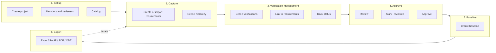

# Typical Workflow with Marreq

This document describes a **typical end-to-end workflow** for using Marreq: from project setup through requirements, **verification management**, traceability, approval, baselines, and export. For detailed steps on each screen, see the [User Manual](user-manual.md), in particular [Test Management (Verifications)](user-manual.md#5-test-management-verifications) and [Traceability](user-manual.md#6-traceability).

---

## Overview

A common Marreq workflow follows this sequence:

1. **Set up the project**: members, **project reviewers** (who may change requirement and verification **status** and approve requirement **versions**), and the catalog (categories, applicability, verification methods, requirement and **verification statuses**).
2. **Capture requirements** (create, import, organise in a hierarchy).
3. **Verification management**: define verifications (tests, analyses, …), organise them in a hierarchy, link them to the requirements they verify, and track their status (Passed/Failed/Pending) as they are run.
4. **Review and approve** requirements (draft → reviewed → approved).
5. **Create baselines** for milestones or releases.
6. **Export** for audits, documentation, or tooling (Excel, ReqIF/ReqIFZ, PDF/ODT report documents, project bundles).

You can adapt the order (e.g. import requirements first, then configure categories) or iterate (add requirements and verifications over time, update verification status as you run them).

### Workflow diagram

---

## 1. Set Up the Project

- **Create the project**: **Projects → New project**. Choose the namespace (personal or a group), enter the name and an optional description. Any user can create a project and becomes its Admin. The project starts with default statuses, verification methods (Inspection, Test, Analysis, Review), one category and one applicability value.
- **Add project members** (**Project settings › Members & reviewers**): add users with a role: **Admin** (manages the project), **Reviewer** and **Author** (edit requirements and verifications), or **Viewer** (read only).
- **Designate project reviewers** on the same page, then **Save reviewer list**. Reviewers alone may change **requirement status**, **verification status**, and **version approval** (draft / reviewed / approved). Do this first: until the project has a reviewer, nobody can create requirements or verifications.
- **Configure the catalog** (**Project settings › Catalog**, project Admins):
  - **Categories** (e.g. Safety, Performance, Usability), used to tag requirements.
  - **Applicability** (e.g. Product A, Product B, All), for product lines or scope.
  - **Verification methods** (e.g. Test, Analysis, Review, Inspection), how each requirement will be verified. At least one is needed to create requirements.
  - **Requirement statuses** (e.g. Draft, Accepted, Rejected), the requirement lifecycle.
  - **Verification statuses** (e.g. Passed, Failed, Not run, Blocked), each with an **outcome** that drives requirement close-out.
  - **Custom fields** for extra requirement attributes.

Having these in place before bulk-adding requirements keeps data consistent and makes filtering and reporting more useful.

---

## 2. Capture Requirements

- **Create requirements** one by one: **Create requirement** in the top bar. Fill in the reference code, title, statement, rationale, category, status, applicability, verification method(s), author, reviewer and, optionally, parent requirements. To start from an existing requirement, use **Duplicate**; to add a child, select the parent in **Traceability › Hierarchy** and use **Add child**.
- **Or import** existing data from **Project settings › Import** (or **Create → Import**): Excel/CSV with column mapping, or ReqIF / ReqIFZ (see [User Manual – Import](user-manual.md#10-import)).
- **Refine** in the **Requirements** list: the **Table** view (with inline editing) or the **List** view, filtered by status, category or approval and searched with Global Search. Save useful filters as **saved views**. **Edit** requirements to adjust content or parent links.
- **AI search**: when embeddings are enabled, AI assistants connected through Marreq's MCP server can search requirements by meaning; the web pages have no AI search.

---

## 3. Test Management and Traceability

### 3.1 Define and Organize Verifications

- **Create verifications**: **Create verification** in the top bar. Enter the reference code (e.g. VER-PWR-001), name, description, **Source** (e.g. a test procedure), **Status**, verification method, author and reviewer, and tick the requirements it verifies. Use **Parent verification** to build a hierarchy (campaigns, feature areas).
- **Manage verifications** from the **Verifications** list (Table or List view): filter by status and method, use the status chips and pass rate, and edit inline.
- **Export verifications**: the **Excel** button on the list, or **Reports & exports → Verifications (.xlsx)**; **CSV** exports the rows shown.

### 3.2 Link Verifications to Requirements (Traceability)

- Links are set on the verification: tick the requirements under **Traceability (requirements)** when creating or editing it (**Edit links** on its page).
- **Traceability › Matrix** then shows requirements × verifications with the status of each link, and lists **coverage gaps**: requirements without verifications and verifications without requirements. The **Dashboard** (Gaps, Orphans) and **Reports & exports** (Coverage & gaps) show the same, and each requirement page lists its verifications under **Downstream (verifications)**.

### 3.3 Track Test Execution (Verification Status)

- **Update verification status** as verifications are run (e.g. Passed, Failed, Pending, In progress): in the verification editor or inline in the verifications list. Only project reviewers can do this.
- Requirement pages show each linked verification's status, and the **Verification close-out** card shows whether the requirement can be closed.
- Filter the **Matrix** by verification status (e.g. only *Fail / reject*) for follow-up.

---

## 4. Review and Approve Requirements

- **Review**: authors and reviewers read the requirement on its page, check the linked verifications and their status, and discuss in the **Discussion** section.
- **Who can change status and approval**: only **project reviewers** can change **requirement status**, **verification status**, and move the current version through **draft → reviewed → approved**. While the reviewer list is empty, site administrators can; once it has members, administrators must be on it too. Others with edit rights can still edit text and most metadata.
- **Mark as Reviewed**, then **Approve Requirement** (each with a confirmation) on the requirement page. An approved requirement shows the approver and date; comments on it are locked, and editing it creates a new **Draft** version.
- **Filter by approval**: on the Requirements list, set **Approval** to Draft, Reviewed or Approved to focus on what still needs review.

---

## 5. Create Baselines

- When the requirement set (and its approvals) reach a **milestone** (e.g. a release or an audit point), create a **baseline**: **Baselines → Create baseline**. Enter a name and optional description, optionally restrict it to a **saved view**, then **Create**.
- The baseline is **immutable**: it stores the current version of each included requirement, the traceability links, a snapshot of each verification and the list of attached files at that moment.
- Use baselines to:
  - **Export ReqIF** or **Export ReqIFZ (with files)** for that exact snapshot (e.g. for auditors or downstream tools).
  - **Compare** later: **Diff vs current** shows what changed in a requirement since the baseline, and **Compare with baseline** compares two baselines.

---

## 6. Export for Audits and Documentation

All of these are on **Reports & exports**:

- **Requirements (.xlsx)** (with a Comments sheet) and **Verifications (.xlsx)**; the list pages also export their visible rows as CSV.
- **Matrix (.xlsx)** (coverage grid) and **Matrix links (.xlsx)** (for re-import); the Matrix tab has its own **Export Excel**.
- **ReqIF**: **Requirements (.reqif)** for the current state, or **Requirements with files (.reqifz)** to include the attachments. From a baseline, use **Export ReqIF** / **Export ReqIFZ** on its page.
- **Report documents**: the **Verification Control Document (VCD)** and the **traceability & coverage report**, as PDF or ODT, from a default or saved template (**Customize…** opens the report builder). **Report PDF** is the coverage report with default settings, and **Requirements PDF** lists the requirements.
- **Project bundle (.json)** or **Project bundle with files (.zip)** to move a whole project to another Marreq instance.

---

## Iteration and Maintenance

- **Ongoing**: add or edit requirements and verifications, update links, **run verifications and update their status**, and discuss in comments. Create new baselines at each major milestone.
- **Test management**: use the Verifications list (status chips, pass rate) and the Matrix to track which verifications pass or fail; use Reports & exports for coverage and the VCD.
- **After changes**: when a requirement changes, its links to verifications are marked **suspect**. Review them in the Matrix side panel (**Review** compares the versions) and **Clear** the flag when the link still holds; the user and time are recorded.
- **History**: use the **Changelog** and **Compare versions** on requirements and verifications, and **Diff vs current** on baselines, to see what changed and when.
- **When the project is finished**: the owner or an instance administrator can **archive** it (**Project settings › General › Archive project…**). It becomes read-only for everyone but stays readable and exportable, and can be unarchived at any time (see [User Manual – Archiving a Project](user-manual.md#35-archiving-a-project)).

For detailed instructions on each action, see the [User Manual](user-manual.md), including [Test Management (Verifications)](user-manual.md#5-test-management-verifications).
